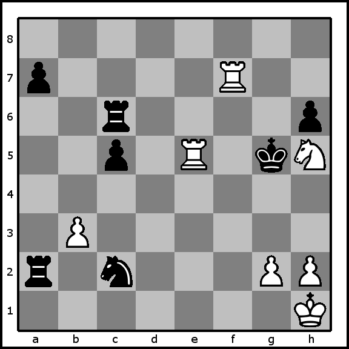

# White to Play and Win
A NaNoGenMo 2017 entry.

Written by the open-source "ChessBook" software (https://github.com/greg-kennedy/ChessBook), by **Greg Kennedy** (<kennedy.greg@gmail.com>).

Generated on Wed Nov 22 10:50:05 2017.

## Contents
* [Introduction](#introduction)
* [White e1e2](#white-e1e2)
* [White e1e3](#white-e1e3)
* [White e1e4](#white-e1e4)
* [White e1e5](#white-e1e5)
* [White e1e6](#white-e1e6)
* [White e1e7](#white-e1e7)
* [White e1e8](#white-e1e8)
* [White e1f1](#white-e1f1)
* [White e1g1](#white-e1g1)
* [White e1d1](#white-e1d1)
* [White e1c1](#white-e1c1)
* [White e1b1](#white-e1b1)
* [White e1a1](#white-e1a1)
* [White h1g1](#white-h1g1)
* [White g2g3](#white-g2g3)
* [White g2g4](#white-g2g4)
* [White h2h3](#white-h2h3)
* [White h2h4](#white-h2h4)
* [White b3b4](#white-b3b4)
* [White h5f4](#white-h5f4)
* [White h5f6](#white-h5f6)
* [White h5g3](#white-h5g3)
* [White h5g7](#white-h5g7)
* [White f7f8](#white-f7f8)
* [White f7f6](#white-f7f6)
* [White f7f5](#white-f7f5)
* [White f7f4](#white-f7f4)
* [White f7f3](#white-f7f3)
* [White f7f2](#white-f7f2)
* [White f7f1](#white-f7f1)
* [White f7g7](#white-f7g7)
* [White f7h7](#white-f7h7)
* [White f7e7](#white-f7e7)
* [White f7d7](#white-f7d7)
* [White f7c7](#white-f7c7)
* [White f7b7](#white-f7b7)
* [White f7a7](#white-f7a7)
* [Conclusion](#conclusion)

## Introduction
Harold and Maude sat across from each other at a square table.  Between them was a chess board.

**Initial Position**

There was a White Rook at e1.
There was a White King at h1.
There was a Black Rook at a2.
There was a Black Knight at c2.
There was a White Pawn at g2.
There was a White Pawn at h2.
There was a White Pawn at b3.
There was a Black Pawn at c5.
There was a Black King at g5.
There was a White Knight at h5.
There was a Black Rook at c6.
There was a Black Pawn at h6.
There was a Black Pawn at a7.
There was a White Rook at f7.

Harold was playing White.  It was his turn.

## White e1e2
Harold considered moving his Rook from e1 to e2.
Maude might react using her Rook from a2 to a3.

### Black a2a3
He might respond using his King at h1 to g1.
He could react with his Rook from e2 to e3.
Harold may react using his Rook from e2 to e4.
Harold could respond by playing his Rook at e2 to e5 and putting Black in Check.
Harold may answer by moving his Rook from e2 to e6.
Plus, He might refute with his Rook at e2 to e7.
Harold may respond using his Rook at e2 to e8.
Additionally, Harold could counter by moving his Rook at e2 to e1.
Or, He could answer using his Rook at e2 to f2.
In addition, Harold may refute by playing his Rook at e2 to d2.
Harold may react by playing his Rook from e2 to c2, taking the Black Knight.
Harold might reply with his Pawn from g2 to g3.
Possibly, He may refute by playing his Pawn from g2 to g4.
Harold might refute by playing his Pawn at h2 to h3.
Harold might refute using his Pawn from h2 to h4.
He may respond by playing his Pawn at b3 to b4.
Plus, Harold may respond by playing his Knight at h5 to f4.
Harold may react by playing his Knight at h5 to f6.
Harold may reply by moving his Knight at h5 to g3.
Possibly, He could counter using his Knight from h5 to g7.
Possibly, He may answer with his Rook from f7 to f8.
He may react by playing his Rook from f7 to f6.
Also, Harold might answer with his Rook at f7 to f5 and putting Maude in Check.
Harold might counter by moving his Rook from f7 to f4.
He could answer by playing his Rook at f7 to f3.
He could reply by moving his Rook at f7 to f2.
Harold could refute by playing his Rook at f7 to f1.
He might respond by playing his Rook from f7 to g7 and putting Black in Check.
Plus, Harold could refute by moving his Rook from f7 to h7.
He may refute using his Rook from f7 to e7.
Possibly, He might react with his Rook from f7 to d7.
He could react by moving his Rook from f7 to c7.
Harold may react by moving his Rook at f7 to b7.
He may react by playing his Rook at f7 to a7, capturing the Black Pawn.
Of these candidates, the best move for Harold was h1g1.

Also, Maude may respond by moving her Rook from a2 to a4.

### Black a2a4
Harold might answer by playing his King at h1 to g1.
This route was disastrous for Harold, so it was ignored.

Maude might respond by playing her Rook at a2 to a5.

### Black a2a5
Harold could reply using his King from h1 to g1.
This sequence was not as good for White, so it was abandoned.

Additionally, Maude could counter using her Rook from a2 to a6.

### Black a2a6
He might counter using his King at h1 to g1.
This path was not as good for White, so it was abandoned.

Maude may refute using her Rook from a2 to a1 and putting White in Check.

### Black a2a1
He could answer by moving his Rook from e2 to e1.
This sequence was bad for White, so it was abandoned.

Also, She may respond using her Rook at a2 to b2.

### Black a2b2
Harold may refute by playing his King at h1 to g1.
Also, Harold might respond by moving his Rook at e2 to e3.
This sequence was not as good for White, so it was ignored.

Maude could counter by playing her Knight at c2 to a1.

### Black c2a1
He might answer with his King at h1 to g1.
This line was not as good for Harold, so it was abandoned.

Plus, She may counter with her Knight at c2 to a3.

### Black c2a3
Harold may answer by playing his King at h1 to g1.
Harold could reply by playing his Rook from e2 to e3.
This line was not as good for White, so it was abandoned.

She could refute with her Knight at c2 to b4.

### Black c2b4
Harold might refute using his King from h1 to g1.
He might respond by playing his Rook at e2 to e3.
This sequence was worse for White, so it was disregarded.

Or, She could answer with her Knight from c2 to d4.

### Black c2d4
Harold could respond with his King from h1 to g1.
Or, Harold could answer by playing his Rook from e2 to e3.
Or, He might react by playing his Rook from e2 to e4.
Harold might answer by playing his Rook from e2 to e5 and putting Black in Check.
Plus, Harold may react by playing his Rook from e2 to e6.
Harold may react by moving his Rook at e2 to e7.
This route was disastrous for Harold, so it was ignored.

Maude might answer with her Knight from c2 to e1.

### Black c2e1
Harold might refute using his King from h1 to g1.
This path was unsound for Harold, so it was disregarded.

Maude might react with her Knight from c2 to e3.

### Black c2e3
He could respond with his King at h1 to g1.
This sequence was bad for Harold, so it was disregarded.

In addition, She may react with her Pawn from c5 to c4.

### Black c5c4
Harold might refute with his King from h1 to g1.
He may answer with his Rook at e2 to e3.
This line was disastrous for White, so it was abandoned.

Also, She might respond with her King from g5 to g4.

### Black g5g4
He might reply with his King at h1 to g1.
Harold could refute by moving his Rook from e2 to e3.
This line was bad for White, so it was disregarded.

In addition, She might answer by playing her King from g5 to h4.

### Black g5h4
Harold may react by moving his King at h1 to g1.
Also, He may reply using his Rook from e2 to e3.
Plus, He could react using his Rook at e2 to e4 and putting Maude in Check.
This path was worse for Harold, so it was ignored.

She might answer by playing her King at g5 to h5, capturing his Knight.

### Black g5h5
Harold could refute with his King at h1 to g1.
This route was unsound for White, so it was ignored.

She could counter using her King from g5 to g6.

### Black g5g6
He could react by moving his King from h1 to g1.
This route was not as good for Harold, so it was ignored.

She may reply by moving her Rook from c6 to c7.

### Black c6c7
Harold could respond using his King from h1 to g1.
He might respond with his Rook from e2 to e3.
This line was not as good for Harold, so it was ignored.

Possibly, Maude could react by moving her Rook at c6 to c8.

### Black c6c8
He could reply by moving his King at h1 to g1.
This route was worse for Harold, so it was abandoned.

Maude may react using her Rook at c6 to d6.

### Black c6d6
Harold may reply with his King at h1 to g1.
Additionally, Harold might counter by playing his Rook at e2 to e3.
This line was bad for White, so it was ignored.

She might answer with her Rook at c6 to e6.

### Black c6e6
He may respond using his King at h1 to g1.
Harold may reply by playing his Rook from e2 to e3.
This route was unsound for Harold, so it was ignored.

Also, Maude might react with her Rook at c6 to f6.

### Black c6f6
He might counter by playing his King from h1 to g1.
Harold may refute using his Rook from e2 to e3.
Harold might react by moving his Rook at e2 to e4.
Harold could counter by moving his Rook from e2 to e5 and putting Maude in Check.
He could reply with his Rook at e2 to e6.
He could respond by playing his Rook from e2 to e7.
This route was not as good for White, so it was ignored.

She may reply by playing her Rook at c6 to g6.

### Black c6g6
He may react using his King at h1 to g1.
Possibly, He could react by playing his Rook from e2 to e3.
This sequence was worse for White, so it was abandoned.

And, Maude may refute with her Rook at c6 to b6.

### Black c6b6
Harold might reply using his King from h1 to g1.
Harold may answer with his Rook at e2 to e3.
This line was worse for Harold, so it was disregarded.

Maude may respond with her Rook at c6 to a6.

### Black c6a6
Harold might refute by playing his King from h1 to g1.
Or, He might refute using his Rook from e2 to e3.
This route was disastrous for White, so it was disregarded.

She might counter with her Pawn at a7 to a6.

### Black a7a6
He may counter by playing his King at h1 to g1.
This sequence was unsound for White, so it was abandoned.

Possibly, She may respond by moving her Pawn from a7 to a5.

### Black a7a5
Harold could refute with his King at h1 to g1.
This sequence was unsound for White, so it was abandoned.

Of these options, the best move for Maude was a2a3.

## White e1e3
Harold considered moving his Rook from e1 to e3.
She might refute using her Rook from a2 to a3.

### Black a2a3
He may refute using his King from h1 to g1.
He could refute by playing his Pawn at g2 to g3.
Or, Harold might answer using his Pawn from g2 to g4.
Or, He may respond with his Pawn at h2 to h3.
Harold could answer with his Pawn at h2 to h4.
Harold may respond by moving his Pawn at b3 to b4.
Harold might respond by playing his Rook at e3 to e4.
Harold could refute using his Rook from e3 to e5 and putting Maude in Check.
Harold could respond using his Rook at e3 to e6.
Also, Harold may respond with his Rook at e3 to e7.
He could react with his Rook at e3 to e8.
He may reply by playing his Rook from e3 to e2.
He might answer by playing his Rook at e3 to e1.
Harold could respond using his Rook at e3 to f3.
Harold may react by moving his Rook from e3 to g3 and putting Maude in Check.
Harold could respond using his Rook from e3 to h3.
He might counter by playing his Rook from e3 to d3.
Harold might refute with his Rook at e3 to c3.
Harold may respond by playing his Knight from h5 to f4.
He may answer by playing his Knight from h5 to f6.
He may counter by playing his Knight from h5 to g3.
He may refute with his Knight from h5 to g7.
Harold may answer using his Rook from f7 to f8.
Or, Harold may respond by playing his Rook from f7 to f6.
He could reply using his Rook at f7 to f5 and putting Black in Check.
Possibly, He might answer by moving his Rook from f7 to f4.
Plus, Harold may counter by playing his Rook from f7 to f3.
And, Harold might reply using his Rook from f7 to f2.
He may reply with his Rook at f7 to f1.
Harold may counter using his Rook from f7 to g7 and putting Maude in Check.
Harold may react with his Rook from f7 to h7.
In addition, He may react by playing his Rook at f7 to e7.
Also, Harold could counter by playing his Rook at f7 to d7.
He could react by playing his Rook from f7 to c7.
He might refute by playing his Rook at f7 to b7.
Or, Harold may counter with his Rook at f7 to a7, taking her Pawn.
Out of these choices, the best move for Harold was h1g1.

She could answer by playing her Rook at a2 to a4.

### Black a2a4
He might react by playing his King at h1 to g1.
He might refute by playing his Pawn from g2 to g3.
This route was not as good for White, so it was disregarded.

Maude might respond with her Rook at a2 to a5.

### Black a2a5
Harold may respond using his King at h1 to g1.
Harold might respond by playing his Pawn at g2 to g3.
This line was not as good for White, so it was disregarded.

Also, She might react by moving her Rook at a2 to a6.

### Black a2a6
Harold could reply by moving his King at h1 to g1.
Harold could react by playing his Pawn at g2 to g3.
He could reply by moving his Pawn from g2 to g4.
This route was bad for Harold, so it was disregarded.

She may respond using her Rook from a2 to a1 and putting Harold in Check.

### Black a2a1
He may refute using his Rook from e3 to e1.
He could counter by moving his Rook from f7 to f1.
This line was unsound for Harold, so it was ignored.

Maude may reply using her Rook at a2 to b2.

### Black a2b2
He might refute by playing his King from h1 to g1.
This sequence was not as good for White, so it was abandoned.

She could respond by playing her Knight from c2 to a1.

### Black c2a1
He might counter using his King from h1 to g1.
He might respond with his Pawn from g2 to g3.
This path was unsound for Harold, so it was abandoned.

Additionally, She might answer by moving her Knight at c2 to a3.

### Black c2a3
He could reply with his King at h1 to g1.
This line was disastrous for White, so it was disregarded.

She could refute with her Knight from c2 to b4.

### Black c2b4
He might reply by moving his King from h1 to g1.
Harold may answer using his Pawn at g2 to g3.
Or, Harold may refute with his Pawn from g2 to g4.
Also, Harold may refute by playing his Pawn at h2 to h3.
And, He may answer using his Pawn from h2 to h4.
Or, He could counter with his Rook from e3 to e4.
He may reply with his Rook at e3 to e5 and putting Black in Check.
This line was bad for Harold, so it was disregarded.

She could counter using her Knight from c2 to d4.

### Black c2d4
Harold may refute by moving his King at h1 to g1.
Harold might counter with his Pawn at g2 to g3.
This route was unsound for White, so it was ignored.

Also, She might respond by playing her Knight at c2 to e1.

### Black c2e1
He may respond by moving his King at h1 to g1.
This path was disastrous for Harold, so it was ignored.

She could counter by moving her Knight from c2 to e3, taking his Rook.

### Black c2e3
Harold may respond with his King from h1 to g1.
This path was disastrous for White, so it was disregarded.

Or, Maude could answer using her Pawn at c5 to c4.

### Black c5c4
He may reply using his King at h1 to g1.
Harold may refute by playing his Pawn at g2 to g3.
This route was worse for White, so it was abandoned.

She could answer using her King at g5 to g4.

### Black g5g4
He may reply using his King at h1 to g1.
He might counter with his Pawn from g2 to g3.
This sequence was unsound for White, so it was disregarded.

Maude could respond by playing her King from g5 to h4.

### Black g5h4
Harold could reply using his King from h1 to g1.
Harold could counter by playing his Pawn from g2 to g3 and putting Maude in Check.
Harold could answer with his Pawn at g2 to g4.
This line was disastrous for Harold, so it was abandoned.

Maude might counter using her King from g5 to h5, taking the White Knight.

### Black g5h5
He might respond by moving his King at h1 to g1.
This line was unsound for Harold, so it was abandoned.

Maude could react by moving her King from g5 to g6.

### Black g5g6
Harold may respond using his King at h1 to g1.
This sequence was unsound for Harold, so it was disregarded.

Or, She may respond with her Rook at c6 to c7.

### Black c6c7
He may refute with his King at h1 to g1.
Plus, He could react by moving his Pawn at g2 to g3.
This route was disastrous for Harold, so it was disregarded.

She could answer using her Rook at c6 to c8.

### Black c6c8
He may counter with his King from h1 to g1.
This route was not as good for Harold, so it was ignored.

Maude might answer by playing her Rook at c6 to d6.

### Black c6d6
He may refute by moving his King from h1 to g1.
Harold could counter by moving his Pawn at g2 to g3.
He might refute by moving his Pawn at g2 to g4.
Harold may reply with his Pawn at h2 to h3.
This route was bad for Harold, so it was abandoned.

Also, She might respond with her Rook from c6 to e6.

### Black c6e6
He may refute with his King at h1 to g1.
Possibly, He might refute by moving his Pawn at g2 to g3.
This route was bad for Harold, so it was disregarded.

And, Maude might refute by moving her Rook from c6 to f6.

### Black c6f6
Harold may react by playing his King from h1 to g1.
This sequence was disastrous for Harold, so it was ignored.

Maude might answer using her Rook from c6 to g6.

### Black c6g6
He could reply with his King from h1 to g1.
This path was not as good for White, so it was abandoned.

Maude might react with her Rook at c6 to b6.

### Black c6b6
Harold might respond using his King at h1 to g1.
Harold may answer with his Pawn from g2 to g3.
He may refute by playing his Pawn at g2 to g4.
Additionally, Harold might react by playing his Pawn at h2 to h3.
This sequence was worse for White, so it was abandoned.

She could reply using her Rook from c6 to a6.

### Black c6a6
Harold could respond with his King from h1 to g1.
Harold might respond with his Pawn from g2 to g3.
Additionally, Harold could counter using his Pawn from g2 to g4.
Harold might react by moving his Pawn at h2 to h3.
This route was not as good for White, so it was disregarded.

She could counter by moving her Pawn at a7 to a6.

### Black a7a6
He could react with his King at h1 to g1.
Also, Harold might refute using his Pawn from g2 to g3.
This line was bad for White, so it was ignored.

Or, She may counter by playing her Pawn at a7 to a5.

### Black a7a5
Harold might counter by playing his King at h1 to g1.
This sequence was bad for Harold, so it was ignored.

Of these candidates, the best move for Maude was a2a3.

## White e1e4
Harold considered moving his Rook from e1 to e4.
Maude might reply using her Rook at a2 to a3.

### Black a2a3
Harold may counter with his King at h1 to g1.
In addition, He might respond with his Pawn at g2 to g3.
He could answer by moving his Pawn from g2 to g4.
He could answer with his Pawn from h2 to h3.
He may counter using his Pawn from h2 to h4.
Additionally, Harold could counter by moving his Pawn from b3 to b4.
In addition, He may reply using his Rook from e4 to e5 and putting Maude in Check.
Plus, Harold may refute with his Rook at e4 to e6.
He could refute by playing his Rook at e4 to e7.
Harold could react with his Rook from e4 to e8.
He could respond using his Rook from e4 to e3.
Harold might counter with his Rook at e4 to e2.
He may reply by playing his Rook at e4 to e1.
Also, Harold may respond by playing his Rook at e4 to f4.
Harold may counter by moving his Rook at e4 to g4 and putting Maude in Check.
He may react by playing his Rook from e4 to h4.
Or, He might react by moving his Rook from e4 to d4.
Harold could respond by moving his Rook at e4 to c4.
Harold may counter with his Rook from e4 to b4.
Possibly, Harold may respond by moving his Rook from e4 to a4.
Additionally, He could react using his Knight at h5 to f4.
In addition, He might react using his Knight from h5 to f6.
Possibly, He may counter by playing his Knight from h5 to g3.
He may respond using his Knight at h5 to g7.
He may refute with his Rook at f7 to f8.
Possibly, He might refute by moving his Rook at f7 to f6.
Possibly, Harold could answer by playing his Rook at f7 to f5 and putting Black in Check.
Harold could react by playing his Rook from f7 to f4.
In addition, Harold may answer with his Rook from f7 to f3.
Harold may answer using his Rook from f7 to f2.
Harold may react by playing his Rook at f7 to f1.
Harold might answer using his Rook from f7 to g7 and putting Maude in Check.
Harold could counter by playing his Rook from f7 to h7.
He could reply by moving his Rook from f7 to e7.
And, He may respond using his Rook from f7 to d7.
Harold could reply by playing his Rook at f7 to c7.
Harold may counter by moving his Rook at f7 to b7.
Plus, He could refute by moving his Rook from f7 to a7, capturing the Black Pawn.
Out of these options, the best move for Harold was h1g1.

Maude might counter using her Rook from a2 to a4.

### Black a2a4
He could refute using his King at h1 to g1.
Harold may refute with his Pawn from g2 to g3.
Harold may refute by playing his Pawn at g2 to g4.
This route was disastrous for Harold, so it was disregarded.

Maude could respond by playing her Rook from a2 to a5.

### Black a2a5
He might respond with his King from h1 to g1.
This path was not as good for White, so it was abandoned.

Maude might refute by moving her Rook from a2 to a6.

### Black a2a6
He might react using his King at h1 to g1.
He may counter using his Pawn from g2 to g3.
Also, He could respond using his Pawn from g2 to g4.
This line was bad for White, so it was abandoned.

Also, She might counter by playing her Rook at a2 to a1 and putting Harold in Check.

### Black a2a1
He could refute with his Rook at e4 to e1.
This line was unsound for Harold, so it was abandoned.

Maude may counter using her Rook at a2 to b2.

### Black a2b2
Harold could answer by moving his King from h1 to g1.
This sequence was bad for White, so it was ignored.

Maude might counter using her Knight at c2 to a1.

### Black c2a1
He might react using his King at h1 to g1.
This line was disastrous for White, so it was ignored.

Additionally, Maude might react by playing her Knight at c2 to a3.

### Black c2a3
He could reply using his King at h1 to g1.
Harold could react with his Pawn at g2 to g3.
This line was bad for White, so it was ignored.

Additionally, Maude might answer by moving her Knight from c2 to b4.

### Black c2b4
He could refute by playing his King at h1 to g1.
And, He may react by moving his Pawn from g2 to g3.
Additionally, He might refute by moving his Pawn from g2 to g4.
This line was unsound for Harold, so it was abandoned.

Maude might respond by playing her Knight from c2 to d4.

### Black c2d4
Harold may reply using his King at h1 to g1.
This path was unsound for White, so it was ignored.

Maude may refute by moving her Knight at c2 to e1.

### Black c2e1
Harold might reply with his King at h1 to g1.
He could answer by moving his Pawn from g2 to g3.
This line was not as good for Harold, so it was ignored.

She may respond with her Knight at c2 to e3.

### Black c2e3
Harold might react by playing his King at h1 to g1.
Harold could refute by playing his Pawn at g2 to g3.
He might refute by playing his Pawn at g2 to g4.
He may reply by moving his Pawn from h2 to h3.
He may answer by playing his Pawn at h2 to h4.
Harold could answer by moving his Pawn from b3 to b4.
This line was bad for White, so it was disregarded.

Maude could reply using her Pawn at c5 to c4.

### Black c5c4
He may counter using his King from h1 to g1.
Harold might reply by playing his Pawn from g2 to g3.
He could answer by playing his Pawn at g2 to g4.
Or, He may answer using his Pawn at h2 to h3.
He may respond with his Pawn from h2 to h4.
This path was disastrous for Harold, so it was ignored.

Maude might counter by playing her King from g5 to h5, capturing the White Knight.

### Black g5h5
He may react by playing his King at h1 to g1.
This sequence was bad for White, so it was abandoned.

She might reply with her King from g5 to g6.

### Black g5g6
Harold might respond by moving his King from h1 to g1.
He may answer with his Pawn from g2 to g3.
This route was worse for Harold, so it was disregarded.

Additionally, She might refute using her Rook from c6 to c7.

### Black c6c7
He may reply using his King from h1 to g1.
He might respond by moving his Pawn at g2 to g3.
This route was disastrous for Harold, so it was abandoned.

Also, Maude may respond with her Rook at c6 to c8.

### Black c6c8
He might counter by moving his King at h1 to g1.
This sequence was bad for White, so it was abandoned.

Plus, Maude might answer by playing her Rook from c6 to d6.

### Black c6d6
He could refute with his King from h1 to g1.
This line was bad for White, so it was ignored.

Plus, Maude might reply with her Rook from c6 to e6.

### Black c6e6
Harold might refute with his King from h1 to g1.
This path was not as good for White, so it was abandoned.

She could react by playing her Rook from c6 to f6.

### Black c6f6
He may answer by moving his King at h1 to g1.
This line was worse for Harold, so it was disregarded.

Or, She might respond by playing her Rook from c6 to g6.

### Black c6g6
He may react by playing his King at h1 to g1.
This path was bad for Harold, so it was ignored.

She may reply by moving her Rook from c6 to b6.

### Black c6b6
He could respond using his King from h1 to g1.
This path was not as good for White, so it was abandoned.

And, Maude might answer by playing her Rook from c6 to a6.

### Black c6a6
Harold might reply by moving his King at h1 to g1.
He might react using his Pawn at g2 to g3.
He might reply by playing his Pawn at g2 to g4.
Or, Harold may reply by moving his Pawn from h2 to h3.
This path was bad for White, so it was abandoned.

She may reply with her Pawn at a7 to a6.

### Black a7a6
Harold could respond by playing his King from h1 to g1.
This path was unsound for White, so it was ignored.

She could respond using her Pawn from a7 to a5.

### Black a7a5
He could respond using his King from h1 to g1.
He might counter by playing his Pawn from g2 to g3.
He could refute with his Pawn from g2 to g4.
This route was disastrous for White, so it was disregarded.

Of these options, the best move for Maude was a2a3.

## White e1e5
Harold considered moving his Rook from e1 to e5 and putting Maude in Check.
She could refute with her King from g5 to g4.

### Black g5g4
Harold could answer using his King from h1 to g1.
Harold may answer by playing his Pawn from g2 to g3.
Plus, Harold may respond by moving his Pawn at h2 to h3.
In addition, He may answer using his Pawn at h2 to h4.
Harold might react by playing his Pawn at b3 to b4.
In addition, Harold might counter using his Rook from e5 to e6.
Harold may react using his Rook at e5 to e7.
He might counter using his Rook at e5 to e8.
Harold could counter with his Rook at e5 to e4 and putting Maude in Check.
Harold may react by playing his Rook from e5 to e3.
Harold could answer by moving his Rook at e5 to e2.
Harold might respond using his Rook at e5 to e1.
Harold may reply by moving his Rook at e5 to f5.
Harold might react by moving his Rook from e5 to g5 and putting Maude in Check.
Harold could react by playing his Rook from e5 to d5.
In addition, Harold could refute using his Rook from e5 to c5, taking the Black Pawn.
Also, Harold could reply using his Knight at h5 to f4.
He could answer with his Knight at h5 to f6 and putting Maude in Check.
Additionally, He may reply with his Knight at h5 to g3.
Or, Harold could respond with his Knight from h5 to g7.
Possibly, He could reply using his Rook from f7 to f8.
Harold may respond with his Rook at f7 to f6.
Harold could refute by moving his Rook at f7 to f5.
He could refute by moving his Rook from f7 to f4 and putting Black in Check.
That would be Checkmate for Maude.

Harold may respond by playing his Rook at f7 to f3.
Or, Harold may answer using his Rook from f7 to f2.
He could refute with his Rook from f7 to f1.
Harold could answer by playing his Rook from f7 to g7 and putting Maude in Check.
In addition, He could respond by playing his Rook at f7 to h7.
Plus, Harold may react with his Rook from f7 to e7.
Additionally, Harold might counter using his Rook from f7 to d7.
Additionally, Harold might counter with his Rook from f7 to c7.
Harold could reply by moving his Rook at f7 to b7.
He might react by moving his Rook from f7 to a7, taking her Pawn.
Of these candidates, the best move for Harold was f7f4.

Possibly, She may respond by playing her King at g5 to h4.

### Black g5h4
He might refute by moving his King at h1 to g1.
And, He could counter using his Pawn at g2 to g3 and putting Black in Check.
Or, He might counter using his Pawn from g2 to g4.
He may reply by moving his Pawn at h2 to h3.
Harold may answer with his Pawn at b3 to b4.
In addition, He may counter by moving his Rook at e5 to e6.
Or, Harold could respond by moving his Rook from e5 to e7.
He might respond with his Rook at e5 to e8.
Harold could counter using his Rook from e5 to e4 and putting Black in Check.
He could react with his Rook at e5 to e3.
Possibly, He may react with his Rook from e5 to e2.
Harold could reply with his Rook from e5 to e1.
Or, He may react with his Rook from e5 to f5.
He could counter by moving his Rook from e5 to g5.
He could answer with his Rook from e5 to d5.
Plus, He might counter by playing his Rook from e5 to c5, capturing the Black Pawn.
Harold might respond with his Knight from h5 to f4.
Also, Harold might answer using his Knight at h5 to f6.
Possibly, Harold may respond with his Knight at h5 to g3.
Harold may counter by moving his Knight at h5 to g7.
Plus, Harold may react by moving his Rook from f7 to f8.
He might respond with his Rook from f7 to f6.
Harold may counter by moving his Rook from f7 to f5.
He might refute by playing his Rook from f7 to f4 and putting Maude in Check.
That would be Checkmate for Black.

This route was not as good for Harold, so it was abandoned.

Possibly, Maude might respond using her King at g5 to g6.

### Black g5g6
He might refute with his King from h1 to g1.
Harold may respond with his Pawn from g2 to g3.
Or, He could refute with his Pawn at g2 to g4.
He could answer with his Pawn from h2 to h3.
Harold could counter with his Pawn at h2 to h4.
Harold might refute by playing his Pawn from b3 to b4.
Harold may respond with his Rook from e5 to e6 and putting Maude in Check.
Plus, He may refute by moving his Rook from e5 to e7.
Harold may respond with his Rook at e5 to e8.
Harold may answer with his Rook from e5 to e4.
He could counter by moving his Rook at e5 to e3.
He might answer using his Rook from e5 to e2.
Harold might react with his Rook from e5 to e1.
He could refute using his Rook from e5 to f5.
Harold may refute with his Rook from e5 to g5 and putting Black in Check.
Harold may react using his Rook from e5 to d5.
Harold may reply using his Rook at e5 to c5, taking her Pawn.
He may reply by playing his Knight at h5 to f4 and putting Maude in Check.
Harold could refute by moving his Knight from h5 to f6.
Additionally, Harold could answer by playing his Knight at h5 to g3.
Harold might respond using his Knight at h5 to g7.
Harold might react by playing his Rook at f7 to f8.
He could reply with his Rook at f7 to f6 and putting Maude in Check.
He might counter by moving his Rook from f7 to f5.
He may counter using his Rook from f7 to f4.
He could reply by playing his Rook from f7 to f3.
Harold might reply with his Rook from f7 to f2.
Also, Harold might answer by moving his Rook at f7 to f1.
He could answer by moving his Rook from f7 to g7 and putting Black in Check.
That would be Checkmate for Maude.

He may react by moving his Rook at f7 to h7.
He may counter using his Rook at f7 to e7.
He might respond by playing his Rook at f7 to d7.
Harold may reply by moving his Rook from f7 to c7.
Harold may counter using his Rook at f7 to b7.
In addition, He may refute by playing his Rook at f7 to a7, capturing her Pawn.
Out of these candidates, the best move for Harold was f7g7.

Among these candidates, the best move for Maude was g5g4.

## White e1e6
Harold considered moving his Rook from e1 to e6.
Maude could answer using her Rook from a2 to a3.

### Black a2a3
He might respond by playing his King at h1 to g1.
And, Harold might refute by playing his Pawn at g2 to g3.
Harold could reply by playing his Pawn at g2 to g4.
Harold might answer by playing his Pawn at h2 to h3.
Harold could counter with his Pawn from h2 to h4.
Harold may react using his Pawn at b3 to b4.
Harold may answer by moving his Knight from h5 to f4.
And, He could answer using his Knight at h5 to f6.
He may react with his Knight at h5 to g3.
He could react using his Knight from h5 to g7.
Harold may respond using his Rook from e6 to e7.
He could counter with his Rook from e6 to e8.
Harold may reply by moving his Rook from e6 to e5 and putting Black in Check.
Harold could reply using his Rook at e6 to e4.
Harold could react with his Rook at e6 to e3.
In addition, He may react with his Rook from e6 to e2.
Harold may react by playing his Rook at e6 to e1.
He might react using his Rook at e6 to f6.
He may respond with his Rook from e6 to g6 and putting Maude in Check.
He could counter by moving his Rook at e6 to h6, capturing her Pawn.
He could counter by playing his Rook from e6 to d6.
Additionally, He may react using his Rook from e6 to c6, taking the Black Rook.
He could counter using his Rook from f7 to f8.
Possibly, He may react by moving his Rook at f7 to f6.
Harold might react using his Rook at f7 to f5 and putting Black in Check.
Also, Harold may react with his Rook from f7 to f4.
Harold might answer by moving his Rook at f7 to f3.
And, Harold might respond by playing his Rook at f7 to f2.
He might reply using his Rook at f7 to f1.
He may counter by moving his Rook from f7 to g7 and putting Maude in Check.
In addition, Harold might react with his Rook at f7 to h7.
He may reply with his Rook from f7 to e7.
Possibly, He might reply using his Rook from f7 to d7.
Plus, Harold might react by moving his Rook at f7 to c7.
Harold may counter with his Rook at f7 to b7.
Possibly, Harold could reply by moving his Rook from f7 to a7, taking the Black Pawn.
Out of these choices, the best move for Harold was h1g1.

Maude may counter by playing her Rook at a2 to a4.

### Black a2a4
He might react by playing his King from h1 to g1.
He may react by playing his Pawn from g2 to g3.
Harold may refute using his Pawn at g2 to g4.
This path was bad for White, so it was disregarded.

Maude could refute with her Rook from a2 to a5.

### Black a2a5
He might respond by moving his King from h1 to g1.
In addition, He could refute by moving his Pawn from g2 to g3.
And, Harold might reply with his Pawn from g2 to g4.
Harold may reply with his Pawn from h2 to h3.
Harold could answer with his Pawn at h2 to h4.
This sequence was unsound for White, so it was abandoned.

Maude may react with her Rook at a2 to a6.

### Black a2a6
He could counter using his King at h1 to g1.
Additionally, Harold could counter by playing his Pawn at g2 to g3.
This sequence was unsound for Harold, so it was ignored.

Maude may react by moving her Rook from a2 to a1 and putting White in Check.

### Black a2a1
He may respond using his Rook from e6 to e1.
Harold could respond by playing his Rook from f7 to f1.
This line was unsound for White, so it was disregarded.

And, She could refute by moving her Rook from a2 to b2.

### Black a2b2
Harold may counter with his King from h1 to g1.
This path was not as good for Harold, so it was disregarded.

She may respond by moving her Knight from c2 to a1.

### Black c2a1
He could respond using his King from h1 to g1.
This route was bad for Harold, so it was disregarded.

Maude may reply using her Knight from c2 to a3.

### Black c2a3
He could respond by playing his King from h1 to g1.
Harold may refute using his Pawn at g2 to g3.
Additionally, He may answer with his Pawn from g2 to g4.
This line was disastrous for Harold, so it was abandoned.

In addition, She might answer using her Knight at c2 to b4.

### Black c2b4
He may respond using his King at h1 to g1.
He could respond by playing his Pawn from g2 to g3.
Harold may respond with his Pawn from g2 to g4.
This line was unsound for Harold, so it was disregarded.

Maude could answer by playing her Knight from c2 to d4.

### Black c2d4
Harold could counter using his King from h1 to g1.
Harold may refute by moving his Pawn from g2 to g3.
This route was bad for White, so it was abandoned.

Maude may react using her Knight from c2 to e1.

### Black c2e1
He may reply by moving his King from h1 to g1.
This path was disastrous for Harold, so it was disregarded.

Maude could refute with her Knight at c2 to e3.

### Black c2e3
He could counter by playing his King from h1 to g1.
He could refute by moving his Pawn from g2 to g3.
Harold might counter using his Pawn at g2 to g4.
He could counter with his Pawn at h2 to h3.
This path was unsound for Harold, so it was abandoned.

Or, She might respond by moving her Pawn from c5 to c4.

### Black c5c4
Harold might reply by moving his King at h1 to g1.
This route was worse for Harold, so it was abandoned.

Or, She could react with her King at g5 to g4.

### Black g5g4
He may counter using his King at h1 to g1.
Also, He may counter using his Pawn at g2 to g3.
Also, He might refute using his Pawn at h2 to h3.
This route was not as good for White, so it was disregarded.

Maude could refute with her King at g5 to h4.

### Black g5h4
He could counter by playing his King from h1 to g1.
This sequence was bad for White, so it was ignored.

Maude could counter with her King at g5 to h5, taking the White Knight.

### Black g5h5
Harold may react with his King from h1 to g1.
This path was worse for Harold, so it was abandoned.

Possibly, Maude may answer by playing her Rook at c6 to c7.

### Black c6c7
He could counter by moving his King from h1 to g1.
This sequence was worse for Harold, so it was ignored.

Also, She might respond by moving her Rook from c6 to c8.

### Black c6c8
He could refute by playing his King from h1 to g1.
He could counter using his Pawn from g2 to g3.
He could refute using his Pawn at g2 to g4.
This line was disastrous for White, so it was disregarded.

She might refute with her Rook at c6 to d6.

### Black c6d6
He may react by moving his King from h1 to g1.
Possibly, He may reply by playing his Pawn from g2 to g3.
This route was disastrous for White, so it was abandoned.

Maude could answer by playing her Rook at c6 to e6, capturing his Rook.

### Black c6e6
Harold could reply by playing his King at h1 to g1.
This line was bad for White, so it was disregarded.

Maude may reply by playing her Rook at c6 to b6.

### Black c6b6
Harold might react by playing his King at h1 to g1.
Harold might refute by moving his Pawn at g2 to g3.
Also, He may respond with his Pawn at g2 to g4.
This sequence was disastrous for Harold, so it was ignored.

Additionally, Maude could answer with her Rook from c6 to a6.

### Black c6a6
Harold may answer by playing his King at h1 to g1.
This path was unsound for White, so it was ignored.

Maude could respond by playing her Pawn at a7 to a6.

### Black a7a6
He could refute using his King at h1 to g1.
Harold may answer by playing his Pawn from g2 to g3.
He might react using his Pawn from g2 to g4.
This line was bad for White, so it was ignored.

Maude may react using her Pawn from a7 to a5.

### Black a7a5
He may reply by playing his King from h1 to g1.
This route was not as good for Harold, so it was ignored.

Out of these choices, the best move for Maude was a2a3.

## White e1e7
Harold considered moving his Rook from e1 to e7.
Maude could counter using her Rook at a2 to a3.

### Black a2a3
Harold might refute by playing his King at h1 to g1.
And, He may answer using his Pawn at g2 to g3.
In addition, He could reply using his Pawn from g2 to g4.
Harold could react by playing his Pawn at h2 to h3.
And, He could reply with his Pawn at h2 to h4.
Harold could react using his Pawn at b3 to b4.
He could react with his Knight from h5 to f4.
He may react using his Knight at h5 to f6.
Harold may answer with his Knight from h5 to g3.
Harold may react with his Knight at h5 to g7.
Harold might respond by moving his Rook at e7 to e8.
He might answer by moving his Rook at e7 to e6.
He may respond with his Rook at e7 to e5 and putting Maude in Check.
Harold could counter with his Rook from e7 to e4.
Additionally, He might reply by playing his Rook at e7 to e3.
Possibly, He might respond with his Rook from e7 to e2.
He might refute by playing his Rook at e7 to e1.
Harold might reply by playing his Rook at e7 to d7.
He might reply by playing his Rook at e7 to c7.
Harold might react with his Rook at e7 to b7.
Additionally, He might answer using his Rook from e7 to a7, taking the Black Pawn.
Plus, He might answer using his Rook at f7 to f8.
He may respond by playing his Rook from f7 to f6.
Harold could answer with his Rook from f7 to f5 and putting Black in Check.
In addition, Harold might answer by playing his Rook at f7 to f4.
And, He might reply by playing his Rook from f7 to f3.
Harold might refute by moving his Rook at f7 to f2.
He may react by moving his Rook from f7 to f1.
Or, He could reply by playing his Rook from f7 to g7 and putting Black in Check.
Harold could reply with his Rook at f7 to h7.
Among these moves, the best move for Harold was h1g1.

She may answer by playing her Rook from a2 to a4.

### Black a2a4
Harold may react by playing his King from h1 to g1.
He might react with his Pawn at g2 to g3.
He might react by moving his Pawn at g2 to g4.
He might answer by playing his Pawn at h2 to h3.
Harold might respond by moving his Pawn at h2 to h4.
This route was bad for Harold, so it was abandoned.

She could answer with her Rook at a2 to a5.

### Black a2a5
He could reply by moving his King from h1 to g1.
Harold could reply by moving his Pawn from g2 to g3.
This sequence was bad for White, so it was abandoned.

Maude may react by moving her Rook from a2 to a6.

### Black a2a6
Harold may reply with his King at h1 to g1.
This route was bad for Harold, so it was ignored.

Maude might react with her Rook at a2 to a1 and putting White in Check.

### Black a2a1
He may refute using his Rook at e7 to e1.
Harold could react by playing his Rook from f7 to f1.
This sequence was not as good for White, so it was disregarded.

Maude might answer with her Rook from a2 to b2.

### Black a2b2
Harold might answer by playing his King from h1 to g1.
He might reply by playing his Pawn at g2 to g3.
This path was worse for White, so it was disregarded.

Maude may counter by moving her Knight from c2 to a1.

### Black c2a1
He might counter by playing his King at h1 to g1.
This sequence was not as good for Harold, so it was ignored.

Maude could reply by moving her Knight from c2 to a3.

### Black c2a3
Harold could react with his King from h1 to g1.
This route was bad for Harold, so it was ignored.

She might reply using her Knight from c2 to b4.

### Black c2b4
Harold could reply by moving his King at h1 to g1.
This path was bad for Harold, so it was ignored.

She may react by playing her Knight at c2 to d4.

### Black c2d4
He could reply with his King from h1 to g1.
This path was unsound for Harold, so it was ignored.

Additionally, Maude might respond by moving her Knight from c2 to e1.

### Black c2e1
Harold could respond with his King at h1 to g1.
This path was not as good for Harold, so it was abandoned.

Maude might react with her Knight at c2 to e3.

### Black c2e3
Harold could refute with his King from h1 to g1.
This sequence was not as good for White, so it was abandoned.

Or, Maude might counter using her Pawn at c5 to c4.

### Black c5c4
He could counter using his King from h1 to g1.
This path was bad for Harold, so it was abandoned.

She may counter using her King from g5 to g4.

### Black g5g4
Harold may react by moving his King from h1 to g1.
And, He could respond using his Pawn from g2 to g3.
This line was disastrous for Harold, so it was abandoned.

Maude may answer by playing her King at g5 to h4.

### Black g5h4
Harold could counter by moving his King at h1 to g1.
Harold may answer with his Pawn from g2 to g3 and putting Maude in Check.
He might respond with his Pawn from g2 to g4.
This line was worse for White, so it was abandoned.

In addition, She might counter by moving her King at g5 to h5, capturing the White Knight.

### Black g5h5
He may counter with his King from h1 to g1.
This sequence was bad for Harold, so it was abandoned.

Maude could respond with her King at g5 to g6.

### Black g5g6
Harold may react using his King at h1 to g1.
Harold might refute by playing his Pawn at g2 to g3.
Plus, Harold might respond by playing his Pawn at g2 to g4.
Harold could refute with his Pawn from h2 to h3.
This sequence was unsound for Harold, so it was disregarded.

She could react by playing her Rook at c6 to c7.

### Black c6c7
Harold could respond by moving his King at h1 to g1.
This route was worse for White, so it was disregarded.

And, Maude may react with her Rook at c6 to c8.

### Black c6c8
He might respond using his King from h1 to g1.
In addition, Harold might counter using his Pawn at g2 to g3.
In addition, He might answer using his Pawn at g2 to g4.
Possibly, Harold could counter using his Pawn from h2 to h3.
In addition, He could respond by playing his Pawn at h2 to h4.
This sequence was bad for Harold, so it was ignored.

Maude could counter by playing her Rook at c6 to d6.

### Black c6d6
He might react by playing his King from h1 to g1.
Harold might respond with his Pawn from g2 to g3.
This route was not as good for Harold, so it was ignored.

She may reply using her Rook from c6 to e6.

### Black c6e6
Harold could reply by playing his King at h1 to g1.
This path was not as good for White, so it was disregarded.

Maude may refute with her Rook at c6 to f6.

### Black c6f6
He may react by playing his King at h1 to g1.
He might counter by playing his Pawn at g2 to g3.
This sequence was disastrous for White, so it was disregarded.

And, She could answer with her Rook at c6 to g6.

### Black c6g6
He could answer by moving his King from h1 to g1.
This path was disastrous for Harold, so it was ignored.

And, Maude might respond with her Rook from c6 to b6.

### Black c6b6
He may answer using his King from h1 to g1.
In addition, Harold might react with his Pawn from g2 to g3.
Plus, Harold might respond with his Pawn from g2 to g4.
This path was worse for White, so it was abandoned.

She could reply by playing her Rook from c6 to a6.

### Black c6a6
Harold could refute by playing his King from h1 to g1.
Harold may counter by playing his Pawn from g2 to g3.
This line was not as good for Harold, so it was abandoned.

She could respond by moving her Pawn at a7 to a6.

### Black a7a6
Harold may answer with his King at h1 to g1.
This path was disastrous for Harold, so it was abandoned.

And, Maude could reply by playing her Pawn at a7 to a5.

### Black a7a5
He may respond by moving his King at h1 to g1.
He could reply with his Pawn from g2 to g3.
This path was worse for Harold, so it was ignored.

Out of these moves, the best move for Maude was a2a3.

## White e1e8
Harold considered moving his Rook from e1 to e8.
Maude could refute with her Rook at a2 to a3.

### Black a2a3
Harold might refute by moving his King at h1 to g1.
Additionally, He might refute by playing his Pawn from g2 to g3.
Additionally, He might respond by moving his Pawn from g2 to g4.
Harold may answer by moving his Pawn at h2 to h3.
Harold could react by playing his Pawn from h2 to h4.
He may react by moving his Pawn at b3 to b4.
He might answer by moving his Knight at h5 to f4.
Harold could reply by moving his Knight at h5 to f6.
Additionally, He might respond using his Knight from h5 to g3.
Harold may respond by moving his Knight from h5 to g7.
Harold might reply using his Rook from f7 to f8.
He might reply using his Rook at f7 to f6.
Harold might react using his Rook from f7 to f5 and putting Maude in Check.
Harold could counter with his Rook from f7 to f4.
Additionally, Harold might reply with his Rook at f7 to f3.
Additionally, Harold might answer with his Rook at f7 to f2.
Harold may refute using his Rook at f7 to f1.
He could refute by playing his Rook at f7 to g7 and putting Black in Check.
Harold might react by moving his Rook at f7 to h7.
He might counter by playing his Rook at f7 to e7.
He could counter using his Rook from f7 to d7.
He may refute by moving his Rook at f7 to c7.
Additionally, Harold could respond by moving his Rook at f7 to b7.
Also, Harold may answer using his Rook at f7 to a7, taking her Pawn.
He may react by moving his Rook at e8 to e7.
Harold may refute using his Rook at e8 to e6.
He might counter with his Rook at e8 to e5 and putting Black in Check.
Possibly, He may react by moving his Rook at e8 to e4.
He could counter by moving his Rook at e8 to e3.
He may refute by moving his Rook at e8 to e2.
Harold may respond by playing his Rook from e8 to e1.
Also, He might reply with his Rook at e8 to f8.
Or, Harold could refute using his Rook from e8 to g8 and putting Black in Check.
Or, Harold could refute using his Rook from e8 to h8.
Or, Harold could react by moving his Rook at e8 to d8.
He might refute by moving his Rook at e8 to c8.
He might counter with his Rook at e8 to b8.
In addition, He could reply by moving his Rook from e8 to a8.
Of these candidates, the best move for Harold was h1g1.

Maude could reply using her Rook at a2 to a4.

### Black a2a4
Harold may answer by moving his King at h1 to g1.
This route was disastrous for White, so it was disregarded.

Maude may react with her Rook from a2 to a5.

### Black a2a5
He might respond by moving his King from h1 to g1.
This path was not as good for White, so it was ignored.

She may respond by moving her Rook at a2 to a6.

### Black a2a6
He could answer using his King at h1 to g1.
This sequence was disastrous for White, so it was disregarded.

Maude may reply using her Rook at a2 to a1 and putting Harold in Check.

### Black a2a1
Harold might answer with his Rook at f7 to f1.
This line was unsound for Harold, so it was disregarded.

She could answer with her Rook at a2 to b2.

### Black a2b2
Harold could counter by moving his King from h1 to g1.
He might refute by moving his Pawn at g2 to g3.
This sequence was unsound for White, so it was ignored.

She may counter using her Knight at c2 to a1.

### Black c2a1
He might respond by moving his King from h1 to g1.
Harold could react by playing his Pawn at g2 to g3.
This sequence was worse for White, so it was disregarded.

Or, She might answer by moving her Knight at c2 to a3.

### Black c2a3
He might counter by moving his King from h1 to g1.
This route was worse for White, so it was abandoned.

She may respond by moving her Knight at c2 to b4.

### Black c2b4
Harold may answer by moving his King from h1 to g1.
This sequence was worse for Harold, so it was disregarded.

Additionally, She could refute by playing her Knight at c2 to d4.

### Black c2d4
Harold may counter with his King from h1 to g1.
This path was worse for White, so it was disregarded.

Plus, Maude may respond with her Knight from c2 to e1.

### Black c2e1
He might reply by playing his King from h1 to g1.
In addition, Harold may refute by playing his Pawn from g2 to g3.
This route was not as good for White, so it was ignored.

Maude may answer using her Knight at c2 to e3.

### Black c2e3
Harold might respond with his King at h1 to g1.
This path was bad for Harold, so it was abandoned.

Possibly, Maude might react by playing her Pawn from c5 to c4.

### Black c5c4
He might refute using his King at h1 to g1.
Harold may respond by moving his Pawn from g2 to g3.
He could refute by playing his Pawn from g2 to g4.
This route was bad for Harold, so it was disregarded.

Maude might react using her King from g5 to g4.

### Black g5g4
He could reply using his King at h1 to g1.
He might reply by playing his Pawn at g2 to g3.
He might reply by moving his Pawn at h2 to h3.
This path was unsound for Harold, so it was disregarded.

She could reply by moving her King at g5 to h4.

### Black g5h4
He could counter by moving his King from h1 to g1.
Harold may react with his Pawn at g2 to g3 and putting Black in Check.
This route was not as good for White, so it was disregarded.

She could counter using her King from g5 to h5, taking his Knight.

### Black g5h5
Harold could answer by playing his King from h1 to g1.
This route was unsound for Harold, so it was disregarded.

She might answer by playing her King from g5 to g6.

### Black g5g6
Harold might refute by playing his King at h1 to g1.
This route was worse for Harold, so it was abandoned.

Possibly, Maude might respond by playing her Rook from c6 to c7.

### Black c6c7
Harold might refute using his King at h1 to g1.
He could counter with his Pawn from g2 to g3.
Harold may respond with his Pawn at g2 to g4.
This line was disastrous for Harold, so it was abandoned.

She may answer by playing her Rook from c6 to c8.

### Black c6c8
Harold could refute by playing his King at h1 to g1.
He could reply using his Pawn from g2 to g3.
This path was bad for Harold, so it was ignored.

Maude could react with her Rook from c6 to d6.

### Black c6d6
He could answer by playing his King at h1 to g1.
Harold could refute by moving his Pawn from g2 to g3.
This line was worse for White, so it was ignored.

Possibly, Maude could refute with her Rook at c6 to e6.

### Black c6e6
He could reply by moving his King at h1 to g1.
This line was disastrous for White, so it was abandoned.

In addition, She might refute using her Rook at c6 to f6.

### Black c6f6
Harold may reply with his King at h1 to g1.
Harold may react by playing his Pawn from g2 to g3.
Additionally, Harold might respond with his Pawn at g2 to g4.
Possibly, Harold could answer by moving his Pawn at h2 to h3.
This path was worse for Harold, so it was ignored.

She may refute using her Rook at c6 to g6.

### Black c6g6
Harold could reply by playing his King at h1 to g1.
He might react by moving his Pawn at g2 to g3.
This sequence was bad for White, so it was ignored.

And, Maude could respond with her Rook at c6 to b6.

### Black c6b6
Harold might reply using his King from h1 to g1.
And, He may reply by moving his Pawn at g2 to g3.
This line was unsound for Harold, so it was abandoned.

She may respond with her Rook from c6 to a6.

### Black c6a6
He might reply by moving his King from h1 to g1.
He may answer by playing his Pawn from g2 to g3.
This line was disastrous for Harold, so it was ignored.

And, Maude might counter by playing her Pawn at a7 to a6.

### Black a7a6
Harold may answer by moving his King at h1 to g1.
He may reply with his Pawn at g2 to g3.
This route was bad for Harold, so it was abandoned.

Maude could answer by playing her Pawn at a7 to a5.

### Black a7a5
Harold might counter by playing his King at h1 to g1.
This path was not as good for White, so it was ignored.

Out of these options, the best move for Maude was a2a3.

## White e1f1
Harold considered moving his Rook from e1 to f1.
She might answer with her Rook from a2 to a3.

### Black a2a3
Harold might refute using his Rook at f1 to f2.
He could react with his Rook from f1 to f3.
Harold may refute by moving his Rook at f1 to f4.
He could respond using his Rook from f1 to f5 and putting Maude in Check.
Also, He may refute using his Rook at f1 to f6.
He may react by playing his Rook from f1 to g1.
Harold might react by playing his Rook at f1 to e1.
He might answer by playing his Rook from f1 to d1.
He could react by moving his Rook from f1 to c1.
Additionally, Harold could counter by moving his Rook at f1 to b1.
He may respond using his Rook from f1 to a1.
He could counter by moving his King at h1 to g1.
Possibly, He may react using his Pawn from g2 to g3.
He may answer by moving his Pawn at g2 to g4.
Also, Harold might respond using his Pawn from h2 to h3.
Harold might respond by moving his Pawn at h2 to h4.
He may reply by playing his Pawn at b3 to b4.
He may respond with his Knight at h5 to f4.
He could answer by moving his Knight at h5 to f6.
Or, He could react using his Knight at h5 to g3.
Harold may refute by moving his Knight at h5 to g7.
Or, He might respond with his Rook at f7 to f8.
He could answer using his Rook at f7 to f6.
Harold could refute by moving his Rook from f7 to f5 and putting Black in Check.
Or, He might refute by moving his Rook from f7 to f4.
He might respond using his Rook at f7 to f3.
Plus, Harold could react with his Rook at f7 to f2.
Also, Harold could refute by moving his Rook at f7 to g7 and putting Maude in Check.
He might react by playing his Rook from f7 to h7.
And, He might respond by playing his Rook from f7 to e7.
Or, He could refute using his Rook at f7 to d7.
He may respond by moving his Rook from f7 to c7.
Harold may react by playing his Rook from f7 to b7.
Harold might counter by moving his Rook at f7 to a7, taking the Black Pawn.
Among these options, the best move for Harold was f1f2.

Maude may reply with her Rook at a2 to a4.

### Black a2a4
Harold may react using his Rook from f1 to f2.
This line was unsound for White, so it was ignored.

Additionally, Maude might reply with her Rook at a2 to a5.

### Black a2a5
He could counter by moving his Rook from f1 to f2.
Harold could counter by playing his Rook at f1 to f3.
This route was bad for Harold, so it was abandoned.

Possibly, She might reply using her Rook from a2 to a6.

### Black a2a6
Harold could refute by moving his Rook at f1 to f2.
This line was disastrous for Harold, so it was abandoned.

She might respond using her Rook at a2 to a1.

### Black a2a1
Harold may react using his Rook at f1 to g1.
This sequence was unsound for Harold, so it was disregarded.

She might refute using her Rook at a2 to b2.

### Black a2b2
He may counter with his Rook from f1 to f2.
He may respond using his Rook at f1 to f3.
This route was worse for White, so it was ignored.

Also, Maude may answer by moving her Knight at c2 to a1.

### Black c2a1
Harold could react by moving his Rook from f1 to f2.
He may refute by playing his Rook at f1 to f3.
This sequence was unsound for White, so it was abandoned.

Also, Maude could respond using her Knight from c2 to a3.

### Black c2a3
Harold may reply with his Rook at f1 to f2.
He might answer with his Rook at f1 to f3.
Or, Harold could refute using his Rook at f1 to f4.
In addition, He may answer with his Rook at f1 to f5 and putting Maude in Check.
Harold could respond by moving his Rook at f1 to f6.
This line was bad for Harold, so it was disregarded.

She may refute using her Knight at c2 to b4.

### Black c2b4
He could reply with his Rook from f1 to f2.
In addition, Harold might respond using his Rook from f1 to f3.
This path was disastrous for White, so it was abandoned.

She may refute with her Knight from c2 to d4.

### Black c2d4
He might refute using his Rook from f1 to f2.
This path was not as good for Harold, so it was disregarded.

She could react with her Knight at c2 to e1.

### Black c2e1
He could refute with his Rook from f1 to f2.
This sequence was bad for Harold, so it was disregarded.

She could answer by playing her Knight at c2 to e3.

### Black c2e3
He could respond using his Rook from f1 to f2.
And, Harold could reply using his Rook at f1 to f3.
This line was not as good for Harold, so it was ignored.

She may react with her Pawn from c5 to c4.

### Black c5c4
Harold might reply using his Rook at f1 to f2.
This route was bad for Harold, so it was disregarded.

She might refute by playing her King at g5 to g4.

### Black g5g4
Harold might answer using his Rook at f1 to f2.
This sequence was not as good for White, so it was disregarded.

She might respond by playing her King at g5 to h4.

### Black g5h4
Harold might respond using his Rook from f1 to f2.
He may answer by moving his Rook from f1 to f3.
This path was unsound for Harold, so it was ignored.

She might answer using her King at g5 to h5, capturing the White Knight.

### Black g5h5
He may respond with his Rook from f1 to f2.
This path was unsound for White, so it was disregarded.

She may reply by playing her King from g5 to g6.

### Black g5g6
Harold might react by moving his Rook from f1 to f2.
Harold could react by moving his Rook from f1 to f3.
This sequence was unsound for White, so it was ignored.

She could counter by moving her Rook from c6 to c7.

### Black c6c7
He could counter with his Rook from f1 to f2.
This path was disastrous for White, so it was ignored.

She might react by playing her Rook at c6 to c8.

### Black c6c8
Harold might refute by playing his Rook from f1 to f2.
Or, Harold could react with his Rook from f1 to f3.
This path was not as good for White, so it was ignored.

Or, She may answer with her Rook from c6 to d6.

### Black c6d6
He could refute by moving his Rook from f1 to f2.
This line was bad for Harold, so it was ignored.

Or, Maude may respond by playing her Rook from c6 to e6.

### Black c6e6
Harold might react using his Rook from f1 to f2.
This route was worse for White, so it was abandoned.

Maude might reply by playing her Rook from c6 to f6.

### Black c6f6
Harold might refute with his Rook from f1 to f2.
Harold could react using his Rook at f1 to f3.
This sequence was worse for White, so it was ignored.

She may react by playing her Rook at c6 to g6.

### Black c6g6
He might respond using his Rook at f1 to f2.
This line was worse for Harold, so it was abandoned.

Maude might reply by playing her Rook at c6 to b6.

### Black c6b6
Harold may react using his Rook at f1 to f2.
Harold might counter by moving his Rook at f1 to f3.
He might refute using his Rook from f1 to f4.
He might reply with his Rook at f1 to f5 and putting Maude in Check.
This line was bad for Harold, so it was abandoned.

Maude could counter by playing her Rook at c6 to a6.

### Black c6a6
He could react using his Rook at f1 to f2.
This route was not as good for Harold, so it was disregarded.

Possibly, She might reply by moving her Pawn at a7 to a6.

### Black a7a6
Harold could counter using his Rook at f1 to f2.
This route was disastrous for Harold, so it was abandoned.

Maude could counter using her Pawn from a7 to a5.

### Black a7a5
He may respond using his Rook from f1 to f2.
Additionally, Harold may react by playing his Rook from f1 to f3.
This path was disastrous for Harold, so it was ignored.

Among these choices, the best move for Maude was a2a3.

## White e1g1
Harold considered moving his Rook from e1 to g1.
Maude could reply using her Rook at a2 to a3.

### Black a2a3
Harold could refute by moving his Rook at g1 to f1.
Plus, Harold may respond with his Rook at g1 to e1.
Plus, Harold may react with his Rook from g1 to d1.
In addition, He could react using his Rook at g1 to c1.
And, Harold could counter by moving his Rook from g1 to b1.
Or, He could reply by moving his Rook at g1 to a1.
Harold could react with his Pawn from g2 to g3.
Additionally, He could counter using his Pawn at g2 to g4.
Plus, He might react using his Pawn from h2 to h3.
Harold could refute by playing his Pawn at h2 to h4.
Harold may reply with his Pawn at b3 to b4.
He might refute by playing his Knight from h5 to f4.
And, He could react by moving his Knight at h5 to f6.
He might refute with his Knight at h5 to g3.
He could answer by playing his Knight from h5 to g7.
In addition, Harold could reply with his Rook at f7 to f8.
In addition, He might counter using his Rook at f7 to f6.
He might answer by playing his Rook from f7 to f5 and putting Black in Check.
He could respond with his Rook at f7 to f4.
Also, He could reply with his Rook at f7 to f3.
Harold might answer by moving his Rook at f7 to f2.
Possibly, Harold might react using his Rook from f7 to f1.
He might react by moving his Rook at f7 to g7 and putting Black in Check.
He may counter by playing his Rook from f7 to h7.
Harold may respond using his Rook at f7 to e7.
And, Harold might reply by playing his Rook at f7 to d7.
Possibly, Harold may counter by playing his Rook at f7 to c7.
Harold may refute using his Rook at f7 to b7.
He might react by moving his Rook from f7 to a7, capturing the Black Pawn.
Out of these moves, the best move for Harold was g1f1.

Maude might respond by playing her Rook from a2 to a4.

### Black a2a4
He could answer with his Rook at g1 to f1.
This sequence was unsound for Harold, so it was abandoned.

She might counter by moving her Rook at a2 to a5.

### Black a2a5
He may react by moving his Rook at g1 to f1.
Additionally, Harold could counter by playing his Rook from g1 to e1.
Harold might refute by playing his Rook from g1 to d1.
This sequence was bad for Harold, so it was ignored.

She could reply with her Rook at a2 to a6.

### Black a2a6
Harold may reply by playing his Rook at g1 to f1.
Harold may react with his Rook from g1 to e1.
This line was bad for Harold, so it was disregarded.

Maude may react by moving her Rook from a2 to a1.

### Black a2a1
He may respond by moving his Rook at g1 to f1.
This route was disastrous for White, so it was disregarded.

She might reply using her Rook from a2 to b2.

### Black a2b2
Harold may refute by playing his Rook at g1 to f1.
He may reply by playing his Rook from g1 to e1.
He may respond by playing his Rook from g1 to d1.
In addition, He could counter with his Rook at g1 to c1.
This line was worse for Harold, so it was abandoned.

She might reply using her Knight from c2 to a1.

### Black c2a1
Harold might reply by playing his Rook at g1 to f1.
This line was disastrous for Harold, so it was ignored.

She could reply using her Knight from c2 to a3.

### Black c2a3
He might refute with his Rook at g1 to f1.
He may respond by playing his Rook from g1 to e1.
This line was disastrous for White, so it was ignored.

Plus, She might reply by moving her Knight at c2 to b4.

### Black c2b4
He could reply by playing his Rook at g1 to f1.
This path was disastrous for White, so it was ignored.

Maude may reply with her Knight at c2 to d4.

### Black c2d4
Harold could counter using his Rook at g1 to f1.
He might react with his Rook at g1 to e1.
He may react by playing his Rook from g1 to d1.
This line was worse for Harold, so it was ignored.

She may respond with her Knight at c2 to e1.

### Black c2e1
Harold might refute by playing his Rook from g1 to f1.
Plus, He might respond by moving his Rook from g1 to e1, taking the Black Knight.
And, He might counter with his Pawn from g2 to g3.
This sequence was bad for White, so it was disregarded.

Also, She might respond by playing her Knight at c2 to e3.

### Black c2e3
Harold may reply using his Rook at g1 to f1.
Or, Harold may respond by playing his Rook from g1 to e1.
Harold may refute by playing his Rook from g1 to d1.
This sequence was bad for Harold, so it was ignored.

Maude could react with her Pawn from c5 to c4.

### Black c5c4
Harold may respond by playing his Rook at g1 to f1.
This route was not as good for White, so it was ignored.

She might respond by playing her King from g5 to g4.

### Black g5g4
Harold may react with his Rook at g1 to f1.
Possibly, He may reply by moving his Rook from g1 to e1.
Harold may counter by moving his Rook at g1 to d1.
Harold might reply using his Rook at g1 to c1.
This sequence was unsound for White, so it was ignored.

Maude may counter by moving her King at g5 to h4.

### Black g5h4
Harold could refute using his Rook at g1 to f1.
This route was disastrous for Harold, so it was abandoned.

Maude may react using her King from g5 to h5, taking the White Knight.

### Black g5h5
He may refute using his Rook from g1 to f1.
This path was not as good for White, so it was abandoned.

Plus, She may react with her King from g5 to g6.

### Black g5g6
He may respond using his Rook from g1 to f1.
And, Harold might reply by moving his Rook at g1 to e1.
This route was worse for Harold, so it was ignored.

Also, Maude might counter by moving her Rook at c6 to c7.

### Black c6c7
Harold might react by playing his Rook at g1 to f1.
In addition, Harold might respond by moving his Rook from g1 to e1.
This sequence was worse for Harold, so it was abandoned.

Possibly, She might refute by playing her Rook from c6 to c8.

### Black c6c8
Harold might reply by moving his Rook at g1 to f1.
He might counter by playing his Rook at g1 to e1.
Harold might respond by playing his Rook at g1 to d1.
This line was unsound for White, so it was abandoned.

She could refute with her Rook from c6 to d6.

### Black c6d6
Harold may refute using his Rook from g1 to f1.
This sequence was unsound for Harold, so it was ignored.

Maude might respond using her Rook at c6 to e6.

### Black c6e6
Harold might react by playing his Rook from g1 to f1.
In addition, Harold may reply using his Rook from g1 to e1.
Harold might refute by playing his Rook at g1 to d1.
This route was worse for White, so it was abandoned.

Maude might reply with her Rook from c6 to f6.

### Black c6f6
Harold might reply using his Rook from g1 to f1.
Additionally, He may answer using his Rook from g1 to e1.
Harold might react with his Rook from g1 to d1.
He could reply using his Rook at g1 to c1.
This route was disastrous for White, so it was ignored.

Or, Maude might answer by moving her Rook at c6 to g6.

### Black c6g6
He might respond by moving his Rook at g1 to f1.
This line was worse for Harold, so it was disregarded.

Or, Maude could respond by playing her Rook from c6 to b6.

### Black c6b6
He may counter with his Rook at g1 to f1.
This path was worse for Harold, so it was abandoned.

Possibly, She might counter with her Rook from c6 to a6.

### Black c6a6
Harold may react using his Rook at g1 to f1.
He may refute by playing his Rook from g1 to e1.
This sequence was not as good for Harold, so it was abandoned.

And, Maude might react by playing her Pawn from a7 to a6.

### Black a7a6
Harold might refute by moving his Rook from g1 to f1.
Additionally, Harold might reply with his Rook from g1 to e1.
Harold may refute by moving his Rook from g1 to d1.
This sequence was worse for Harold, so it was ignored.

Possibly, Maude may refute by moving her Pawn from a7 to a5.

### Black a7a5
Harold could answer using his Rook from g1 to f1.
Or, Harold could refute with his Rook from g1 to e1.
Harold could answer by moving his Rook at g1 to d1.
This sequence was disastrous for White, so it was ignored.

Among these candidates, the best move for Maude was a2a3.

## White e1d1
Harold considered moving his Rook from e1 to d1.
Maude may counter with her Rook from a2 to a3.

### Black a2a3
He could counter by playing his Rook from d1 to d2.
In addition, Harold could counter using his Rook at d1 to d3.
And, Harold might react by playing his Rook at d1 to d4.
He could react using his Rook from d1 to d5 and putting Black in Check.
Harold might respond with his Rook from d1 to d6.
Harold may refute using his Rook from d1 to d7.
Harold might refute with his Rook from d1 to d8.
Harold may react by playing his Rook from d1 to e1.
He might reply using his Rook from d1 to f1.
Harold could counter with his Rook from d1 to g1.
Possibly, Harold might react with his Rook from d1 to c1.
He could answer by moving his Rook from d1 to b1.
He might respond with his Rook at d1 to a1.
He might respond by moving his King from h1 to g1.
Harold might refute using his Pawn from g2 to g3.
Possibly, Harold might respond by playing his Pawn from g2 to g4.
Also, Harold could respond by playing his Pawn at h2 to h3.
Harold might counter with his Pawn from h2 to h4.
And, Harold might refute by playing his Pawn from b3 to b4.
Harold could counter by playing his Knight at h5 to f4.
Harold might react using his Knight from h5 to f6.
He might counter using his Knight from h5 to g3.
He could answer using his Knight from h5 to g7.
Or, Harold might answer with his Rook at f7 to f8.
In addition, He might counter by playing his Rook from f7 to f6.
Additionally, He could respond by moving his Rook at f7 to f5 and putting Maude in Check.
He could reply with his Rook at f7 to f4.
Additionally, Harold could reply by playing his Rook from f7 to f3.
Or, Harold may refute by moving his Rook from f7 to f2.
He may counter by playing his Rook at f7 to f1.
Harold may answer by moving his Rook at f7 to g7 and putting Black in Check.
Harold could counter with his Rook from f7 to h7.
Harold might reply with his Rook at f7 to e7.
Or, Harold might answer using his Rook from f7 to d7.
He may reply by playing his Rook from f7 to c7.
He could counter with his Rook from f7 to b7.
Harold could answer by playing his Rook at f7 to a7, capturing the Black Pawn.
Of these moves, the best move for Harold was d1d2.

Maude could respond by moving her Rook at a2 to a4.

### Black a2a4
He could counter with his Rook at d1 to d2.
This route was not as good for Harold, so it was ignored.

Maude might answer by moving her Rook at a2 to a5.

### Black a2a5
He could reply using his Rook at d1 to d2.
This sequence was unsound for Harold, so it was disregarded.

She might reply using her Rook at a2 to a6.

### Black a2a6
Harold might refute by moving his Rook from d1 to d2.
This line was bad for White, so it was disregarded.

Maude could answer by playing her Rook at a2 to a1.

### Black a2a1
He might respond by moving his Rook at d1 to e1.
He might answer using his Rook at d1 to f1.
This path was disastrous for White, so it was abandoned.

Maude could answer using her Rook at a2 to b2.

### Black a2b2
Harold could respond by moving his Rook at d1 to d2.
Harold could respond using his Rook from d1 to d3.
Harold may reply by playing his Rook from d1 to d4.
This path was worse for White, so it was abandoned.

Maude could refute by moving her Knight from c2 to a1.

### Black c2a1
He might respond using his Rook from d1 to d2.
This route was worse for Harold, so it was disregarded.

Maude may react using her Knight at c2 to a3.

### Black c2a3
Harold might respond with his Rook from d1 to d2.
Additionally, Harold may react by moving his Rook at d1 to d3.
He may refute with his Rook from d1 to d4.
He may counter by playing his Rook from d1 to d5 and putting Black in Check.
This line was not as good for Harold, so it was ignored.

Maude may respond by playing her Knight from c2 to b4.

### Black c2b4
Harold might reply with his Rook from d1 to d2.
This path was bad for Harold, so it was disregarded.

She might answer by playing her Knight at c2 to d4.

### Black c2d4
He may refute by moving his Rook from d1 to d2.
He could answer by playing his Rook at d1 to d3.
This route was unsound for White, so it was ignored.

Maude might reply using her Knight from c2 to e1.

### Black c2e1
He may refute by moving his Rook from d1 to d2.
This line was unsound for White, so it was abandoned.

Maude might refute with her Knight from c2 to e3.

### Black c2e3
He could counter using his Rook from d1 to d2.
This route was bad for White, so it was disregarded.

Or, Maude might reply with her Pawn at c5 to c4.

### Black c5c4
He might reply with his Rook at d1 to d2.
He may answer by moving his Rook from d1 to d3.
This sequence was unsound for Harold, so it was disregarded.

Or, She may answer by playing her King from g5 to g4.

### Black g5g4
He may react using his Rook from d1 to d2.
This path was disastrous for White, so it was abandoned.

Additionally, Maude may respond using her King at g5 to h4.

### Black g5h4
Harold could answer by playing his Rook at d1 to d2.
Harold could reply with his Rook at d1 to d3.
This path was worse for Harold, so it was abandoned.

Maude may answer by moving her King from g5 to h5, taking the White Knight.

### Black g5h5
Harold might counter using his Rook from d1 to d2.
This line was unsound for Harold, so it was disregarded.

And, She may refute by moving her King from g5 to g6.

### Black g5g6
He may reply by moving his Rook at d1 to d2.
This line was worse for White, so it was abandoned.

Maude could respond by playing her Rook from c6 to c7.

### Black c6c7
He might respond with his Rook from d1 to d2.
This line was bad for White, so it was abandoned.

She could answer using her Rook at c6 to c8.

### Black c6c8
He may counter with his Rook from d1 to d2.
This sequence was unsound for White, so it was ignored.

She might counter using her Rook from c6 to d6.

### Black c6d6
He may reply by moving his Rook at d1 to d2.
Harold could respond by moving his Rook at d1 to d3.
Also, He may answer by playing his Rook at d1 to d4.
This route was disastrous for Harold, so it was disregarded.

She may refute with her Rook from c6 to e6.

### Black c6e6
He may respond by playing his Rook from d1 to d2.
Harold may react by playing his Rook at d1 to d3.
This path was disastrous for White, so it was ignored.

Plus, She may refute using her Rook from c6 to f6.

### Black c6f6
Harold could answer using his Rook at d1 to d2.
This route was disastrous for Harold, so it was disregarded.

And, She could reply with her Rook at c6 to g6.

### Black c6g6
He might answer with his Rook at d1 to d2.
This path was unsound for Harold, so it was disregarded.

And, She may react with her Rook from c6 to b6.

### Black c6b6
He could answer by playing his Rook at d1 to d2.
This line was disastrous for White, so it was disregarded.

She could answer with her Rook from c6 to a6.

### Black c6a6
Harold may refute with his Rook at d1 to d2.
This line was disastrous for White, so it was disregarded.

Maude could reply using her Pawn at a7 to a6.

### Black a7a6
He could refute with his Rook from d1 to d2.
This line was worse for Harold, so it was abandoned.

Maude could respond by playing her Pawn from a7 to a5.

### Black a7a5
He could refute by moving his Rook at d1 to d2.
This route was bad for White, so it was abandoned.

Out of these choices, the best move for Maude was a2a3.

## White e1c1
Harold considered moving his Rook from e1 to c1.
Maude could answer using her Rook from a2 to a3.

### Black a2a3
He might answer by moving his Rook at c1 to c2, capturing her Knight.
Also, Harold could reply using his Rook from c1 to d1.
Or, Harold could refute by moving his Rook from c1 to e1.
Additionally, He could react by moving his Rook from c1 to f1.
He could respond using his Rook from c1 to g1.
He might refute by moving his Rook from c1 to b1.
Harold might counter with his Rook at c1 to a1.
Harold could respond by playing his King from h1 to g1.
Harold might respond by playing his Pawn at g2 to g3.
Harold could counter by playing his Pawn from g2 to g4.
Also, He may refute by playing his Pawn from h2 to h3.
And, He may reply using his Pawn at h2 to h4.
Harold might react using his Pawn from b3 to b4.
Harold may answer by moving his Knight at h5 to f4.
Harold could react by moving his Knight at h5 to f6.
He could reply using his Knight at h5 to g3.
Possibly, Harold might counter using his Knight at h5 to g7.
Harold might counter with his Rook at f7 to f8.
Harold could refute by playing his Rook at f7 to f6.
Harold might refute with his Rook at f7 to f5 and putting Black in Check.
Or, Harold could react using his Rook from f7 to f4.
He might react using his Rook from f7 to f3.
Harold could answer using his Rook from f7 to f2.
In addition, He might reply using his Rook at f7 to f1.
Harold might reply by playing his Rook at f7 to g7 and putting Maude in Check.
He may react by playing his Rook from f7 to h7.
Harold could refute by moving his Rook at f7 to e7.
He could refute with his Rook from f7 to d7.
He may react using his Rook from f7 to c7.
Or, Harold may counter by playing his Rook at f7 to b7.
He could reply by moving his Rook from f7 to a7, taking the Black Pawn.
Of these moves, the best move for Harold was c1d1.

She may reply by playing her Rook at a2 to a4.

### Black a2a4
Harold could respond by playing his Rook at c1 to c2, capturing the Black Knight.
And, He may respond by playing his Rook at c1 to d1.
This line was worse for White, so it was ignored.

Or, She may counter by moving her Rook from a2 to a5.

### Black a2a5
Harold could reply by moving his Rook at c1 to c2, capturing the Black Knight.
He may answer by playing his Rook from c1 to d1.
And, He could counter by playing his Rook from c1 to e1.
He could counter by moving his Rook at c1 to f1.
This sequence was disastrous for Harold, so it was abandoned.

And, She may counter with her Rook at a2 to a6.

### Black a2a6
Harold might answer by playing his Rook at c1 to c2, capturing her Knight.
He might answer by moving his Rook from c1 to d1.
Harold might refute with his Rook from c1 to e1.
He might refute by playing his Rook from c1 to f1.
This route was bad for Harold, so it was ignored.

Maude might reply with her Rook from a2 to a1.

### Black a2a1
Harold could counter using his Rook from c1 to d1.
This sequence was disastrous for Harold, so it was ignored.

Plus, She may answer by playing her Rook from a2 to b2.

### Black a2b2
He may counter by playing his Rook from c1 to c2, taking her Knight.
Harold could react using his Rook from c1 to d1.
This sequence was disastrous for White, so it was disregarded.

She could answer using her Knight from c2 to a1.

### Black c2a1
He could refute by moving his Rook at c1 to c2.
Harold may refute by playing his Rook from c1 to c3.
This sequence was bad for White, so it was ignored.

Plus, Maude may react using her Knight from c2 to a3.

### Black c2a3
He may refute by playing his Rook from c1 to c2.
Also, Harold may respond by moving his Rook from c1 to c3.
Additionally, He might answer with his Rook at c1 to c4.
Harold might reply by playing his Rook from c1 to c5, capturing the Black Pawn and putting Black in Check.
Harold could counter using his Rook from c1 to d1.
This path was bad for White, so it was abandoned.

Maude might counter by moving her Knight at c2 to b4.

### Black c2b4
He could answer with his Rook at c1 to c2.
He could counter using his Rook from c1 to c3.
This sequence was disastrous for White, so it was abandoned.

Maude might refute with her Knight at c2 to d4.

### Black c2d4
He could refute by moving his Rook at c1 to c2.
Harold might reply with his Rook from c1 to c3.
This path was bad for Harold, so it was abandoned.

She may reply using her Knight from c2 to e1.

### Black c2e1
He could counter with his Rook at c1 to c2.
This path was disastrous for White, so it was disregarded.

Plus, She could reply by moving her Knight at c2 to e3.

### Black c2e3
Harold may counter by moving his Rook at c1 to c2.
This route was unsound for White, so it was disregarded.

Maude might refute using her Pawn from c5 to c4.

### Black c5c4
Harold may react using his Rook at c1 to c2, taking her Knight.
He could answer by playing his Rook at c1 to d1.
Harold may reply with his Rook at c1 to e1.
Harold could counter by playing his Rook from c1 to f1.
Possibly, Harold may reply with his Rook at c1 to g1.
This sequence was disastrous for White, so it was abandoned.

Maude may react by playing her King at g5 to g4.

### Black g5g4
Harold might counter by playing his Rook at c1 to c2, capturing the Black Knight.
Or, Harold might answer using his Rook from c1 to d1.
Or, Harold could answer by playing his Rook at c1 to e1.
This route was not as good for Harold, so it was disregarded.

Also, She might respond with her King from g5 to h4.

### Black g5h4
He might counter by moving his Rook at c1 to c2, taking her Knight.
He may respond with his Rook from c1 to d1.
This path was worse for White, so it was abandoned.

She could answer with her King at g5 to h5, capturing his Knight.

### Black g5h5
He may refute with his Rook from c1 to c2, taking the Black Knight.
This sequence was bad for Harold, so it was abandoned.

In addition, She might counter by playing her King at g5 to g6.

### Black g5g6
Harold could respond by playing his Rook at c1 to c2, capturing the Black Knight.
Harold might answer using his Rook from c1 to d1.
This route was bad for White, so it was disregarded.

In addition, She might refute with her Rook at c6 to c7.

### Black c6c7
Harold may reply with his Rook from c1 to c2, capturing her Knight.
Harold may counter by playing his Rook at c1 to d1.
Or, He may respond by playing his Rook at c1 to e1.
Or, Harold may reply by playing his Rook at c1 to f1.
This route was worse for Harold, so it was abandoned.

And, Maude might counter with her Rook at c6 to c8.

### Black c6c8
Harold may react by moving his Rook from c1 to c2, taking the Black Knight.
In addition, Harold could respond using his Rook from c1 to d1.
This sequence was bad for Harold, so it was disregarded.

She might reply by playing her Rook from c6 to d6.

### Black c6d6
Harold might react using his Rook from c1 to c2, taking her Knight.
Harold might refute by playing his Rook at c1 to d1.
This sequence was bad for Harold, so it was disregarded.

She may answer with her Rook from c6 to e6.

### Black c6e6
Harold may counter using his Rook at c1 to c2, taking her Knight.
Harold may refute by moving his Rook from c1 to d1.
This path was worse for Harold, so it was disregarded.

Plus, Maude may respond using her Rook at c6 to f6.

### Black c6f6
He could respond by playing his Rook from c1 to c2, taking her Knight.
Possibly, Harold may reply by playing his Rook from c1 to d1.
Harold could counter using his Rook from c1 to e1.
This line was disastrous for White, so it was abandoned.

Maude might respond with her Rook at c6 to g6.

### Black c6g6
Harold might react by playing his Rook from c1 to c2, taking the Black Knight.
And, Harold may reply by moving his Rook from c1 to d1.
He might answer with his Rook at c1 to e1.
This route was worse for Harold, so it was disregarded.

Maude may react by playing her Rook from c6 to b6.

### Black c6b6
Harold might answer by moving his Rook from c1 to c2, taking her Knight.
Harold might react by moving his Rook at c1 to d1.
This sequence was unsound for Harold, so it was disregarded.

She might counter with her Rook from c6 to a6.

### Black c6a6
He might refute by moving his Rook at c1 to c2, capturing her Knight.
Or, Harold could refute by moving his Rook from c1 to d1.
Harold may respond with his Rook at c1 to e1.
This route was bad for Harold, so it was ignored.

Or, Maude could answer by moving her Pawn from a7 to a6.

### Black a7a6
He could react by playing his Rook from c1 to c2, taking her Knight.
He might counter by moving his Rook at c1 to d1.
This route was disastrous for White, so it was disregarded.

She may refute using her Pawn at a7 to a5.

### Black a7a5
Harold could reply with his Rook at c1 to c2, capturing her Knight.
Harold might refute by playing his Rook from c1 to d1.
This route was unsound for White, so it was ignored.

Among these options, the best move for Maude was a2a3.

## White e1b1
Harold considered moving his Rook from e1 to b1.
She could react by playing her Rook at a2 to a3.

### Black a2a3
He may reply using his Rook from b1 to b2.
He might refute by moving his Rook at b1 to c1.
He might react by playing his Rook at b1 to d1.
Harold might respond with his Rook at b1 to e1.
He could reply by playing his Rook at b1 to f1.
In addition, Harold might react with his Rook at b1 to g1.
He could counter by moving his Rook at b1 to a1.
And, He could refute with his King from h1 to g1.
He may respond by moving his Pawn from g2 to g3.
Plus, Harold may respond using his Pawn at g2 to g4.
Harold could react by playing his Pawn at h2 to h3.
Harold could react with his Pawn from h2 to h4.
Harold might counter by moving his Pawn from b3 to b4.
In addition, Harold may counter using his Knight at h5 to f4.
He may respond by playing his Knight at h5 to f6.
Harold may react with his Knight from h5 to g3.
He might reply using his Knight from h5 to g7.
He may respond by moving his Rook at f7 to f8.
He may respond with his Rook at f7 to f6.
He might answer with his Rook at f7 to f5 and putting Black in Check.
Harold might reply with his Rook from f7 to f4.
Plus, Harold could respond by moving his Rook at f7 to f3.
Harold could reply by playing his Rook from f7 to f2.
Possibly, He could answer using his Rook from f7 to f1.
Harold might reply by moving his Rook at f7 to g7 and putting Black in Check.
Additionally, Harold may counter by moving his Rook at f7 to h7.
He may reply by playing his Rook from f7 to e7.
Additionally, Harold might respond by playing his Rook at f7 to d7.
Harold might respond by moving his Rook from f7 to c7.
Additionally, Harold could answer by moving his Rook from f7 to b7.
And, He may reply by playing his Rook from f7 to a7, capturing her Pawn.
Among these candidates, the best move for Harold was b1b2.

She may refute by moving her Rook at a2 to a4.

### Black a2a4
He may answer with his Rook from b1 to b2.
Additionally, Harold could react by playing his Rook from b1 to c1.
Possibly, Harold might respond with his Rook from b1 to d1.
Harold could respond using his Rook at b1 to e1.
Harold may react using his Rook at b1 to f1.
This line was unsound for Harold, so it was abandoned.

Or, She might respond by playing her Rook from a2 to a5.

### Black a2a5
Harold might refute by moving his Rook at b1 to b2.
He could refute with his Rook at b1 to c1.
He may reply using his Rook from b1 to d1.
In addition, Harold may reply by playing his Rook at b1 to e1.
He may counter by playing his Rook from b1 to f1.
This route was worse for Harold, so it was ignored.

She might reply using her Rook from a2 to a6.

### Black a2a6
He might counter by playing his Rook at b1 to b2.
This sequence was not as good for White, so it was ignored.

Plus, She may react by playing her Rook from a2 to a1.

### Black a2a1
He might respond using his Rook from b1 to c1.
He may respond with his Rook at b1 to d1.
Additionally, He might reply using his Rook from b1 to e1.
This line was bad for Harold, so it was disregarded.

She could counter using her Rook from a2 to b2.

### Black a2b2
He could reply by playing his Rook from b1 to b2, capturing her Rook.
Plus, Harold may respond with his Rook at b1 to c1.
He could respond by moving his Rook at b1 to d1.
Or, He might refute by playing his Rook at b1 to e1.
This path was unsound for White, so it was ignored.

Maude may answer with her Knight from c2 to a1.

### Black c2a1
He might react by moving his Rook from b1 to b2.
He might respond by moving his Rook from b1 to c1.
He may counter with his Rook at b1 to d1.
This route was bad for Harold, so it was disregarded.

She may respond by playing her Knight from c2 to a3.

### Black c2a3
He may react with his Rook at b1 to b2.
He may answer with his Rook at b1 to c1.
This line was unsound for White, so it was disregarded.

Maude could reply using her Knight from c2 to b4.

### Black c2b4
He may react by playing his Rook from b1 to b2.
This sequence was disastrous for Harold, so it was ignored.

She might answer by playing her Knight from c2 to d4.

### Black c2d4
Harold could react with his Rook from b1 to b2.
Harold may reply with his Rook at b1 to c1.
This line was bad for White, so it was ignored.

Maude might react by playing her Knight from c2 to e1.

### Black c2e1
He could counter with his Rook from b1 to b2.
He might counter with his Rook at b1 to c1.
This path was bad for White, so it was abandoned.

She may counter by playing her Knight from c2 to e3.

### Black c2e3
Harold could respond by playing his Rook from b1 to b2.
And, Harold could reply with his Rook from b1 to c1.
Harold may respond using his Rook from b1 to d1.
This route was unsound for Harold, so it was abandoned.

She could refute by playing her Pawn at c5 to c4.

### Black c5c4
Harold could counter by playing his Rook from b1 to b2.
This route was bad for Harold, so it was ignored.

Possibly, Maude might react by playing her King from g5 to g4.

### Black g5g4
He might reply by moving his Rook from b1 to b2.
He might refute by playing his Rook from b1 to c1.
This sequence was worse for Harold, so it was disregarded.

Maude might refute using her King at g5 to h4.

### Black g5h4
He may react by moving his Rook at b1 to b2.
He could reply with his Rook from b1 to c1.
Harold might respond by moving his Rook at b1 to d1.
This sequence was not as good for Harold, so it was disregarded.

Maude could counter using her King at g5 to h5, capturing the White Knight.

### Black g5h5
He may answer using his Rook at b1 to b2.
This sequence was worse for Harold, so it was ignored.

Or, Maude might respond with her King from g5 to g6.

### Black g5g6
He might answer by playing his Rook from b1 to b2.
Harold may counter by moving his Rook at b1 to c1.
He might respond with his Rook from b1 to d1.
This line was bad for White, so it was disregarded.

Additionally, Maude may respond by playing her Rook at c6 to c7.

### Black c6c7
He may answer using his Rook from b1 to b2.
This route was unsound for Harold, so it was ignored.

And, Maude could respond with her Rook from c6 to c8.

### Black c6c8
Harold may respond using his Rook at b1 to b2.
He might counter with his Rook at b1 to c1.
This path was unsound for Harold, so it was abandoned.

Maude may reply by playing her Rook from c6 to d6.

### Black c6d6
He might respond with his Rook at b1 to b2.
He could respond with his Rook from b1 to c1.
Also, Harold might counter with his Rook at b1 to d1.
This sequence was not as good for White, so it was abandoned.

Maude may counter with her Rook from c6 to e6.

### Black c6e6
He could reply with his Rook at b1 to b2.
This line was unsound for Harold, so it was abandoned.

Maude may react with her Rook from c6 to f6.

### Black c6f6
Harold may refute with his Rook at b1 to b2.
This route was not as good for Harold, so it was abandoned.

Maude could answer with her Rook from c6 to g6.

### Black c6g6
He might counter by playing his Rook from b1 to b2.
This line was worse for White, so it was abandoned.

Maude might counter by playing her Rook at c6 to b6.

### Black c6b6
Harold could counter using his Rook at b1 to b2.
Additionally, He could respond by playing his Rook from b1 to c1.
This sequence was disastrous for White, so it was ignored.

Possibly, Maude could react using her Rook at c6 to a6.

### Black c6a6
Harold might answer by playing his Rook at b1 to b2.
This line was bad for Harold, so it was ignored.

She might counter with her Pawn from a7 to a6.

### Black a7a6
He could answer with his Rook from b1 to b2.
Or, Harold could react with his Rook at b1 to c1.
This route was worse for Harold, so it was abandoned.

She may counter by playing her Pawn at a7 to a5.

### Black a7a5
Harold could answer by moving his Rook at b1 to b2.
He could refute using his Rook from b1 to c1.
This route was worse for Harold, so it was ignored.

Out of these choices, the best move for Maude was a2a3.

## White e1a1
Harold considered moving his Rook from e1 to a1.
Maude may reply using her Rook from a2 to a3.

### Black a2a3
He may counter with his Rook at a1 to a2.
He might refute with his Rook from a1 to a3, capturing her Rook.
He could counter by playing his Rook at a1 to b1.
He might respond using his Rook at a1 to c1.
He might respond using his Rook from a1 to d1.
Also, He could react by playing his Rook from a1 to e1.
He may counter by moving his Rook from a1 to f1.
Harold could answer by playing his Rook at a1 to g1.
Harold may refute with his King from h1 to g1.
Additionally, Harold could counter using his Pawn at g2 to g3.
He might reply with his Pawn at g2 to g4.
Or, Harold may counter with his Pawn at h2 to h3.
He could answer by moving his Pawn from h2 to h4.
Harold may counter by playing his Pawn at b3 to b4.
And, He could counter by playing his Knight at h5 to f4.
He may answer by playing his Knight at h5 to f6.
Harold may reply using his Knight from h5 to g3.
Harold could react using his Knight from h5 to g7.
Also, He could react with his Rook from f7 to f8.
Harold might respond using his Rook at f7 to f6.
He might refute using his Rook from f7 to f5 and putting Black in Check.
Harold may answer by moving his Rook at f7 to f4.
He might reply by moving his Rook at f7 to f3.
He could counter by moving his Rook from f7 to f2.
Harold may refute by playing his Rook from f7 to f1.
Harold could react by moving his Rook from f7 to g7 and putting Maude in Check.
Also, Harold could refute using his Rook from f7 to h7.
He could respond using his Rook at f7 to e7.
Harold may respond using his Rook at f7 to d7.
Plus, He might refute by moving his Rook from f7 to c7.
Harold could reply using his Rook at f7 to b7.
He might answer by playing his Rook from f7 to a7, capturing the Black Pawn.
Among these choices, the best move for Harold was a1a2.

She may refute by moving her Rook from a2 to a4.

### Black a2a4
He might counter using his Rook from a1 to a2.
This path was unsound for White, so it was ignored.

Maude could react by playing her Rook at a2 to a5.

### Black a2a5
He may refute by moving his Rook at a1 to a2.
And, He might answer by moving his Rook at a1 to a3.
This line was bad for Harold, so it was abandoned.

She may answer by moving her Rook from a2 to a6.

### Black a2a6
He could respond by playing his Rook at a1 to a2.
This route was unsound for Harold, so it was ignored.

Possibly, Maude could counter using her Rook at a2 to a1, taking the White Rook and putting White in Check.

### Black a2a1
He could reply by playing his Rook from f7 to f1.
This route was worse for White, so it was abandoned.

Maude could reply by moving her Rook at a2 to b2.

### Black a2b2
He may reply with his Rook from a1 to a2.
This sequence was not as good for White, so it was abandoned.

Maude may react by playing her Knight at c2 to a1, capturing his Rook.

### Black c2a1
Harold might react with his King from h1 to g1.
This route was unsound for Harold, so it was disregarded.

Maude could counter with her Knight from c2 to a3.

### Black c2a3
Harold might react using his Rook from a1 to a2, taking her Rook.
He may answer by playing his Rook at a1 to b1.
This line was worse for White, so it was abandoned.

Maude may answer using her Knight at c2 to b4.

### Black c2b4
He could counter with his Rook from a1 to a2, taking the Black Rook.
Harold might answer using his Rook at a1 to b1.
Plus, Harold could respond by playing his Rook at a1 to c1.
He may counter by playing his Rook from a1 to d1.
This line was bad for Harold, so it was ignored.

She might respond by playing her Knight from c2 to d4.

### Black c2d4
He might respond with his Rook from a1 to a2, taking her Rook.
Or, Harold could counter using his Rook at a1 to b1.
Or, He could counter by playing his Rook from a1 to c1.
This path was not as good for White, so it was disregarded.

Maude might answer by moving her Knight at c2 to e1.

### Black c2e1
Harold might reply by playing his Rook from a1 to a2, taking the Black Rook.
Or, Harold might refute with his Rook from a1 to b1.
This sequence was not as good for White, so it was abandoned.

She may counter by playing her Knight from c2 to e3.

### Black c2e3
He may reply by moving his Rook at a1 to a2, taking the Black Rook.
Harold could answer by playing his Rook at a1 to b1.
Harold may respond by moving his Rook from a1 to c1.
Harold might refute by moving his Rook at a1 to d1.
Harold may respond by moving his Rook at a1 to e1.
And, Harold could reply by moving his Rook from a1 to f1.
This path was disastrous for White, so it was disregarded.

Maude might respond by playing her Pawn at c5 to c4.

### Black c5c4
Harold might respond with his Rook at a1 to a2, taking her Rook.
Harold could refute with his Rook at a1 to b1.
This route was bad for Harold, so it was ignored.

She may answer with her King from g5 to g4.

### Black g5g4
He could counter by playing his Rook from a1 to a2, taking the Black Rook.
Harold may react with his Rook from a1 to b1.
This path was worse for White, so it was abandoned.

Maude may respond using her King at g5 to h4.

### Black g5h4
He may reply using his Rook from a1 to a2, taking her Rook.
Or, Harold could answer using his Rook from a1 to b1.
Also, He may react using his Rook from a1 to c1.
Harold might refute by playing his Rook at a1 to d1.
And, Harold might reply by moving his Rook at a1 to e1.
Or, Harold might refute by moving his Rook from a1 to f1.
This line was unsound for Harold, so it was ignored.

In addition, Maude might counter with her King at g5 to h5, taking his Knight.

### Black g5h5
He may reply with his Rook at a1 to a2, capturing the Black Rook.
He might counter by playing his Rook from a1 to b1.
This path was not as good for Harold, so it was ignored.

Also, She could answer with her King at g5 to g6.

### Black g5g6
Harold could reply by moving his Rook at a1 to a2, taking her Rook.
Harold could react using his Rook from a1 to b1.
He might counter using his Rook at a1 to c1.
He might refute by playing his Rook from a1 to d1.
He may reply with his Rook from a1 to e1.
Additionally, He might refute with his Rook from a1 to f1.
This line was worse for White, so it was abandoned.

Additionally, Maude may react using her Rook from c6 to c7.

### Black c6c7
He might refute using his Rook at a1 to a2, taking the Black Rook.
Harold might answer by moving his Rook from a1 to b1.
He might answer by playing his Rook from a1 to c1.
This sequence was worse for Harold, so it was ignored.

She might counter by playing her Rook from c6 to c8.

### Black c6c8
He may refute by moving his Rook at a1 to a2, capturing the Black Rook.
He may respond with his Rook from a1 to b1.
This route was unsound for White, so it was abandoned.

In addition, She could reply by moving her Rook from c6 to d6.

### Black c6d6
Harold might respond by moving his Rook from a1 to a2, taking the Black Rook.
He might answer with his Rook from a1 to b1.
Harold might respond with his Rook at a1 to c1.
He could counter with his Rook from a1 to d1.
He may answer by moving his Rook from a1 to e1.
Harold might respond using his Rook from a1 to f1.
Harold might answer using his Rook at a1 to g1.
Harold may react by moving his King from h1 to g1.
This route was disastrous for Harold, so it was abandoned.

Maude could counter with her Rook from c6 to e6.

### Black c6e6
Harold could refute with his Rook from a1 to a2, capturing the Black Rook.
He could refute by playing his Rook at a1 to b1.
Harold might respond with his Rook from a1 to c1.
This sequence was worse for White, so it was disregarded.

Plus, Maude could react using her Rook from c6 to f6.

### Black c6f6
Harold could counter by moving his Rook at a1 to a2, taking her Rook.
Also, He may answer by moving his Rook at a1 to b1.
He might react using his Rook from a1 to c1.
He may counter using his Rook from a1 to d1.
This path was bad for Harold, so it was ignored.

She may react with her Rook from c6 to g6.

### Black c6g6
Harold may respond with his Rook at a1 to a2, taking the Black Rook.
Or, Harold could counter by playing his Rook at a1 to b1.
He may react using his Rook at a1 to c1.
This path was not as good for White, so it was ignored.

She could react by playing her Rook from c6 to b6.

### Black c6b6
Harold might counter using his Rook at a1 to a2, taking the Black Rook.
Harold might react by moving his Rook from a1 to b1.
Or, Harold may counter using his Rook at a1 to c1.
Harold could respond using his Rook at a1 to d1.
Additionally, He may respond with his Rook at a1 to e1.
He might counter with his Rook from a1 to f1.
He might respond by moving his Rook at a1 to g1.
This line was disastrous for Harold, so it was ignored.

Maude could refute by moving her Rook at c6 to a6.

### Black c6a6
He might respond by moving his Rook from a1 to a2, taking the Black Rook.
Harold could react by playing his Rook at a1 to b1.
He could answer by playing his Rook at a1 to c1.
He may react by playing his Rook at a1 to d1.
In addition, He may reply by moving his Rook at a1 to e1.
This sequence was disastrous for Harold, so it was disregarded.

Maude may answer by moving her Pawn from a7 to a6.

### Black a7a6
Harold could answer with his Rook at a1 to a2, taking her Rook.
He could answer by moving his Rook at a1 to b1.
This line was not as good for Harold, so it was ignored.

Maude may respond using her Pawn at a7 to a5.

### Black a7a5
He may respond by moving his Rook from a1 to a2, capturing her Rook.
Possibly, He might reply by moving his Rook at a1 to b1.
Harold might react by playing his Rook at a1 to c1.
Additionally, He might react using his Rook from a1 to d1.
This sequence was unsound for White, so it was ignored.

Of these options, the best move for Maude was a2a3.

## White h1g1
Harold considered moving his King from h1 to g1.
She may reply by moving her Rook at a2 to a3.

### Black a2a3
He might answer by playing his Rook at e1 to e2.
And, He might react by moving his Rook from e1 to e3.
Harold may refute with his Rook from e1 to e4.
He could respond using his Rook at e1 to e5 and putting Maude in Check.
Harold could respond with his Rook from e1 to e6.
And, Harold could answer with his Rook at e1 to e7.
Also, He may respond with his Rook at e1 to e8.
Harold may reply using his Rook from e1 to f1.
Also, Harold may counter using his Rook at e1 to d1.
Plus, He could counter using his Rook at e1 to c1.
Harold could answer using his Rook from e1 to b1.
In addition, He might refute by playing his Rook at e1 to a1.
Harold may respond by playing his King at g1 to f1.
He could refute with his King at g1 to h1.
Harold may counter by moving his King from g1 to f2.
Harold might react by playing his Pawn at g2 to g3.
Additionally, He may counter with his Pawn at g2 to g4.
He may reply using his Pawn at h2 to h3.
Harold may react using his Pawn at h2 to h4.
Harold might react by moving his Pawn from b3 to b4.
Harold may respond by moving his Knight from h5 to f4.
He may refute by moving his Knight at h5 to f6.
And, Harold may answer by playing his Knight at h5 to g3.
He might counter using his Knight from h5 to g7.
Harold might reply using his Rook from f7 to f8.
In addition, Harold might reply by moving his Rook at f7 to f6.
Harold might react by moving his Rook from f7 to f5 and putting Black in Check.
Possibly, Harold might respond with his Rook from f7 to f4.
Harold may react by playing his Rook from f7 to f3.
He could react using his Rook at f7 to f2.
Harold could respond using his Rook at f7 to f1.
He might answer with his Rook at f7 to g7 and putting Maude in Check.
In addition, He might reply by moving his Rook at f7 to h7.
Harold might respond using his Rook from f7 to e7.
He could refute by playing his Rook from f7 to d7.
Harold could reply by moving his Rook at f7 to c7.
Harold may refute by moving his Rook at f7 to b7.
And, Harold might refute using his Rook at f7 to a7, taking the Black Pawn.
Among these candidates, the best move for Harold was e1e2.

Maude might react by playing her Rook at a2 to a4.

### Black a2a4
He might reply with his Rook at e1 to e2.
He could react using his Rook at e1 to e3.
Or, Harold could counter using his Rook at e1 to e4.
This path was unsound for Harold, so it was disregarded.

And, Maude may respond by playing her Rook at a2 to a5.

### Black a2a5
Harold may answer using his Rook at e1 to e2.
This sequence was unsound for Harold, so it was abandoned.

Maude may counter using her Rook at a2 to a6.

### Black a2a6
Harold may react using his Rook from e1 to e2.
This line was bad for White, so it was disregarded.

Possibly, Maude might counter using her Rook at a2 to a1.

### Black a2a1
He might counter with his Rook from e1 to f1.
In addition, He might react by moving his Rook at e1 to d1.
This sequence was not as good for White, so it was disregarded.

She might refute by playing her Rook from a2 to b2.

### Black a2b2
Harold could react with his Rook at e1 to e2.
This line was unsound for White, so it was ignored.

Maude could reply using her Knight from c2 to a1.

### Black c2a1
Harold may react by playing his Rook at e1 to e2.
This line was not as good for White, so it was ignored.

Additionally, Maude could refute by moving her Knight from c2 to a3.

### Black c2a3
He might counter by playing his Rook from e1 to e2.
This line was worse for Harold, so it was ignored.

Also, Maude could reply by playing her Knight at c2 to b4.

### Black c2b4
He might refute with his Rook from e1 to e2.
Plus, He might respond using his Rook from e1 to e3.
Possibly, Harold could respond using his Rook from e1 to e4.
This path was disastrous for White, so it was disregarded.

Maude might react using her Knight at c2 to d4.

### Black c2d4
He could counter by moving his Rook at e1 to e2.
Harold may answer by moving his Rook from e1 to e3.
He might respond using his Rook at e1 to e4.
He might answer using his Rook from e1 to e5 and putting Black in Check.
Harold might answer with his Rook from e1 to e6.
This route was bad for White, so it was disregarded.

She could respond with her Knight at c2 to e1, taking his Rook.

### Black c2e1
He may refute by moving his King from g1 to f1.
This route was bad for White, so it was ignored.

Maude could respond by moving her Knight from c2 to e3.

### Black c2e3
Harold could react by playing his Rook from e1 to e2.
Harold may counter with his Rook from e1 to e3, capturing the Black Knight.
Harold might refute by playing his Rook at e1 to f1.
He may reply using his Rook from e1 to d1.
This sequence was not as good for Harold, so it was abandoned.

She may react with her Pawn from c5 to c4.

### Black c5c4
He could reply with his Rook at e1 to e2.
Harold might answer by moving his Rook at e1 to e3.
This route was not as good for Harold, so it was abandoned.

Or, Maude could reply with her King from g5 to g4.

### Black g5g4
He may answer by playing his Rook from e1 to e2.
This path was disastrous for Harold, so it was ignored.

Maude might answer using her King from g5 to h4.

### Black g5h4
He may counter by moving his Rook from e1 to e2.
This sequence was disastrous for White, so it was disregarded.

Maude may respond by moving her King at g5 to h5, capturing the White Knight.

### Black g5h5
He might answer using his Rook at e1 to e2.
This route was disastrous for Harold, so it was ignored.

Additionally, Maude might reply by playing her King from g5 to g6.

### Black g5g6
He could answer by moving his Rook from e1 to e2.
This route was worse for Harold, so it was disregarded.

She might refute with her Rook at c6 to c7.

### Black c6c7
He might react using his Rook from e1 to e2.
This route was disastrous for Harold, so it was ignored.

Maude could counter using her Rook at c6 to c8.

### Black c6c8
Harold could respond with his Rook from e1 to e2.
Additionally, He may react with his Rook at e1 to e3.
Harold might counter by playing his Rook at e1 to e4.
He might reply by moving his Rook from e1 to e5 and putting Black in Check.
This path was worse for Harold, so it was ignored.

She might react by moving her Rook at c6 to d6.

### Black c6d6
Harold might respond using his Rook at e1 to e2.
Or, He could reply with his Rook from e1 to e3.
This line was bad for Harold, so it was disregarded.

Maude may react by playing her Rook from c6 to e6.

### Black c6e6
Harold might counter by playing his Rook from e1 to e2.
Or, Harold could respond using his Rook at e1 to e3.
This path was bad for Harold, so it was abandoned.

She could refute by moving her Rook at c6 to f6.

### Black c6f6
Harold may refute with his Rook from e1 to e2.
Plus, Harold could reply using his Rook from e1 to e3.
Or, He may reply with his Rook from e1 to e4.
Also, Harold could reply with his Rook at e1 to e5 and putting Black in Check.
This route was unsound for Harold, so it was disregarded.

Or, Maude could answer by playing her Rook from c6 to g6.

### Black c6g6
He could refute by moving his Rook from e1 to e2.
This line was not as good for White, so it was disregarded.

She may respond by moving her Rook at c6 to b6.

### Black c6b6
Harold might refute using his Rook from e1 to e2.
This route was bad for Harold, so it was abandoned.

Maude may reply using her Rook at c6 to a6.

### Black c6a6
Harold might answer by moving his Rook at e1 to e2.
Harold may refute using his Rook at e1 to e3.
He could react by moving his Rook from e1 to e4.
And, He might react with his Rook at e1 to e5 and putting Black in Check.
This sequence was unsound for White, so it was disregarded.

And, She could reply using her Pawn from a7 to a6.

### Black a7a6
Harold could counter by playing his Rook at e1 to e2.
Additionally, He could counter using his Rook at e1 to e3.
Harold might reply with his Rook at e1 to e4.
This route was worse for Harold, so it was ignored.

In addition, Maude could reply using her Pawn from a7 to a5.

### Black a7a5
Harold might refute by playing his Rook from e1 to e2.
This route was not as good for White, so it was disregarded.

Of these moves, the best move for Maude was a2a3.

## White g2g3
Harold considered moving his Pawn from g2 to g3.
She could react by moving her Rook at a2 to a3.

### Black a2a3
He might react by playing his Rook from e1 to e2.
He could counter by moving his Rook from e1 to e3.
In addition, Harold might reply using his Rook from e1 to e4.
He could refute with his Rook at e1 to e5 and putting Black in Check.
Additionally, Harold might respond by playing his Rook from e1 to e6.
Harold may reply using his Rook from e1 to e7.
Harold might react by playing his Rook from e1 to e8.
He could answer with his Rook at e1 to f1.
Also, He may counter with his Rook at e1 to g1.
Also, He may react by playing his Rook from e1 to d1.
He could answer with his Rook from e1 to c1.
Or, Harold could counter by playing his Rook from e1 to b1.
He might refute by moving his Rook at e1 to a1.
He may respond with his King from h1 to g1.
He may answer using his King at h1 to g2.
He may refute by moving his Pawn at h2 to h3.
He could answer with his Pawn from h2 to h4.
Harold might respond by playing his Pawn at b3 to b4.
He may counter by moving his Pawn at g3 to g4.
He might react by playing his Knight from h5 to f4.
Harold may respond by moving his Knight from h5 to f6.
He could counter with his Knight at h5 to g7.
He might reply with his Rook from f7 to f8.
He might react by playing his Rook at f7 to f6.
He could refute with his Rook from f7 to f5 and putting Maude in Check.
In addition, Harold may counter by moving his Rook from f7 to f4.
And, Harold might counter by moving his Rook from f7 to f3.
Harold may reply with his Rook at f7 to f2.
He might refute by moving his Rook at f7 to f1.
Additionally, Harold may react with his Rook at f7 to g7 and putting Maude in Check.
He might respond using his Rook at f7 to h7.
Harold may answer using his Rook from f7 to e7.
He may reply by playing his Rook at f7 to d7.
Or, He may counter by moving his Rook at f7 to c7.
Additionally, He might respond using his Rook from f7 to b7.
He might react using his Rook from f7 to a7, capturing her Pawn.
Among these moves, the best move for Harold was e1e2.

Or, She may reply by playing her Rook at a2 to a4.

### Black a2a4
He might counter by playing his Rook at e1 to e2.
Or, Harold may answer using his Rook from e1 to e3.
He might reply by moving his Rook from e1 to e4.
Also, He may refute using his Rook at e1 to e5 and putting Maude in Check.
This route was disastrous for White, so it was abandoned.

Maude may respond by moving her Rook from a2 to a5.

### Black a2a5
Harold could refute with his Rook from e1 to e2.
Also, He might refute by playing his Rook at e1 to e3.
In addition, He may react with his Rook from e1 to e4.
This sequence was bad for Harold, so it was abandoned.

Possibly, Maude might respond by playing her Rook at a2 to a6.

### Black a2a6
He may answer with his Rook from e1 to e2.
This line was not as good for White, so it was ignored.

Maude might reply by playing her Rook from a2 to a1.

### Black a2a1
Harold may reply using his Rook from e1 to f1.
Or, Harold could respond by moving his Rook from e1 to g1.
He might refute by playing his Rook from e1 to d1.
This sequence was worse for Harold, so it was disregarded.

She might refute with her Rook at a2 to b2.

### Black a2b2
Harold may react by moving his Rook from e1 to e2.
This route was unsound for Harold, so it was disregarded.

Plus, She could answer using her Knight from c2 to a1.

### Black c2a1
He may refute by playing his Rook from e1 to e2.
And, He could reply with his Rook at e1 to e3.
This sequence was disastrous for White, so it was ignored.

Maude might refute by moving her Knight from c2 to a3.

### Black c2a3
Harold could answer using his Rook at e1 to e2.
He could counter with his Rook at e1 to e3.
Also, He might respond with his Rook at e1 to e4.
This line was worse for Harold, so it was ignored.

Possibly, Maude may respond with her Knight at c2 to b4.

### Black c2b4
Harold might respond with his Rook from e1 to e2.
He might answer using his Rook at e1 to e3.
This route was not as good for Harold, so it was abandoned.

Maude may refute using her Knight from c2 to d4.

### Black c2d4
Harold could reply by moving his Rook from e1 to e2.
This line was disastrous for White, so it was disregarded.

Maude might react with her Knight from c2 to e1, capturing his Rook.

### Black c2e1
He could answer by moving his King from h1 to g1.
This sequence was bad for Harold, so it was disregarded.

She might counter by playing her Knight at c2 to e3.

### Black c2e3
Harold might answer by playing his Rook at e1 to e2.
This path was unsound for Harold, so it was abandoned.

She may reply by moving her Pawn at c5 to c4.

### Black c5c4
Harold could respond using his Rook from e1 to e2.
This sequence was worse for White, so it was disregarded.

Possibly, She could answer by moving her King from g5 to g4.

### Black g5g4
Harold could counter by moving his Rook at e1 to e2.
This line was disastrous for White, so it was disregarded.

Maude may react by moving her King at g5 to h5, taking his Knight.

### Black g5h5
He could refute using his Rook at e1 to e2.
This route was unsound for White, so it was abandoned.

Also, Maude could react with her King at g5 to g6.

### Black g5g6
He could react by playing his Rook at e1 to e2.
This line was disastrous for Harold, so it was disregarded.

She may respond by playing her Rook from c6 to c7.

### Black c6c7
He could react by playing his Rook at e1 to e2.
This sequence was disastrous for Harold, so it was ignored.

And, She could react by playing her Rook at c6 to c8.

### Black c6c8
Harold could reply using his Rook at e1 to e2.
Harold could counter using his Rook from e1 to e3.
Harold may reply by moving his Rook at e1 to e4.
This route was bad for Harold, so it was ignored.

Also, Maude could reply by playing her Rook from c6 to d6.

### Black c6d6
He might counter by playing his Rook at e1 to e2.
Harold may refute by moving his Rook from e1 to e3.
This path was not as good for White, so it was disregarded.

Also, Maude may respond with her Rook from c6 to e6.

### Black c6e6
He could reply by moving his Rook from e1 to e2.
He may answer by moving his Rook from e1 to e3.
Harold could respond by moving his Rook from e1 to e4.
This path was unsound for White, so it was abandoned.

Maude could refute using her Rook at c6 to f6.

### Black c6f6
He may refute using his Rook at e1 to e2.
Plus, Harold might answer by moving his Rook from e1 to e3.
This line was bad for Harold, so it was abandoned.

Maude might react using her Rook at c6 to g6.

### Black c6g6
Harold might answer by moving his Rook from e1 to e2.
Harold may refute by moving his Rook at e1 to e3.
This route was not as good for White, so it was abandoned.

In addition, She might counter using her Rook at c6 to b6.

### Black c6b6
Harold may counter by moving his Rook from e1 to e2.
This path was disastrous for Harold, so it was ignored.

Maude could answer by playing her Rook from c6 to a6.

### Black c6a6
Harold may counter using his Rook at e1 to e2.
This line was not as good for White, so it was disregarded.

Maude could reply using her Pawn at a7 to a6.

### Black a7a6
Harold might respond using his Rook at e1 to e2.
Additionally, He may respond with his Rook from e1 to e3.
Also, Harold could reply by playing his Rook at e1 to e4.
Harold might respond using his Rook from e1 to e5 and putting Black in Check.
This line was not as good for White, so it was disregarded.

She may react by moving her Pawn at a7 to a5.

### Black a7a5
He could refute using his Rook from e1 to e2.
This path was worse for Harold, so it was ignored.

Of these candidates, the best move for Maude was a2a3.

## White g2g4
Harold considered moving his Pawn from g2 to g4.
She might refute with her Rook from a2 to a3.

### Black a2a3
Harold could respond by moving his Rook at e1 to e2.
Harold might counter using his Rook at e1 to e3.
Harold may respond with his Rook at e1 to e4.
He may react by playing his Rook from e1 to e5 and putting Black in Check.
In addition, Harold might reply by playing his Rook at e1 to e6.
Harold might counter by moving his Rook from e1 to e7.
He might reply by moving his Rook at e1 to e8.
Or, He might react by playing his Rook from e1 to f1.
He might counter by moving his Rook from e1 to g1.
He could answer by playing his Rook at e1 to d1.
He could respond by playing his Rook from e1 to c1.
Possibly, Harold may answer with his Rook from e1 to b1.
Harold may answer by playing his Rook at e1 to a1.
Plus, Harold may respond using his King at h1 to g1.
He may answer by moving his King at h1 to g2.
Harold might refute with his Pawn at h2 to h3.
He might answer using his Pawn from h2 to h4.
He might react by playing his Pawn at b3 to b4.
In addition, He may reply with his Knight at h5 to f4.
Additionally, He might refute using his Knight from h5 to f6.
Possibly, He may answer by moving his Knight from h5 to g3.
He could counter by moving his Knight from h5 to g7.
He could answer by moving his Rook at f7 to f8.
He could refute by playing his Rook at f7 to f6.
He may answer with his Rook from f7 to f5 and putting Black in Check.
He could answer using his Rook from f7 to f4.
Plus, He might answer by moving his Rook at f7 to f3.
Harold might reply by playing his Rook at f7 to f2.
Harold could answer using his Rook at f7 to f1.
He may answer using his Rook from f7 to g7 and putting Black in Check.
Harold could answer by playing his Rook at f7 to h7.
He could reply with his Rook at f7 to e7.
He might reply using his Rook at f7 to d7.
Plus, He could react by moving his Rook from f7 to c7.
He may reply with his Rook from f7 to b7.
He may reply using his Rook at f7 to a7, taking the Black Pawn.
Out of these choices, the best move for Harold was e1e2.

Maude might reply using her Rook from a2 to a4.

### Black a2a4
Harold might counter by playing his Rook from e1 to e2.
This sequence was disastrous for White, so it was ignored.

She may respond by moving her Rook from a2 to a5.

### Black a2a5
Harold might react using his Rook from e1 to e2.
This line was bad for Harold, so it was disregarded.

Maude could answer by playing her Rook from a2 to a6.

### Black a2a6
Harold might respond by playing his Rook at e1 to e2.
This path was disastrous for Harold, so it was ignored.

Plus, She may answer by moving her Rook at a2 to a1.

### Black a2a1
Harold might respond by playing his Rook from e1 to f1.
This line was bad for White, so it was disregarded.

Also, Maude might react by playing her Rook from a2 to b2.

### Black a2b2
Harold might respond by moving his Rook at e1 to e2.
Harold could refute by playing his Rook from e1 to e3.
He could counter with his Rook at e1 to e4.
Harold may refute with his Rook at e1 to e5 and putting Maude in Check.
Plus, Harold might react using his Rook from e1 to e6.
This path was not as good for Harold, so it was ignored.

Possibly, Maude could reply with her Knight from c2 to a1.

### Black c2a1
He may refute using his Rook from e1 to e2.
Harold may counter by moving his Rook at e1 to e3.
Additionally, He might counter using his Rook from e1 to e4.
Harold may counter by moving his Rook from e1 to e5 and putting Black in Check.
He may respond by playing his Rook from e1 to e6.
This path was bad for White, so it was abandoned.

She might counter by moving her Knight at c2 to a3.

### Black c2a3
Harold could answer by moving his Rook from e1 to e2.
This line was worse for Harold, so it was disregarded.

She may refute by moving her Knight at c2 to b4.

### Black c2b4
He might reply by playing his Rook at e1 to e2.
Possibly, He could counter with his Rook from e1 to e3.
This line was disastrous for Harold, so it was disregarded.

Or, Maude might answer using her Knight from c2 to d4.

### Black c2d4
He might react by playing his Rook from e1 to e2.
Harold could counter by playing his Rook from e1 to e3.
Or, He might answer by moving his Rook at e1 to e4.
Also, He could respond by playing his Rook from e1 to e5 and putting Maude in Check.
Plus, He may react using his Rook at e1 to e6.
He may refute by moving his Rook from e1 to e7.
He may refute by playing his Rook at e1 to e8.
This sequence was worse for White, so it was disregarded.

Maude may react with her Knight at c2 to e1, taking his Rook.

### Black c2e1
Harold may refute by playing his King at h1 to g1.
This route was bad for White, so it was disregarded.

In addition, Maude could refute by moving her Knight from c2 to e3.

### Black c2e3
Harold could respond using his Rook from e1 to e2.
This sequence was not as good for Harold, so it was disregarded.

Also, She could reply with her Pawn at c5 to c4.

### Black c5c4
Harold may respond with his Rook at e1 to e2.
This line was bad for Harold, so it was ignored.

She might reply by moving her King from g5 to g4, capturing the White Pawn.

### Black g5g4
Harold might reply by playing his Rook from e1 to e2.
This line was disastrous for Harold, so it was ignored.

Maude might react by playing her King at g5 to h4.

### Black g5h4
He could counter using his Rook from e1 to e2.
Harold could reply using his Rook from e1 to e3.
This route was not as good for Harold, so it was abandoned.

Maude could counter with her King from g5 to g6.

### Black g5g6
Harold could answer by playing his Rook at e1 to e2.
Harold may react by moving his Rook at e1 to e3.
This route was bad for White, so it was abandoned.

She may reply by playing her Rook from c6 to c7.

### Black c6c7
Harold might answer with his Rook from e1 to e2.
This sequence was disastrous for Harold, so it was disregarded.

Maude could answer using her Rook from c6 to c8.

### Black c6c8
Harold might respond by playing his Rook from e1 to e2.
This sequence was worse for Harold, so it was disregarded.

Also, She may reply with her Rook at c6 to d6.

### Black c6d6
He could react using his Rook from e1 to e2.
This path was unsound for Harold, so it was abandoned.

She might react by moving her Rook at c6 to e6.

### Black c6e6
He might counter using his Rook from e1 to e2.
This path was unsound for Harold, so it was disregarded.

She could react using her Rook at c6 to f6.

### Black c6f6
He may counter with his Rook from e1 to e2.
In addition, He might react using his Rook at e1 to e3.
Harold might reply using his Rook from e1 to e4.
This path was not as good for Harold, so it was disregarded.

Maude could counter by playing her Rook from c6 to g6.

### Black c6g6
He may answer by playing his Rook at e1 to e2.
This route was not as good for Harold, so it was ignored.

Maude could answer with her Rook from c6 to b6.

### Black c6b6
He might respond using his Rook from e1 to e2.
He may respond by moving his Rook at e1 to e3.
He could respond with his Rook at e1 to e4.
Plus, He could react by moving his Rook from e1 to e5 and putting Black in Check.
Harold may counter by moving his Rook at e1 to e6.
Also, He may respond by moving his Rook from e1 to e7.
He may reply with his Rook from e1 to e8.
This sequence was unsound for Harold, so it was disregarded.

She might respond using her Rook from c6 to a6.

### Black c6a6
Harold could refute using his Rook from e1 to e2.
And, He could counter using his Rook from e1 to e3.
And, He may counter by moving his Rook from e1 to e4.
This line was worse for White, so it was ignored.

She may refute using her Pawn from a7 to a6.

### Black a7a6
Harold might react by playing his Rook from e1 to e2.
This path was disastrous for Harold, so it was abandoned.

Maude could reply using her Pawn from a7 to a5.

### Black a7a5
He could refute by playing his Rook from e1 to e2.
This line was bad for White, so it was ignored.

Out of these choices, the best move for Maude was a2a3.

## White h2h3
Harold considered moving his Pawn from h2 to h3.
She may answer with her Rook from a2 to a3.

### Black a2a3
He may react with his Rook from e1 to e2.
Harold may counter with his Rook at e1 to e3.
Harold might respond by playing his Rook from e1 to e4.
He might react by playing his Rook from e1 to e5 and putting Black in Check.
He might refute by playing his Rook at e1 to e6.
He could counter by moving his Rook at e1 to e7.
Also, He could reply using his Rook at e1 to e8.
Additionally, Harold might respond using his Rook at e1 to f1.
Harold could refute with his Rook from e1 to g1.
Harold could refute by moving his Rook at e1 to d1.
In addition, Harold could react by playing his Rook at e1 to c1.
Harold could reply with his Rook from e1 to b1.
He might react by playing his Rook at e1 to a1.
And, He could refute using his King at h1 to g1.
Harold might respond using his King from h1 to h2.
He may reply using his Pawn from g2 to g3.
Harold might refute with his Pawn at g2 to g4.
And, Harold could answer using his Pawn at b3 to b4.
Harold may counter using his Pawn at h3 to h4.
In addition, Harold might answer using his Knight from h5 to f4.
Harold could reply with his Knight from h5 to f6.
He may refute using his Knight from h5 to g3.
Harold may respond by moving his Knight at h5 to g7.
Or, Harold may answer using his Rook from f7 to f8.
In addition, He might answer by playing his Rook from f7 to f6.
He may react by playing his Rook from f7 to f5 and putting Black in Check.
Also, Harold may answer using his Rook from f7 to f4.
Also, Harold may reply by playing his Rook from f7 to f3.
Harold could answer by moving his Rook from f7 to f2.
He could answer by playing his Rook from f7 to f1.
Possibly, Harold may respond by moving his Rook from f7 to g7 and putting Black in Check.
Additionally, Harold may refute by playing his Rook at f7 to h7.
He may respond by playing his Rook at f7 to e7.
Harold may respond by playing his Rook from f7 to d7.
In addition, Harold might react by playing his Rook at f7 to c7.
Also, He could counter with his Rook from f7 to b7.
Possibly, He could refute by playing his Rook from f7 to a7, taking her Pawn.
Out of these moves, the best move for Harold was e1e2.

In addition, Maude might answer by playing her Rook from a2 to a4.

### Black a2a4
Harold could answer by playing his Rook from e1 to e2.
He may reply by moving his Rook at e1 to e3.
Harold might counter by moving his Rook from e1 to e4.
This path was bad for White, so it was disregarded.

Additionally, Maude may react by playing her Rook at a2 to a5.

### Black a2a5
He may react using his Rook from e1 to e2.
This sequence was unsound for Harold, so it was abandoned.

In addition, She could react with her Rook from a2 to a6.

### Black a2a6
Harold may respond with his Rook from e1 to e2.
He may refute with his Rook at e1 to e3.
This line was not as good for White, so it was disregarded.

She may refute using her Rook at a2 to a1.

### Black a2a1
He could react with his Rook from e1 to f1.
This sequence was not as good for White, so it was ignored.

She may counter with her Rook from a2 to b2.

### Black a2b2
He may respond using his Rook at e1 to e2.
Also, Harold may refute by moving his Rook from e1 to e3.
Also, He could respond by playing his Rook at e1 to e4.
He might reply using his Rook from e1 to e5 and putting Maude in Check.
This line was bad for Harold, so it was abandoned.

She could answer by playing her Knight from c2 to a1.

### Black c2a1
Harold may reply by moving his Rook from e1 to e2.
This path was disastrous for Harold, so it was disregarded.

She could answer using her Knight at c2 to a3.

### Black c2a3
He might respond using his Rook from e1 to e2.
Or, Harold may respond with his Rook at e1 to e3.
This route was bad for White, so it was disregarded.

She might reply by moving her Knight from c2 to b4.

### Black c2b4
Harold could counter with his Rook from e1 to e2.
Additionally, He could react with his Rook at e1 to e3.
He might counter by playing his Rook from e1 to e4.
He may answer with his Rook at e1 to e5 and putting Maude in Check.
He could react with his Rook from e1 to e6.
This sequence was unsound for Harold, so it was disregarded.

Maude might refute by moving her Knight at c2 to d4.

### Black c2d4
He might respond by moving his Rook from e1 to e2.
This route was bad for White, so it was abandoned.

She may answer using her Knight at c2 to e1, taking his Rook.

### Black c2e1
Harold may reply by playing his King at h1 to g1.
This sequence was disastrous for White, so it was ignored.

In addition, She may refute by moving her Knight from c2 to e3.

### Black c2e3
He might react with his Rook at e1 to e2.
He could refute with his Rook from e1 to e3, taking her Knight.
Possibly, He may reply with his Rook from e1 to f1.
Harold could react by playing his Rook at e1 to g1.
Additionally, He might reply by moving his Rook at e1 to d1.
This sequence was bad for White, so it was abandoned.

In addition, Maude may answer by playing her Pawn from c5 to c4.

### Black c5c4
He might counter by moving his Rook at e1 to e2.
He might reply using his Rook at e1 to e3.
This sequence was bad for White, so it was ignored.

She may answer by playing her King from g5 to g4.

### Black g5g4
Harold could reply by moving his Rook at e1 to e2.
He might react by playing his Rook at e1 to e3.
This sequence was bad for White, so it was ignored.

Possibly, She could refute using her King from g5 to h4.

### Black g5h4
Harold may reply with his Rook at e1 to e2.
This sequence was unsound for Harold, so it was abandoned.

Possibly, Maude may react by moving her King from g5 to h5, capturing his Knight.

### Black g5h5
Harold might reply by moving his Rook from e1 to e2.
This route was not as good for Harold, so it was ignored.

Maude might react with her King at g5 to g6.

### Black g5g6
Harold might refute with his Rook from e1 to e2.
Harold could refute by moving his Rook at e1 to e3.
He might refute using his Rook from e1 to e4.
This path was not as good for Harold, so it was ignored.

She might refute by moving her Rook from c6 to c7.

### Black c6c7
Harold could respond using his Rook at e1 to e2.
This line was unsound for Harold, so it was ignored.

She may answer by playing her Rook from c6 to c8.

### Black c6c8
He might react by playing his Rook at e1 to e2.
This sequence was worse for White, so it was ignored.

Maude might answer with her Rook from c6 to d6.

### Black c6d6
He may reply using his Rook from e1 to e2.
Additionally, He could react by playing his Rook from e1 to e3.
This sequence was worse for White, so it was abandoned.

Maude may answer using her Rook at c6 to e6.

### Black c6e6
He may react by moving his Rook from e1 to e2.
This line was not as good for Harold, so it was ignored.

Possibly, She could counter by playing her Rook at c6 to f6.

### Black c6f6
Harold could react by playing his Rook at e1 to e2.
This path was bad for Harold, so it was disregarded.

Maude might reply by playing her Rook at c6 to g6.

### Black c6g6
Harold might answer by playing his Rook at e1 to e2.
Harold might respond using his Rook at e1 to e3.
This path was worse for Harold, so it was disregarded.

She could counter by moving her Rook at c6 to b6.

### Black c6b6
Harold may counter by moving his Rook from e1 to e2.
Additionally, Harold may reply with his Rook from e1 to e3.
And, Harold may refute using his Rook at e1 to e4.
This sequence was not as good for Harold, so it was abandoned.

Maude may counter by playing her Rook at c6 to a6.

### Black c6a6
Harold could refute by moving his Rook from e1 to e2.
He could counter by playing his Rook from e1 to e3.
Additionally, He could refute with his Rook from e1 to e4.
This sequence was not as good for White, so it was abandoned.

She might counter using her Pawn from a7 to a6.

### Black a7a6
He could respond by moving his Rook at e1 to e2.
This sequence was unsound for White, so it was abandoned.

In addition, Maude could respond by playing her Pawn at a7 to a5.

### Black a7a5
Harold could react by playing his Rook from e1 to e2.
Harold could refute with his Rook from e1 to e3.
He might reply by playing his Rook from e1 to e4.
Or, Harold could respond by playing his Rook from e1 to e5 and putting Maude in Check.
This sequence was not as good for White, so it was ignored.

Among these candidates, the best move for Maude was a2a3.

## White h2h4
Harold considered moving his Pawn from h2 to h4.
Maude might counter using her Rook from a2 to a3.

### Black a2a3
He might reply using his Rook at e1 to e2.
He could reply using his Rook from e1 to e3.
Or, Harold may reply by playing his Rook from e1 to e4.
He could counter using his Rook at e1 to e5 and putting Maude in Check.
In addition, Harold may answer by moving his Rook at e1 to e6.
Plus, He might answer using his Rook at e1 to e7.
He may reply with his Rook from e1 to e8.
Harold might reply with his Rook from e1 to f1.
Harold could react by moving his Rook from e1 to g1.
He may respond by playing his Rook from e1 to d1.
Harold might refute by moving his Rook from e1 to c1.
Harold could answer by moving his Rook at e1 to b1.
Harold could refute by moving his Rook at e1 to a1.
Harold might answer using his King at h1 to g1.
Harold might refute by playing his King from h1 to h2.
He could answer by playing his Pawn from g2 to g3.
Plus, He might refute by playing his Pawn from g2 to g4.
And, Harold might reply with his Pawn from b3 to b4.
Additionally, Harold may refute using his Pawn at h4 to g5, taking the Black King.
Harold could answer with his Knight at h5 to f4.
And, He could refute by playing his Knight at h5 to f6.
Additionally, Harold could refute by moving his Knight from h5 to g3.
Plus, He could refute by moving his Knight from h5 to g7.
Harold could answer by playing his Rook at f7 to f8.
Harold may refute by playing his Rook at f7 to f6.
Or, He might counter using his Rook at f7 to f5 and putting Maude in Check.
He may answer by moving his Rook at f7 to f4.
In addition, He might react using his Rook from f7 to f3.
Or, He may refute with his Rook from f7 to f2.
Also, He may counter using his Rook from f7 to f1.
Also, He might respond by playing his Rook from f7 to g7 and putting Black in Check.
He may answer by moving his Rook from f7 to h7.
He may refute with his Rook at f7 to e7.
He might reply by playing his Rook at f7 to d7.
He might counter by playing his Rook from f7 to c7.
And, Harold may reply by playing his Rook from f7 to b7.
Additionally, Harold could counter by playing his Rook from f7 to a7, capturing the Black Pawn.
Of these choices, the best move for Harold was e1e2.

Maude might react using her Rook at a2 to a4.

### Black a2a4
Harold could reply by playing his Rook from e1 to e2.
This line was bad for Harold, so it was abandoned.

Maude could counter using her Rook from a2 to a5.

### Black a2a5
He might respond using his Rook at e1 to e2.
He could react by moving his Rook from e1 to e3.
This route was unsound for Harold, so it was abandoned.

Maude might react using her Rook at a2 to a6.

### Black a2a6
Harold might react by moving his Rook from e1 to e2.
This path was disastrous for White, so it was abandoned.

Additionally, She might answer using her Rook from a2 to a1.

### Black a2a1
He may react by moving his Rook at e1 to f1.
Also, He could answer by playing his Rook from e1 to g1.
This route was not as good for White, so it was ignored.

Maude may react by playing her Rook from a2 to b2.

### Black a2b2
He could react using his Rook at e1 to e2.
This route was bad for Harold, so it was ignored.

Maude could counter by moving her Knight at c2 to a1.

### Black c2a1
He may answer by playing his Rook from e1 to e2.
He might react by moving his Rook at e1 to e3.
He might counter by playing his Rook at e1 to e4.
This line was bad for Harold, so it was disregarded.

Maude could reply using her Knight at c2 to a3.

### Black c2a3
Harold may respond using his Rook from e1 to e2.
Harold may respond with his Rook at e1 to e3.
He may answer by playing his Rook from e1 to e4.
This path was unsound for White, so it was disregarded.

Maude might respond by moving her Knight at c2 to b4.

### Black c2b4
Harold might counter by playing his Rook from e1 to e2.
Harold might reply by moving his Rook at e1 to e3.
This route was disastrous for White, so it was abandoned.

And, Maude could react with her Knight at c2 to d4.

### Black c2d4
He could react by moving his Rook from e1 to e2.
This route was bad for Harold, so it was abandoned.

She could counter by playing her Knight from c2 to e1, taking the White Rook.

### Black c2e1
Harold could refute using his King from h1 to g1.
This path was bad for White, so it was abandoned.

In addition, Maude may respond by moving her Knight at c2 to e3.

### Black c2e3
Harold may refute by playing his Rook from e1 to e2.
This line was disastrous for White, so it was abandoned.

And, She might respond using her Pawn at c5 to c4.

### Black c5c4
He might refute using his Rook at e1 to e2.
This route was bad for White, so it was abandoned.

And, Maude may refute using her King at g5 to g4.

### Black g5g4
Harold could refute by playing his Rook from e1 to e2.
Harold might refute using his Rook from e1 to e3.
This sequence was disastrous for White, so it was disregarded.

She may reply by moving her King at g5 to h4, taking his Pawn.

### Black g5h4
He may reply using his Rook at e1 to e2.
This route was worse for White, so it was ignored.

She might refute with her King at g5 to h5, capturing his Knight.

### Black g5h5
Harold could counter by moving his Rook at e1 to e2.
This route was worse for White, so it was abandoned.

She could answer by playing her King from g5 to g6.

### Black g5g6
He may react using his Rook at e1 to e2.
This route was not as good for Harold, so it was disregarded.

Maude might respond with her Rook at c6 to c7.

### Black c6c7
Harold might respond with his Rook at e1 to e2.
This path was worse for White, so it was disregarded.

She may counter with her Rook from c6 to c8.

### Black c6c8
Harold may respond by moving his Rook at e1 to e2.
This line was not as good for White, so it was disregarded.

She might answer using her Rook at c6 to d6.

### Black c6d6
Harold might react by moving his Rook from e1 to e2.
This route was not as good for Harold, so it was abandoned.

Maude might reply using her Rook at c6 to e6.

### Black c6e6
Harold might answer by playing his Rook from e1 to e2.
He might counter by playing his Rook at e1 to e3.
He may react using his Rook from e1 to e4.
Harold could respond by playing his Rook from e1 to e5 and putting Maude in Check.
This path was disastrous for White, so it was disregarded.

She may respond by moving her Rook from c6 to f6.

### Black c6f6
He might reply using his Rook at e1 to e2.
Or, He might answer by moving his Rook at e1 to e3.
He might respond using his Rook at e1 to e4.
Harold may answer using his Rook from e1 to e5 and putting Black in Check.
And, He may react with his Rook from e1 to e6.
Harold might answer by playing his Rook at e1 to e7.
This route was unsound for White, so it was abandoned.

In addition, Maude may refute with her Rook at c6 to g6.

### Black c6g6
He could respond by moving his Rook at e1 to e2.
Harold might react by moving his Rook at e1 to e3.
Or, He may counter by moving his Rook at e1 to e4.
This line was unsound for White, so it was abandoned.

Maude may counter by playing her Rook at c6 to b6.

### Black c6b6
Harold might answer by moving his Rook at e1 to e2.
In addition, He may react with his Rook from e1 to e3.
This line was disastrous for Harold, so it was disregarded.

Maude might react by playing her Rook at c6 to a6.

### Black c6a6
Harold might answer by moving his Rook from e1 to e2.
This path was not as good for Harold, so it was abandoned.

She may react by moving her Pawn at a7 to a6.

### Black a7a6
He could respond by moving his Rook at e1 to e2.
Harold may react by moving his Rook from e1 to e3.
This line was bad for Harold, so it was disregarded.

Or, Maude might answer by playing her Pawn from a7 to a5.

### Black a7a5
He might react with his Rook at e1 to e2.
And, Harold may react using his Rook from e1 to e3.
This sequence was unsound for White, so it was abandoned.

Of these moves, the best move for Maude was a2a3.

## White b3b4
Harold considered moving his Pawn from b3 to b4.
Maude may respond with her Rook from a2 to a3.

### Black a2a3
He may respond using his Rook at e1 to e2.
He might counter by playing his Rook from e1 to e3.
And, He could refute using his Rook from e1 to e4.
Harold might reply with his Rook from e1 to e5 and putting Maude in Check.
He might refute using his Rook at e1 to e6.
Harold could answer by moving his Rook from e1 to e7.
Harold might counter by playing his Rook from e1 to e8.
Harold may react by moving his Rook at e1 to f1.
Harold may answer by playing his Rook from e1 to g1.
Or, Harold might counter by moving his Rook at e1 to d1.
He might answer with his Rook from e1 to c1.
Harold may respond using his Rook at e1 to b1.
Harold could respond by moving his Rook at e1 to a1.
Harold may answer by playing his King from h1 to g1.
He might answer by playing his Pawn from g2 to g3.
Possibly, He may reply with his Pawn at g2 to g4.
And, He could reply by playing his Pawn at h2 to h3.
He may respond by playing his Pawn from h2 to h4.
He could reply with his Pawn from b4 to b5.
In addition, He might counter with his Pawn from b4 to c5, capturing her Pawn.
Possibly, Harold could respond by playing his Knight at h5 to f4.
He might react by moving his Knight at h5 to f6.
He may refute using his Knight at h5 to g3.
In addition, Harold could refute with his Knight at h5 to g7.
Harold might reply using his Rook at f7 to f8.
Harold may react with his Rook from f7 to f6.
Harold could reply using his Rook from f7 to f5 and putting Black in Check.
He might counter using his Rook from f7 to f4.
Or, Harold might respond by moving his Rook at f7 to f3.
Harold could react by moving his Rook at f7 to f2.
Harold might answer by moving his Rook from f7 to f1.
Harold may respond with his Rook at f7 to g7 and putting Black in Check.
Harold may react by moving his Rook at f7 to h7.
He might reply using his Rook from f7 to e7.
Harold could reply using his Rook at f7 to d7.
Harold could answer by moving his Rook at f7 to c7.
Additionally, Harold might reply using his Rook at f7 to b7.
Harold could reply using his Rook from f7 to a7, capturing her Pawn.
Of these options, the best move for Harold was e1e2.

She may refute by playing her Rook at a2 to a4.

### Black a2a4
Harold might refute with his Rook at e1 to e2.
Additionally, He may react using his Rook at e1 to e3.
This line was not as good for Harold, so it was ignored.

She may counter by moving her Rook at a2 to a5.

### Black a2a5
Harold could react by playing his Rook at e1 to e2.
This route was disastrous for White, so it was disregarded.

She may answer by playing her Rook from a2 to a6.

### Black a2a6
He may react by playing his Rook from e1 to e2.
This route was not as good for Harold, so it was abandoned.

Also, She may react by playing her Rook from a2 to a1.

### Black a2a1
He could answer by moving his Rook at e1 to f1.
Harold may counter using his Rook from e1 to g1.
This sequence was not as good for White, so it was ignored.

She could react with her Rook from a2 to b2.

### Black a2b2
He might reply by moving his Rook from e1 to e2.
He may refute by moving his Rook at e1 to e3.
He may refute with his Rook at e1 to e4.
This sequence was not as good for White, so it was ignored.

She may answer by moving her Knight from c2 to a1.

### Black c2a1
He could counter by playing his Rook at e1 to e2.
This route was disastrous for Harold, so it was disregarded.

She might answer with her Knight from c2 to a3.

### Black c2a3
Harold may respond with his Rook at e1 to e2.
This sequence was disastrous for Harold, so it was ignored.

Additionally, She might reply using her Knight from c2 to b4, capturing his Pawn.

### Black c2b4
He might reply by moving his Rook at e1 to e2.
This route was bad for White, so it was abandoned.

Maude may refute with her Knight from c2 to d4.

### Black c2d4
He may reply by playing his Rook at e1 to e2.
This line was unsound for Harold, so it was disregarded.

She may reply using her Knight at c2 to e1, taking his Rook.

### Black c2e1
Harold might respond by moving his King at h1 to g1.
This line was not as good for White, so it was disregarded.

Also, Maude may reply by playing her Knight at c2 to e3.

### Black c2e3
He may refute by moving his Rook at e1 to e2.
Harold could answer with his Rook at e1 to e3, taking the Black Knight.
Harold may answer by moving his Rook from e1 to f1.
Harold could reply using his Rook at e1 to g1.
This sequence was unsound for White, so it was ignored.

She could react by playing her Pawn at c5 to c4.

### Black c5c4
Harold might answer with his Rook at e1 to e2.
This sequence was bad for White, so it was abandoned.

Maude could refute by playing her Pawn from c5 to b4, capturing his Pawn.

### Black c5b4
He might answer with his Rook from e1 to e2.
This path was worse for White, so it was disregarded.

Maude may refute with her King at g5 to g4.

### Black g5g4
Harold may respond by moving his Rook from e1 to e2.
This line was bad for White, so it was disregarded.

She could answer by playing her King from g5 to h4.

### Black g5h4
Harold might refute with his Rook at e1 to e2.
He could respond by playing his Rook from e1 to e3.
This path was unsound for Harold, so it was disregarded.

She may refute by moving her King from g5 to h5, taking the White Knight.

### Black g5h5
He could refute with his Rook from e1 to e2.
This route was disastrous for Harold, so it was disregarded.

Maude might reply using her King at g5 to g6.

### Black g5g6
Harold may react by playing his Rook at e1 to e2.
He may counter by moving his Rook at e1 to e3.
This route was bad for Harold, so it was abandoned.

She might answer with her Rook from c6 to c7.

### Black c6c7
Harold may counter by playing his Rook from e1 to e2.
Harold could answer using his Rook from e1 to e3.
He may refute by moving his Rook at e1 to e4.
Harold might react by moving his Rook at e1 to e5 and putting Maude in Check.
This sequence was not as good for Harold, so it was abandoned.

Maude could counter with her Rook from c6 to c8.

### Black c6c8
Harold might refute with his Rook from e1 to e2.
He could react by moving his Rook from e1 to e3.
This sequence was not as good for White, so it was disregarded.

She could counter with her Rook at c6 to d6.

### Black c6d6
Harold may respond by moving his Rook at e1 to e2.
He could react with his Rook at e1 to e3.
This line was disastrous for Harold, so it was abandoned.

Maude may respond with her Rook at c6 to e6.

### Black c6e6
Harold may counter with his Rook at e1 to e2.
This sequence was bad for White, so it was ignored.

Maude may react with her Rook from c6 to f6.

### Black c6f6
He might reply by playing his Rook at e1 to e2.
He may answer by playing his Rook from e1 to e3.
Plus, Harold might counter with his Rook from e1 to e4.
This route was worse for White, so it was abandoned.

Or, She may answer with her Rook at c6 to g6.

### Black c6g6
Harold may reply by playing his Rook from e1 to e2.
This path was disastrous for Harold, so it was disregarded.

Or, She might react with her Rook at c6 to b6.

### Black c6b6
He may counter using his Rook from e1 to e2.
He might respond with his Rook at e1 to e3.
Harold may reply with his Rook from e1 to e4.
In addition, He could reply by playing his Rook at e1 to e5 and putting Maude in Check.
Harold might refute with his Rook at e1 to e6.
This line was not as good for Harold, so it was disregarded.

She may refute using her Rook at c6 to a6.

### Black c6a6
Harold could reply by moving his Rook from e1 to e2.
He could counter with his Rook at e1 to e3.
Also, Harold might counter with his Rook at e1 to e4.
This line was bad for Harold, so it was abandoned.

Maude might answer using her Pawn from a7 to a6.

### Black a7a6
He may counter with his Rook at e1 to e2.
Harold might answer by moving his Rook at e1 to e3.
This path was worse for White, so it was disregarded.

Maude might reply by playing her Pawn at a7 to a5.

### Black a7a5
He may respond with his Rook from e1 to e2.
This line was not as good for White, so it was abandoned.

Among these choices, the best move for Maude was a2a3.

## White h5f4
Harold considered moving his Knight from h5 to f4.
Maude might answer by playing her Rook from a2 to a3.

### Black a2a3
Harold could reply by playing his Rook at e1 to e2.
He could answer using his Rook at e1 to e3.
He might counter by moving his Rook from e1 to e4.
Harold might reply by playing his Rook from e1 to e5 and putting Black in Check.
Harold might answer by playing his Rook at e1 to e6.
And, He might respond by playing his Rook at e1 to e7.
Harold may react by playing his Rook from e1 to e8.
Harold could reply using his Rook from e1 to f1.
He may refute by moving his Rook at e1 to g1.
Harold may counter with his Rook at e1 to d1.
He could reply with his Rook from e1 to c1.
Additionally, He could reply by moving his Rook from e1 to b1.
Possibly, He might reply with his Rook from e1 to a1.
Harold might answer using his King at h1 to g1.
He could refute with his Pawn at g2 to g3.
He could refute by moving his Pawn from g2 to g4.
In addition, He could refute using his Pawn from h2 to h3.
In addition, Harold might counter with his Pawn at h2 to h4.
He might reply with his Pawn at b3 to b4.
He may respond by moving his Knight at f4 to d3.
Harold might answer by moving his Knight at f4 to d5.
He could counter by playing his Knight at f4 to e2.
He may refute by moving his Knight from f4 to e6 and putting Black in Check.
He could refute using his Knight at f4 to g6.
He may react using his Knight from f4 to h3 and putting Maude in Check.
Harold may reply by moving his Knight from f4 to h5.
Additionally, He may reply with his Rook from f7 to f8.
And, He may counter by playing his Rook at f7 to f6.
Harold could respond by moving his Rook at f7 to f5 and putting Maude in Check.
He may counter using his Rook from f7 to g7 and putting Maude in Check.
Harold might counter using his Rook from f7 to h7.
He could counter with his Rook from f7 to e7.
Harold may react with his Rook at f7 to d7.
He may counter by moving his Rook from f7 to c7.
Or, He may react by moving his Rook from f7 to b7.
He could answer by playing his Rook from f7 to a7, capturing the Black Pawn.
Out of these candidates, the best move for Harold was e1e2.

In addition, She might reply by playing her Rook from a2 to a4.

### Black a2a4
He might react by moving his Rook from e1 to e2.
He might reply by playing his Rook at e1 to e3.
This sequence was bad for Harold, so it was abandoned.

She could answer by playing her Rook from a2 to a5.

### Black a2a5
He might reply by moving his Rook at e1 to e2.
This route was worse for Harold, so it was disregarded.

Or, She may reply with her Rook from a2 to a6.

### Black a2a6
Harold may answer using his Rook from e1 to e2.
This route was disastrous for Harold, so it was abandoned.

She might refute with her Rook at a2 to a1.

### Black a2a1
He might react by moving his Rook from e1 to f1.
He could react with his Rook at e1 to g1.
He could respond by moving his Rook at e1 to d1.
This sequence was worse for Harold, so it was ignored.

Or, She may refute with her Rook at a2 to b2.

### Black a2b2
He could reply by moving his Rook from e1 to e2.
Harold may respond by moving his Rook from e1 to e3.
This route was not as good for White, so it was ignored.

She could answer by moving her Knight from c2 to a1.

### Black c2a1
He might counter using his Rook from e1 to e2.
This path was worse for Harold, so it was ignored.

She could answer with her Knight from c2 to a3.

### Black c2a3
He may refute using his Rook from e1 to e2.
This sequence was unsound for Harold, so it was disregarded.

Also, She might refute by moving her Knight at c2 to b4.

### Black c2b4
He might react by moving his Rook from e1 to e2.
Harold may react by playing his Rook from e1 to e3.
This path was bad for White, so it was abandoned.

Maude could answer by playing her Knight at c2 to d4.

### Black c2d4
Harold could respond by playing his Rook at e1 to e2.
This path was worse for Harold, so it was abandoned.

She might respond with her Knight at c2 to e1, taking his Rook.

### Black c2e1
He could react by playing his King from h1 to g1.
This line was worse for White, so it was abandoned.

Or, She may refute by moving her Knight from c2 to e3.

### Black c2e3
Harold might reply by playing his Rook from e1 to e2.
In addition, Harold could react by playing his Rook from e1 to e3, taking the Black Knight.
He might reply by playing his Rook from e1 to f1.
He may respond using his Rook from e1 to g1.
This path was disastrous for Harold, so it was disregarded.

She might refute by playing her Pawn at c5 to c4.

### Black c5c4
Harold might respond with his Rook at e1 to e2.
This line was worse for Harold, so it was abandoned.

Maude might react using her King at g5 to g4.

### Black g5g4
Harold might refute using his Rook at e1 to e2.
This route was bad for White, so it was abandoned.

Possibly, She could counter using her King from g5 to h4.

### Black g5h4
Harold may reply using his Rook at e1 to e2.
This path was bad for Harold, so it was abandoned.

Maude might counter by moving her Rook at c6 to c7.

### Black c6c7
Harold might refute with his Rook from e1 to e2.
This route was disastrous for White, so it was ignored.

Or, She could answer by playing her Rook at c6 to c8.

### Black c6c8
He could respond with his Rook from e1 to e2.
He could counter using his Rook from e1 to e3.
This path was disastrous for Harold, so it was abandoned.

She may react by moving her Rook from c6 to d6.

### Black c6d6
Harold might counter using his Rook from e1 to e2.
This route was disastrous for White, so it was abandoned.

Plus, She could reply by moving her Rook at c6 to e6.

### Black c6e6
He might react by moving his Rook from e1 to e2.
He may refute by moving his Rook from e1 to e3.
Or, He may refute by moving his Rook at e1 to e4.
This path was bad for Harold, so it was abandoned.

Maude could counter by moving her Rook at c6 to f6.

### Black c6f6
He might reply with his Rook at e1 to e2.
Harold may react with his Rook from e1 to e3.
Harold might respond by moving his Rook at e1 to e4.
Harold might respond by moving his Rook from e1 to e5 and putting Maude in Check.
This path was disastrous for White, so it was ignored.

Additionally, Maude could react by moving her Rook from c6 to g6.

### Black c6g6
Harold could reply with his Rook at e1 to e2.
He may answer by playing his Rook from e1 to e3.
This route was bad for White, so it was ignored.

Maude might counter using her Rook from c6 to b6.

### Black c6b6
Harold might reply by playing his Rook at e1 to e2.
Or, He might answer using his Rook from e1 to e3.
This line was unsound for White, so it was ignored.

She could reply by playing her Rook from c6 to a6.

### Black c6a6
Harold may react by playing his Rook at e1 to e2.
This sequence was unsound for Harold, so it was ignored.

She could counter using her Pawn from h6 to h5.

### Black h6h5
He might refute by playing his Rook at e1 to e2.
Harold might respond by playing his Rook at e1 to e3.
He could answer using his Rook from e1 to e4.
This path was disastrous for Harold, so it was disregarded.

Maude might counter using her Pawn at a7 to a6.

### Black a7a6
Harold could react using his Rook at e1 to e2.
This path was not as good for White, so it was disregarded.

Maude might respond by moving her Pawn at a7 to a5.

### Black a7a5
He could reply using his Rook from e1 to e2.
He may respond by moving his Rook at e1 to e3.
He could refute using his Rook from e1 to e4.
Additionally, He could answer by moving his Rook from e1 to e5 and putting Black in Check.
Harold might answer with his Rook from e1 to e6.
He may answer by playing his Rook from e1 to e7.
This line was bad for White, so it was disregarded.

Of these candidates, the best move for Maude was a2a3.

## White h5f6
Harold considered moving his Knight from h5 to f6.
Maude may react using her Rook from a2 to a3.

### Black a2a3
He could answer with his Rook from e1 to e2.
Harold may reply with his Rook from e1 to e3.
In addition, Harold could react using his Rook at e1 to e4.
Harold could react with his Rook at e1 to e5 and putting Black in Check.
He could answer by playing his Rook at e1 to e6.
Harold may respond by playing his Rook at e1 to e7.
Harold might answer by playing his Rook from e1 to e8.
Possibly, Harold might react by moving his Rook at e1 to f1.
Possibly, Harold may react using his Rook from e1 to g1.
Harold might counter using his Rook at e1 to d1.
He may react using his Rook from e1 to c1.
He may reply using his Rook from e1 to b1.
Plus, He could counter by moving his Rook from e1 to a1.
He might refute by playing his King at h1 to g1.
Or, Harold might answer by playing his Pawn from g2 to g3.
He might react by moving his Pawn at g2 to g4.
And, Harold could reply with his Pawn from h2 to h3.
And, Harold could counter by moving his Pawn at h2 to h4.
He may counter by moving his Pawn at b3 to b4.
Harold could answer with his Knight at f6 to d5.
Harold could reply with his Knight at f6 to d7.
Harold could react with his Knight at f6 to e4 and putting Black in Check.
He could respond using his Knight at f6 to e8.
Plus, Harold could refute by moving his Knight at f6 to g4.
Additionally, Harold may answer with his Knight at f6 to g8.
Additionally, He might reply by moving his Knight at f6 to h5.
He might refute by moving his Knight from f6 to h7 and putting Maude in Check.
Possibly, Harold could answer by moving his Rook from f7 to f8.
Harold may counter by moving his Rook from f7 to g7 and putting Black in Check.
Harold may respond by moving his Rook from f7 to h7.
Harold might refute using his Rook from f7 to e7.
Harold may answer using his Rook from f7 to d7.
He might reply using his Rook from f7 to c7.
He may reply with his Rook at f7 to b7.
Harold could reply by moving his Rook at f7 to a7, taking the Black Pawn.
Of these candidates, the best move for Harold was e1e2.

She could refute with her Rook at a2 to a4.

### Black a2a4
Harold could counter with his Rook at e1 to e2.
And, He could respond with his Rook at e1 to e3.
Additionally, Harold could answer using his Rook from e1 to e4.
He could answer with his Rook at e1 to e5 and putting Black in Check.
This path was bad for Harold, so it was disregarded.

And, She could answer using her Rook from a2 to a5.

### Black a2a5
Harold might react with his Rook from e1 to e2.
This line was bad for Harold, so it was disregarded.

She could counter with her Rook from a2 to a6.

### Black a2a6
He could reply by moving his Rook from e1 to e2.
Harold might reply with his Rook from e1 to e3.
He could reply using his Rook at e1 to e4.
Or, Harold could answer using his Rook from e1 to e5 and putting Maude in Check.
This sequence was disastrous for White, so it was disregarded.

Possibly, She might respond using her Rook from a2 to a1.

### Black a2a1
He may refute with his Rook at e1 to f1.
Or, He might counter by playing his Rook from e1 to g1.
This sequence was worse for White, so it was abandoned.

Maude may respond with her Rook from a2 to b2.

### Black a2b2
Harold might respond with his Rook from e1 to e2.
This route was bad for Harold, so it was disregarded.

Also, She may refute by playing her Knight at c2 to a1.

### Black c2a1
Harold could counter by moving his Rook at e1 to e2.
Harold might counter with his Rook at e1 to e3.
He could reply using his Rook at e1 to e4.
Harold could react with his Rook at e1 to e5 and putting Black in Check.
Also, He might refute using his Rook at e1 to e6.
He may react with his Rook at e1 to e7.
Possibly, Harold may reply using his Rook at e1 to e8.
This route was disastrous for Harold, so it was disregarded.

Maude might answer by playing her Knight at c2 to a3.

### Black c2a3
He could refute by playing his Rook at e1 to e2.
This route was unsound for White, so it was ignored.

In addition, Maude may reply with her Knight from c2 to b4.

### Black c2b4
He may counter by moving his Rook from e1 to e2.
He could react using his Rook from e1 to e3.
This route was worse for White, so it was disregarded.

Also, Maude could answer by playing her Knight at c2 to d4.

### Black c2d4
He could refute using his Rook at e1 to e2.
This path was not as good for White, so it was disregarded.

She may counter by playing her Knight from c2 to e1, taking his Rook.

### Black c2e1
Harold may refute by moving his King from h1 to g1.
This path was worse for Harold, so it was abandoned.

She could refute by moving her Knight from c2 to e3.

### Black c2e3
Harold might counter by moving his Rook at e1 to e2.
This path was unsound for Harold, so it was abandoned.

She might answer with her Pawn from c5 to c4.

### Black c5c4
He could react using his Rook from e1 to e2.
Also, He could react by moving his Rook at e1 to e3.
This path was not as good for White, so it was disregarded.

Maude might refute by playing her King from g5 to f4.

### Black g5f4
He might refute with his Rook at e1 to e2.
He might respond by moving his Rook from e1 to e3.
This path was not as good for Harold, so it was abandoned.

Maude may reply by moving her King from g5 to h4.

### Black g5h4
He may refute by playing his Rook at e1 to e2.
Harold could refute by moving his Rook from e1 to e3.
He may react with his Rook at e1 to e4 and putting Maude in Check.
Or, He may reply with his Rook at e1 to e5.
He might respond by playing his Rook from e1 to e6.
This path was unsound for Harold, so it was disregarded.

She may reply using her King from g5 to f5.

### Black g5f5
Harold may reply using his Rook from e1 to e2.
This route was bad for White, so it was ignored.

Also, She could reply by moving her King from g5 to g6.

### Black g5g6
He might react using his Rook from e1 to e2.
In addition, He might reply by moving his Rook from e1 to e3.
Harold may refute by playing his Rook at e1 to e4.
Plus, Harold might refute by moving his Rook at e1 to e5.
Harold may react with his Rook from e1 to e6.
He might refute using his Rook at e1 to e7.
This route was unsound for White, so it was abandoned.

She may reply by moving her Rook from c6 to c7.

### Black c6c7
He may reply using his Rook from e1 to e2.
This path was worse for White, so it was disregarded.

She may counter using her Rook from c6 to c8.

### Black c6c8
He might counter with his Rook at e1 to e2.
This line was unsound for White, so it was ignored.

She might reply by moving her Rook from c6 to d6.

### Black c6d6
He might refute with his Rook from e1 to e2.
This sequence was not as good for Harold, so it was ignored.

Maude could reply by playing her Rook from c6 to e6.

### Black c6e6
He might refute with his Rook at e1 to e2.
This path was worse for White, so it was disregarded.

She may react by playing her Rook at c6 to f6, taking his Knight.

### Black c6f6
He may respond with his Rook at e1 to e2.
This path was unsound for Harold, so it was ignored.

She could answer using her Rook from c6 to b6.

### Black c6b6
Harold could refute with his Rook from e1 to e2.
Harold could reply by playing his Rook from e1 to e3.
Also, Harold could respond using his Rook at e1 to e4.
Harold might reply with his Rook at e1 to e5 and putting Maude in Check.
Plus, Harold might refute using his Rook at e1 to e6.
He may answer by moving his Rook from e1 to e7.
Plus, He could reply by moving his Rook from e1 to e8.
This line was not as good for White, so it was ignored.

Maude could reply with her Rook at c6 to a6.

### Black c6a6
He may answer with his Rook at e1 to e2.
This line was not as good for White, so it was disregarded.

Also, She might respond with her Pawn from h6 to h5.

### Black h6h5
He may counter by moving his Rook at e1 to e2.
And, He might react by moving his Rook from e1 to e3.
Harold might react by moving his Rook from e1 to e4.
In addition, Harold may react using his Rook at e1 to e5 and putting Maude in Check.
This route was disastrous for White, so it was abandoned.

Possibly, Maude could refute using her Pawn from a7 to a6.

### Black a7a6
He may counter by playing his Rook from e1 to e2.
Harold might respond by playing his Rook from e1 to e3.
Harold might refute by moving his Rook at e1 to e4.
This path was not as good for Harold, so it was disregarded.

Maude might react by playing her Pawn at a7 to a5.

### Black a7a5
He may refute with his Rook from e1 to e2.
He may answer using his Rook from e1 to e3.
This path was disastrous for White, so it was disregarded.

Out of these options, the best move for Maude was a2a3.

## White h5g3
Harold considered moving his Knight from h5 to g3.
She could refute using her Rook from a2 to a3.

### Black a2a3
Harold could refute by moving his Rook at e1 to e2.
He may answer with his Rook from e1 to e3.
Harold might respond by moving his Rook at e1 to e4.
Harold may refute using his Rook from e1 to e5 and putting Maude in Check.
He could refute using his Rook from e1 to e6.
Harold could answer with his Rook at e1 to e7.
Harold could react with his Rook at e1 to e8.
He could respond by moving his Rook at e1 to f1.
Possibly, Harold may counter by playing his Rook at e1 to g1.
He could reply by playing his Rook at e1 to d1.
He might refute using his Rook from e1 to c1.
In addition, He may counter with his Rook at e1 to b1.
Harold may respond using his Rook at e1 to a1.
Harold could reply by playing his King from h1 to g1.
He could reply using his Pawn from h2 to h3.
He may counter by moving his Pawn from h2 to h4.
Possibly, He may reply with his Pawn at b3 to b4.
He could refute by playing his Knight at g3 to e2.
Harold may counter by playing his Knight at g3 to e4 and putting Black in Check.
He might refute by moving his Knight from g3 to f1.
Harold could respond by moving his Knight from g3 to f5.
Harold might counter with his Knight at g3 to h5.
He might react by playing his Rook at f7 to f8.
He might react by moving his Rook at f7 to f6.
Harold might respond using his Rook from f7 to f5 and putting Black in Check.
Additionally, He might answer by moving his Rook at f7 to f4.
He could reply with his Rook at f7 to f3.
He might counter by playing his Rook at f7 to f2.
Harold may react using his Rook from f7 to f1.
Harold could react using his Rook at f7 to g7 and putting Black in Check.
Harold might refute by moving his Rook at f7 to h7.
Or, He may counter using his Rook from f7 to e7.
He may answer by moving his Rook from f7 to d7.
He may reply with his Rook from f7 to c7.
In addition, Harold could counter by playing his Rook from f7 to b7.
Harold may react by playing his Rook at f7 to a7, taking her Pawn.
Among these choices, the best move for Harold was e1e2.

Possibly, Maude may refute with her Rook at a2 to a4.

### Black a2a4
Harold might react by playing his Rook from e1 to e2.
Harold might reply by moving his Rook from e1 to e3.
And, Harold might react by playing his Rook at e1 to e4.
This line was unsound for Harold, so it was ignored.

She could react with her Rook from a2 to a5.

### Black a2a5
Harold could reply with his Rook at e1 to e2.
This line was unsound for White, so it was ignored.

Maude may reply using her Rook from a2 to a6.

### Black a2a6
Harold could refute with his Rook from e1 to e2.
Possibly, Harold may answer using his Rook from e1 to e3.
This line was bad for White, so it was ignored.

She could answer using her Rook at a2 to a1.

### Black a2a1
He may reply with his Rook at e1 to f1.
Harold could answer with his Rook at e1 to g1.
This path was worse for Harold, so it was ignored.

She could reply by playing her Rook from a2 to b2.

### Black a2b2
He might react using his Rook at e1 to e2.
In addition, He might reply by playing his Rook at e1 to e3.
Harold could react by moving his Rook from e1 to e4.
In addition, He might reply with his Rook at e1 to e5 and putting Black in Check.
He might refute with his Rook from e1 to e6.
Harold might answer with his Rook from e1 to e7.
He could refute with his Rook from e1 to e8.
Harold might refute by moving his Rook from e1 to f1.
And, Harold might answer by moving his Rook at e1 to g1.
This path was unsound for White, so it was disregarded.

Additionally, She could react with her Knight at c2 to a1.

### Black c2a1
Harold may refute by moving his Rook at e1 to e2.
This path was worse for White, so it was disregarded.

Maude might answer by moving her Knight at c2 to a3.

### Black c2a3
Harold may refute by moving his Rook at e1 to e2.
Harold could react with his Rook at e1 to e3.
This sequence was not as good for White, so it was disregarded.

Maude could counter by moving her Knight at c2 to b4.

### Black c2b4
He might reply by moving his Rook at e1 to e2.
This line was disastrous for Harold, so it was disregarded.

Or, Maude could respond using her Knight from c2 to d4.

### Black c2d4
He could respond using his Rook at e1 to e2.
He may react with his Rook from e1 to e3.
He may respond by moving his Rook from e1 to e4.
Also, Harold might counter by moving his Rook from e1 to e5 and putting Black in Check.
He may counter with his Rook at e1 to e6.
He could refute by playing his Rook from e1 to e7.
This path was worse for White, so it was disregarded.

Maude could respond by playing her Knight at c2 to e1, capturing the White Rook.

### Black c2e1
He might react with his King from h1 to g1.
This path was bad for White, so it was abandoned.

In addition, Maude could answer with her Knight from c2 to e3.

### Black c2e3
Harold could refute with his Rook from e1 to e2.
He could reply by moving his Rook from e1 to e3, capturing the Black Knight.
He might answer using his Rook at e1 to f1.
Harold may refute by playing his Rook at e1 to g1.
This sequence was bad for White, so it was disregarded.

And, Maude may counter by playing her Pawn from c5 to c4.

### Black c5c4
Harold might react using his Rook at e1 to e2.
He might react by playing his Rook at e1 to e3.
This line was bad for White, so it was disregarded.

Additionally, Maude may reply using her King at g5 to g4.

### Black g5g4
Harold might respond by playing his Rook from e1 to e2.
Harold could respond by moving his Rook at e1 to e3.
Harold may reply using his Rook at e1 to e4 and putting Maude in Check.
This sequence was worse for White, so it was disregarded.

She might counter by moving her King at g5 to h4.

### Black g5h4
He could react using his Rook from e1 to e2.
This path was bad for Harold, so it was disregarded.

She may react using her King from g5 to g6.

### Black g5g6
He might react by playing his Rook from e1 to e2.
This path was unsound for Harold, so it was disregarded.

And, Maude could counter by moving her Rook from c6 to c7.

### Black c6c7
He could reply by playing his Rook at e1 to e2.
This path was disastrous for Harold, so it was ignored.

In addition, She may refute by moving her Rook from c6 to c8.

### Black c6c8
He might respond by moving his Rook from e1 to e2.
This path was not as good for White, so it was abandoned.

She may reply by playing her Rook at c6 to d6.

### Black c6d6
Harold might counter using his Rook at e1 to e2.
Additionally, He could react using his Rook from e1 to e3.
This line was disastrous for White, so it was disregarded.

And, Maude may counter by moving her Rook from c6 to e6.

### Black c6e6
Harold might reply using his Rook from e1 to e2.
This path was unsound for White, so it was ignored.

And, Maude may respond by playing her Rook at c6 to f6.

### Black c6f6
Harold could reply by moving his Rook at e1 to e2.
He might counter by moving his Rook at e1 to e3.
This route was not as good for Harold, so it was disregarded.

Plus, Maude may react by playing her Rook at c6 to g6.

### Black c6g6
Harold might answer using his Rook at e1 to e2.
This line was disastrous for White, so it was disregarded.

She may answer using her Rook from c6 to b6.

### Black c6b6
Harold could answer by playing his Rook at e1 to e2.
This path was unsound for Harold, so it was abandoned.

She could respond with her Rook at c6 to a6.

### Black c6a6
He might respond by playing his Rook from e1 to e2.
This route was disastrous for Harold, so it was disregarded.

Maude might answer by playing her Pawn at h6 to h5.

### Black h6h5
Harold might answer by moving his Rook at e1 to e2.
This sequence was not as good for Harold, so it was disregarded.

She could counter by playing her Pawn from a7 to a6.

### Black a7a6
Harold may answer using his Rook at e1 to e2.
Also, Harold might reply with his Rook from e1 to e3.
This route was unsound for Harold, so it was abandoned.

She could reply using her Pawn at a7 to a5.

### Black a7a5
He could answer by moving his Rook at e1 to e2.
He could answer by moving his Rook at e1 to e3.
In addition, He might refute using his Rook at e1 to e4.
Harold may reply by playing his Rook at e1 to e5 and putting Black in Check.
Also, Harold might counter with his Rook at e1 to e6.
He could respond using his Rook at e1 to e7.
This path was unsound for White, so it was disregarded.

Among these choices, the best move for Maude was a2a3.

## White h5g7
Harold considered moving his Knight from h5 to g7.
Maude may counter with her Rook from a2 to a3.

### Black a2a3
He could counter by moving his Rook at e1 to e2.
Possibly, He could respond with his Rook from e1 to e3.
He could react by playing his Rook from e1 to e4.
Additionally, He might react using his Rook at e1 to e5 and putting Maude in Check.
Additionally, Harold might refute with his Rook from e1 to e6.
He might respond by playing his Rook at e1 to e7.
He might refute by playing his Rook at e1 to e8.
Harold might counter by playing his Rook at e1 to f1.
Harold could refute using his Rook from e1 to g1.
He may reply by playing his Rook at e1 to d1.
He could reply by moving his Rook at e1 to c1.
Harold could react by moving his Rook from e1 to b1.
Harold may react by moving his Rook from e1 to a1.
Harold could respond by moving his King from h1 to g1.
He could answer by playing his Pawn at g2 to g3.
Harold may reply by playing his Pawn at g2 to g4.
Harold might counter by playing his Pawn from h2 to h3.
He might refute by moving his Pawn at h2 to h4.
Plus, He could counter by moving his Pawn from b3 to b4.
He could refute using his Rook from f7 to f8.
He may refute by playing his Rook at f7 to f6.
He might answer with his Rook at f7 to f5 and putting Maude in Check.
He might counter by moving his Rook from f7 to f4.
Harold might answer by moving his Rook at f7 to f3.
Also, He might reply using his Rook at f7 to f2.
Harold may react by playing his Rook from f7 to f1.
Plus, Harold could counter with his Rook from f7 to e7.
And, He might counter using his Rook at f7 to d7.
He could reply using his Rook at f7 to c7.
He may reply by moving his Rook from f7 to b7.
He could counter using his Rook at f7 to a7, taking the Black Pawn.
Harold might react with his Knight from g7 to e6 and putting Black in Check.
Harold might counter by playing his Knight at g7 to e8.
He may react by playing his Knight from g7 to f5.
Harold could counter by playing his Knight at g7 to h5.
Among these choices, the best move for Harold was e1e2.

And, She may answer by moving her Rook at a2 to a4.

### Black a2a4
Harold may counter using his Rook at e1 to e2.
Harold could refute with his Rook from e1 to e3.
Harold may answer using his Rook at e1 to e4.
This sequence was bad for Harold, so it was abandoned.

She could counter with her Rook at a2 to a5.

### Black a2a5
He might answer by moving his Rook from e1 to e2.
This sequence was not as good for White, so it was abandoned.

She might respond by playing her Rook at a2 to a6.

### Black a2a6
He may react by playing his Rook at e1 to e2.
Possibly, He could react by playing his Rook at e1 to e3.
He could answer using his Rook from e1 to e4.
This path was unsound for White, so it was ignored.

Maude may counter using her Rook from a2 to a1.

### Black a2a1
He could refute with his Rook from e1 to f1.
Harold could counter by moving his Rook at e1 to g1.
He could answer by playing his Rook from e1 to d1.
Harold could refute by moving his Rook at e1 to c1.
This sequence was bad for Harold, so it was ignored.

Maude may refute using her Rook from a2 to b2.

### Black a2b2
He could answer using his Rook from e1 to e2.
This path was bad for White, so it was disregarded.

Maude may answer by playing her Knight from c2 to a1.

### Black c2a1
Harold may reply by moving his Rook at e1 to e2.
This line was unsound for White, so it was ignored.

She might respond by playing her Knight at c2 to a3.

### Black c2a3
He may counter by playing his Rook at e1 to e2.
Harold could respond with his Rook at e1 to e3.
This line was worse for White, so it was disregarded.

And, She might answer by moving her Knight at c2 to b4.

### Black c2b4
He might refute by moving his Rook from e1 to e2.
This sequence was unsound for White, so it was abandoned.

She could answer with her Knight from c2 to d4.

### Black c2d4
He may counter by moving his Rook at e1 to e2.
This line was not as good for Harold, so it was abandoned.

Maude might react by moving her Knight at c2 to e1, taking the White Rook.

### Black c2e1
Harold could reply by playing his King from h1 to g1.
This route was disastrous for White, so it was disregarded.

She may counter by moving her Knight from c2 to e3.

### Black c2e3
Harold may respond by playing his Rook at e1 to e2.
Harold may reply using his Rook at e1 to e3, taking the Black Knight.
He could refute with his Rook from e1 to f1.
Harold may answer by playing his Rook at e1 to g1.
Harold could counter by moving his Rook from e1 to d1.
This line was worse for White, so it was abandoned.

Also, Maude could reply by playing her Pawn at c5 to c4.

### Black c5c4
Harold might refute by playing his Rook from e1 to e2.
This path was bad for Harold, so it was ignored.

Also, Maude could refute by moving her King at g5 to g4.

### Black g5g4
He may react by moving his Rook from e1 to e2.
Harold might reply by playing his Rook from e1 to e3.
Also, He may counter with his Rook at e1 to e4 and putting Black in Check.
This route was not as good for Harold, so it was abandoned.

She could counter with her King at g5 to h4.

### Black g5h4
Harold may reply by playing his Rook from e1 to e2.
Possibly, He could respond using his Rook at e1 to e3.
He could answer using his Rook at e1 to e4 and putting Maude in Check.
Also, Harold might react with his Rook from e1 to e5.
This line was unsound for White, so it was abandoned.

Plus, She might counter by playing her King from g5 to g6.

### Black g5g6
Harold could reply by moving his Rook from e1 to e2.
This line was not as good for White, so it was ignored.

Maude might counter by moving her Rook from c6 to c7.

### Black c6c7
Harold might counter by moving his Rook from e1 to e2.
This line was worse for White, so it was ignored.

She might counter with her Rook from c6 to c8.

### Black c6c8
He might respond using his Rook from e1 to e2.
Harold could counter using his Rook from e1 to e3.
This line was disastrous for White, so it was ignored.

Maude might react by playing her Rook at c6 to d6.

### Black c6d6
He might react by moving his Rook at e1 to e2.
This path was bad for Harold, so it was ignored.

She might react by moving her Rook at c6 to e6.

### Black c6e6
Harold could counter with his Rook from e1 to e2.
This sequence was disastrous for White, so it was ignored.

And, She could refute by moving her Rook at c6 to f6.

### Black c6f6
Harold could react by moving his Rook at e1 to e2.
He may answer by playing his Rook from e1 to e3.
He could reply by playing his Rook at e1 to e4.
This path was unsound for Harold, so it was disregarded.

Maude may counter by moving her Rook from c6 to g6.

### Black c6g6
Harold might reply with his Rook at e1 to e2.
This path was bad for Harold, so it was disregarded.

Maude may respond by playing her Rook at c6 to b6.

### Black c6b6
Harold might refute by playing his Rook at e1 to e2.
This path was bad for Harold, so it was disregarded.

Maude may respond by playing her Rook at c6 to a6.

### Black c6a6
Harold might react using his Rook from e1 to e2.
This line was worse for White, so it was abandoned.

Maude might reply using her Pawn from h6 to h5.

### Black h6h5
He may counter by moving his Rook at e1 to e2.
Harold might refute using his Rook from e1 to e3.
Also, Harold may react by moving his Rook at e1 to e4.
Also, He might refute by playing his Rook from e1 to e5 and putting Black in Check.
He could refute with his Rook at e1 to e6.
He could react using his Rook at e1 to e7.
This path was unsound for White, so it was ignored.

And, She could respond by moving her Pawn from a7 to a6.

### Black a7a6
Harold might refute using his Rook from e1 to e2.
In addition, Harold may counter using his Rook from e1 to e3.
This path was unsound for White, so it was disregarded.

Maude might counter by playing her Pawn at a7 to a5.

### Black a7a5
Harold might reply with his Rook from e1 to e2.
This route was unsound for Harold, so it was ignored.

Out of these moves, the best move for Maude was a2a3.

## White f7f8
Harold considered moving his Rook from f7 to f8.
She may refute with her Rook at a2 to a3.

### Black a2a3
He may respond by playing his Rook from e1 to e2.
Possibly, He could reply with his Rook at e1 to e3.
He might reply by moving his Rook from e1 to e4.
He might reply with his Rook at e1 to e5 and putting Black in Check.
He may reply using his Rook at e1 to e6.
Harold could react by playing his Rook at e1 to e7.
Harold could counter using his Rook from e1 to e8.
He might react by moving his Rook at e1 to f1.
In addition, Harold may counter by moving his Rook from e1 to g1.
Harold may reply using his Rook from e1 to d1.
Harold might react with his Rook from e1 to c1.
Harold may refute using his Rook from e1 to b1.
Harold may react with his Rook at e1 to a1.
Additionally, He could counter by moving his King at h1 to g1.
He might respond using his Pawn from g2 to g3.
He may react by playing his Pawn at g2 to g4.
He may react with his Pawn at h2 to h3.
Or, Harold may answer by playing his Pawn at h2 to h4.
He may reply by playing his Pawn at b3 to b4.
Harold could answer by moving his Knight from h5 to f4.
Also, He may counter by moving his Knight from h5 to f6.
Harold may counter by playing his Knight from h5 to g3.
Harold may respond by moving his Knight from h5 to g7.
He could answer with his Rook from f8 to f7.
Harold could react using his Rook at f8 to f6.
In addition, Harold might refute using his Rook from f8 to f5 and putting Black in Check.
Harold might reply with his Rook at f8 to f4.
Or, Harold might counter by moving his Rook from f8 to f3.
Harold might reply by playing his Rook from f8 to f2.
Possibly, He might answer by moving his Rook at f8 to f1.
He could counter by playing his Rook at f8 to g8 and putting Black in Check.
Also, He might reply by playing his Rook from f8 to h8.
Possibly, He could react by playing his Rook from f8 to e8.
In addition, He might answer by moving his Rook at f8 to d8.
Harold could respond by playing his Rook from f8 to c8.
He could respond using his Rook at f8 to b8.
He might reply by playing his Rook from f8 to a8.
Out of these options, the best move for Harold was e1e2.

She may respond by moving her Rook from a2 to a4.

### Black a2a4
He could react with his Rook from e1 to e2.
He could reply with his Rook from e1 to e3.
This path was bad for Harold, so it was ignored.

She might reply by playing her Rook from a2 to a5.

### Black a2a5
He could answer by playing his Rook from e1 to e2.
This path was disastrous for White, so it was disregarded.

Maude could reply using her Rook from a2 to a6.

### Black a2a6
He might reply by playing his Rook at e1 to e2.
He may answer by moving his Rook from e1 to e3.
He may answer with his Rook at e1 to e4.
This route was unsound for White, so it was abandoned.

Or, Maude may answer by playing her Rook at a2 to a1.

### Black a2a1
Harold could react using his Rook at e1 to f1.
And, Harold may answer with his Rook at e1 to g1.
Harold could counter with his Rook at e1 to d1.
This route was not as good for White, so it was ignored.

Additionally, Maude might counter by moving her Rook from a2 to b2.

### Black a2b2
He might answer by moving his Rook at e1 to e2.
Harold could counter using his Rook at e1 to e3.
Harold may answer by moving his Rook at e1 to e4.
This sequence was worse for White, so it was ignored.

Or, She could reply with her Knight at c2 to a1.

### Black c2a1
Harold might answer by moving his Rook at e1 to e2.
Plus, He might respond by playing his Rook from e1 to e3.
This route was bad for White, so it was abandoned.

Maude could reply using her Knight from c2 to a3.

### Black c2a3
He may react using his Rook from e1 to e2.
This sequence was disastrous for Harold, so it was abandoned.

Maude could refute using her Knight from c2 to b4.

### Black c2b4
He may counter using his Rook from e1 to e2.
This path was not as good for Harold, so it was abandoned.

In addition, She may counter with her Knight from c2 to d4.

### Black c2d4
Harold could answer with his Rook at e1 to e2.
This route was worse for Harold, so it was abandoned.

In addition, She may respond by moving her Knight at c2 to e1, capturing his Rook.

### Black c2e1
He may counter using his King at h1 to g1.
This path was worse for White, so it was abandoned.

Maude may react with her Knight from c2 to e3.

### Black c2e3
He may answer by moving his Rook from e1 to e2.
He may refute by playing his Rook at e1 to e3, capturing the Black Knight.
In addition, Harold could counter by moving his Rook from e1 to f1.
This route was disastrous for White, so it was ignored.

She may react by moving her Pawn at c5 to c4.

### Black c5c4
He may reply with his Rook at e1 to e2.
This line was disastrous for Harold, so it was abandoned.

She may respond by moving her King from g5 to g4.

### Black g5g4
Harold might refute by playing his Rook at e1 to e2.
He may respond by moving his Rook at e1 to e3.
He could respond with his Rook from e1 to e4 and putting Maude in Check.
This sequence was worse for Harold, so it was ignored.

Maude might reply using her King at g5 to h4.

### Black g5h4
Harold could react with his Rook at e1 to e2.
This line was not as good for White, so it was ignored.

She may react by playing her King from g5 to h5, capturing the White Knight.

### Black g5h5
He might answer using his Rook at e1 to e2.
This path was bad for Harold, so it was disregarded.

Maude may answer by playing her King at g5 to g6.

### Black g5g6
Harold might refute with his Rook from e1 to e2.
This route was not as good for White, so it was disregarded.

Also, She might respond with her Rook from c6 to c7.

### Black c6c7
He might counter using his Rook at e1 to e2.
This path was disastrous for Harold, so it was disregarded.

Or, She might refute by playing her Rook from c6 to c8.

### Black c6c8
He may counter by playing his Rook from e1 to e2.
He may answer using his Rook at e1 to e3.
This route was unsound for Harold, so it was disregarded.

Also, She may refute by playing her Rook from c6 to d6.

### Black c6d6
He may counter by playing his Rook at e1 to e2.
This sequence was not as good for White, so it was ignored.

Maude may reply by playing her Rook from c6 to e6.

### Black c6e6
Harold might counter by playing his Rook from e1 to e2.
Harold might respond with his Rook from e1 to e3.
Or, He may answer by playing his Rook from e1 to e4.
This sequence was worse for Harold, so it was ignored.

Maude may refute by playing her Rook at c6 to f6.

### Black c6f6
He might counter using his Rook from e1 to e2.
This path was unsound for Harold, so it was abandoned.

Maude might counter with her Rook from c6 to g6.

### Black c6g6
He might reply using his Rook at e1 to e2.
Or, He may answer using his Rook from e1 to e3.
Or, Harold may answer using his Rook at e1 to e4.
In addition, Harold might react by playing his Rook from e1 to e5 and putting Maude in Check.
This line was bad for White, so it was abandoned.

Maude could reply by moving her Rook from c6 to b6.

### Black c6b6
He may reply by playing his Rook at e1 to e2.
Plus, Harold may answer with his Rook at e1 to e3.
He might counter with his Rook at e1 to e4.
Harold could react with his Rook at e1 to e5 and putting Maude in Check.
This line was not as good for White, so it was disregarded.

She could answer by playing her Rook at c6 to a6.

### Black c6a6
He may refute by moving his Rook from e1 to e2.
Or, He may refute by moving his Rook at e1 to e3.
This route was worse for Harold, so it was disregarded.

She could reply by moving her Pawn at a7 to a6.

### Black a7a6
Harold could answer by moving his Rook from e1 to e2.
This line was disastrous for Harold, so it was ignored.

Plus, She may refute with her Pawn at a7 to a5.

### Black a7a5
Harold may reply with his Rook from e1 to e2.
This path was not as good for Harold, so it was disregarded.

Out of these options, the best move for Maude was a2a3.

## White f7f6
Harold considered moving his Rook from f7 to f6.
Maude might answer by moving her Rook from a2 to a3.

### Black a2a3
Harold may respond with his Rook at e1 to e2.
Harold could answer by playing his Rook at e1 to e3.
And, Harold could refute with his Rook at e1 to e4.
In addition, He may react by playing his Rook at e1 to e5 and putting Black in Check.
Harold may reply using his Rook at e1 to e6.
Harold could answer with his Rook from e1 to e7.
And, Harold could respond by moving his Rook at e1 to e8.
Harold might react by playing his Rook at e1 to f1.
Also, Harold could refute by moving his Rook at e1 to g1.
Or, He may answer using his Rook at e1 to d1.
He may refute by moving his Rook at e1 to c1.
Harold might respond by playing his Rook at e1 to b1.
He might counter by moving his Rook from e1 to a1.
Possibly, Harold could refute with his King from h1 to g1.
Or, Harold could answer with his Pawn from g2 to g3.
Harold could refute by moving his Pawn from g2 to g4.
He may reply by moving his Pawn at h2 to h3.
In addition, Harold might counter by playing his Pawn from h2 to h4.
In addition, Harold could respond by moving his Pawn at b3 to b4.
Harold could refute by playing his Knight from h5 to f4.
He may respond using his Knight from h5 to g3.
He may reply using his Knight at h5 to g7.
Harold could react with his Rook at f6 to f7.
He may refute by playing his Rook at f6 to f8.
Harold may react by moving his Rook from f6 to f5 and putting Black in Check.
Harold may reply by playing his Rook at f6 to f4.
Harold may counter using his Rook from f6 to f3.
He might respond using his Rook at f6 to f2.
Additionally, He may reply with his Rook from f6 to f1.
He may react by playing his Rook at f6 to g6 and putting Black in Check.
Harold might reply using his Rook at f6 to h6, capturing her Pawn.
He may answer using his Rook from f6 to e6.
Or, Harold may react by playing his Rook from f6 to d6.
Possibly, He may refute by playing his Rook from f6 to c6, taking her Rook.
Of these moves, the best move for Harold was e1e2.

Maude might refute using her Rook from a2 to a4.

### Black a2a4
Harold could counter with his Rook from e1 to e2.
He could reply by moving his Rook from e1 to e3.
This route was worse for Harold, so it was disregarded.

Plus, Maude may counter by playing her Rook from a2 to a5.

### Black a2a5
Harold could respond with his Rook from e1 to e2.
Possibly, He may answer with his Rook from e1 to e3.
And, Harold may respond by playing his Rook from e1 to e4.
He may counter with his Rook at e1 to e5 and putting Black in Check.
This path was not as good for White, so it was ignored.

Additionally, Maude could react using her Rook from a2 to a6.

### Black a2a6
He could react by moving his Rook from e1 to e2.
Harold could reply using his Rook at e1 to e3.
Harold could react by moving his Rook at e1 to e4.
Harold may react using his Rook from e1 to e5 and putting Black in Check.
He might answer with his Rook from e1 to e6.
This path was not as good for White, so it was abandoned.

She might reply by playing her Rook from a2 to a1.

### Black a2a1
Harold may react by moving his Rook from e1 to f1.
Harold may react using his Rook from e1 to g1.
He may react with his Rook at e1 to d1.
Or, Harold could refute by playing his Rook from e1 to c1.
This route was disastrous for White, so it was disregarded.

Plus, Maude may refute by playing her Rook from a2 to b2.

### Black a2b2
Harold may respond by moving his Rook at e1 to e2.
Additionally, He might reply by playing his Rook at e1 to e3.
This route was not as good for Harold, so it was ignored.

She may respond using her Knight at c2 to a1.

### Black c2a1
He might respond with his Rook at e1 to e2.
Additionally, Harold might counter using his Rook from e1 to e3.
In addition, Harold might counter using his Rook at e1 to e4.
This path was not as good for Harold, so it was ignored.

Maude may react with her Knight from c2 to a3.

### Black c2a3
He might refute by playing his Rook from e1 to e2.
This path was unsound for White, so it was disregarded.

Plus, Maude might counter by moving her Knight from c2 to b4.

### Black c2b4
Harold could answer with his Rook from e1 to e2.
This path was not as good for Harold, so it was disregarded.

Maude might counter with her Knight from c2 to d4.

### Black c2d4
Harold may react using his Rook at e1 to e2.
This path was not as good for White, so it was abandoned.

Plus, She could refute by moving her Knight at c2 to e1, capturing the White Rook.

### Black c2e1
He might react by moving his King from h1 to g1.
This path was disastrous for White, so it was disregarded.

Possibly, She may respond by playing her Knight at c2 to e3.

### Black c2e3
Harold might refute using his Rook at e1 to e2.
Additionally, He may refute using his Rook from e1 to e3, taking the Black Knight.
He could counter by moving his Rook at e1 to f1.
This path was disastrous for White, so it was disregarded.

She might react with her Pawn from c5 to c4.

### Black c5c4
Harold could reply with his Rook at e1 to e2.
This route was disastrous for Harold, so it was disregarded.

Maude could reply with her King at g5 to g4.

### Black g5g4
Harold might respond by playing his Rook from e1 to e2.
This sequence was disastrous for White, so it was abandoned.

She might react by moving her King at g5 to h4.

### Black g5h4
Harold may reply by playing his Rook from e1 to e2.
He could refute with his Rook at e1 to e3.
This route was not as good for White, so it was disregarded.

Maude might answer by playing her King from g5 to h5, taking the White Knight.

### Black g5h5
Harold could refute by moving his Rook at e1 to e2.
This route was worse for Harold, so it was abandoned.

Plus, Maude might reply by moving her Rook at c6 to c7.

### Black c6c7
He may counter using his Rook at e1 to e2.
This path was bad for Harold, so it was disregarded.

She could respond with her Rook from c6 to c8.

### Black c6c8
He could react by moving his Rook at e1 to e2.
This route was bad for White, so it was abandoned.

Maude might respond by playing her Rook from c6 to d6.

### Black c6d6
Harold may refute by playing his Rook at e1 to e2.
This route was bad for Harold, so it was disregarded.

She might counter by moving her Rook at c6 to e6.

### Black c6e6
Harold could respond by moving his Rook from e1 to e2.
He might respond by playing his Rook at e1 to e3.
Harold might refute by playing his Rook at e1 to e4.
He might answer by moving his Rook at e1 to e5 and putting Black in Check.
Harold may refute using his Rook at e1 to e6, capturing her Rook.
Harold may reply by moving his Rook from e1 to f1.
This path was unsound for White, so it was abandoned.

Plus, She might counter by playing her Rook from c6 to f6, capturing his Rook.

### Black c6f6
Harold could answer by moving his Rook at e1 to e2.
This route was not as good for Harold, so it was disregarded.

Maude might counter using her Rook at c6 to b6.

### Black c6b6
He could react by playing his Rook at e1 to e2.
Harold may counter by playing his Rook from e1 to e3.
This line was not as good for Harold, so it was abandoned.

Possibly, She may react by playing her Rook at c6 to a6.

### Black c6a6
He may react by playing his Rook at e1 to e2.
This sequence was worse for White, so it was disregarded.

In addition, She could refute with her Pawn at a7 to a6.

### Black a7a6
He might reply using his Rook at e1 to e2.
Harold could answer by moving his Rook at e1 to e3.
Additionally, He might refute by moving his Rook at e1 to e4.
Harold might refute by playing his Rook at e1 to e5 and putting Black in Check.
He may refute using his Rook at e1 to e6.
This line was unsound for Harold, so it was disregarded.

She might answer by playing her Pawn from a7 to a5.

### Black a7a5
Harold may respond by playing his Rook from e1 to e2.
He might answer by playing his Rook at e1 to e3.
He could answer by moving his Rook at e1 to e4.
This line was disastrous for White, so it was ignored.

Of these moves, the best move for Maude was a2a3.

## White f7f5
Harold considered moving his Rook from f7 to f5 and putting Maude in Check.
Maude could refute using her King at g5 to g4.

### Black g5g4
Harold may answer with his Rook at e1 to e2.
He may reply by moving his Rook from e1 to e3.
Harold could react by playing his Rook from e1 to e4 and putting Black in Check.
In addition, He may react by moving his Rook from e1 to e5.
Or, He may reply using his Rook from e1 to e6.
Harold may react by moving his Rook at e1 to e7.
Harold could reply by playing his Rook from e1 to e8.
In addition, Harold may reply by moving his Rook from e1 to f1.
He may counter by playing his Rook at e1 to g1.
Harold could reply with his Rook at e1 to d1.
He might react using his Rook from e1 to c1.
Plus, Harold may refute with his Rook from e1 to b1.
Additionally, Harold may refute with his Rook at e1 to a1.
He could refute by moving his King from h1 to g1.
He might reply by moving his Pawn from g2 to g3.
Harold may refute by playing his Pawn at h2 to h3.
Plus, He could reply by playing his Pawn at h2 to h4.
He may reply by moving his Pawn from b3 to b4.
Plus, Harold could react by playing his Rook at f5 to f6.
Harold could react using his Rook from f5 to f7.
Harold might answer by moving his Rook at f5 to f8.
He might counter using his Rook at f5 to f4 and putting Maude in Check.
He may answer by playing his Rook at f5 to f3.
Harold might counter using his Rook from f5 to f2.
Harold could respond using his Rook from f5 to f1.
Also, He could refute by moving his Rook from f5 to g5 and putting Maude in Check.
Harold may respond with his Rook at f5 to e5.
He may reply with his Rook at f5 to d5.
Harold may reply by moving his Rook at f5 to c5, taking her Pawn.
He might reply using his Knight at h5 to f4.
Harold could respond by playing his Knight at h5 to f6 and putting Maude in Check.
He might counter by playing his Knight at h5 to g3.
Additionally, Harold may react by moving his Knight from h5 to g7.
Of these options, the best move for Harold was e1e2.

Maude could counter by moving her King at g5 to h4.

### Black g5h4
Harold might reply using his Rook from e1 to e2.
This path was not as good for White, so it was abandoned.

Additionally, She may respond using her King from g5 to f5, taking his Rook.

### Black g5f5
He may counter with his Rook from e1 to e2.
This path was bad for White, so it was disregarded.

Maude may counter by playing her King at g5 to g6.

### Black g5g6
He might respond by playing his Rook from e1 to e2.
This route was unsound for White, so it was disregarded.

Of these moves, the best move for Maude was g5g4.

## White f7f4
Harold considered moving his Rook from f7 to f4.
She may react by moving her Rook from a2 to a3.

### Black a2a3
He may respond with his Rook at e1 to e2.
Additionally, Harold may refute by moving his Rook from e1 to e3.
He may counter by moving his Rook from e1 to e4.
Harold may reply using his Rook from e1 to e5 and putting Black in Check.
Harold could reply using his Rook from e1 to e6.
Harold could answer by moving his Rook from e1 to e7.
Possibly, Harold may respond by moving his Rook at e1 to e8.
Also, He might respond using his Rook at e1 to f1.
He may answer by moving his Rook from e1 to g1.
Harold might counter using his Rook from e1 to d1.
Also, He may reply by moving his Rook from e1 to c1.
Also, He could counter by moving his Rook at e1 to b1.
And, Harold might react by moving his Rook from e1 to a1.
Harold could answer with his King from h1 to g1.
Also, He may respond by playing his Pawn at g2 to g3.
He may reply with his Pawn from g2 to g4.
He might counter by moving his Pawn at h2 to h3.
Harold might refute with his Pawn at h2 to h4.
He might respond using his Pawn from b3 to b4.
Harold may reply using his Rook from f4 to f5 and putting Maude in Check.
Or, He could counter by moving his Rook at f4 to f6.
Additionally, He could refute with his Rook at f4 to f7.
And, He may answer by moving his Rook from f4 to f8.
Harold may respond with his Rook at f4 to f3.
In addition, He could react with his Rook at f4 to f2.
Harold may counter by moving his Rook at f4 to f1.
Also, He might react using his Rook at f4 to g4 and putting Black in Check.
Harold may answer with his Rook at f4 to h4.
Harold could react by moving his Rook from f4 to e4.
Harold could answer using his Rook at f4 to d4.
He might refute by moving his Rook from f4 to c4.
Harold might answer by playing his Rook at f4 to b4.
Harold may counter using his Rook at f4 to a4.
Harold could react with his Knight at h5 to f6.
He may respond by playing his Knight at h5 to g3.
Possibly, Harold may reply by moving his Knight from h5 to g7.
Among these options, the best move for Harold was e1e2.

In addition, She could counter by playing her Rook from a2 to a4.

### Black a2a4
Harold could refute using his Rook from e1 to e2.
This sequence was disastrous for Harold, so it was abandoned.

Or, Maude could answer with her Rook at a2 to a5.

### Black a2a5
Harold might counter by playing his Rook from e1 to e2.
This route was bad for White, so it was disregarded.

She might answer using her Rook from a2 to a6.

### Black a2a6
Harold may answer by playing his Rook from e1 to e2.
This sequence was bad for Harold, so it was ignored.

Maude might respond with her Rook from a2 to a1.

### Black a2a1
He may react with his Rook at e1 to f1.
This path was disastrous for Harold, so it was disregarded.

She might respond by playing her Rook at a2 to b2.

### Black a2b2
He could counter by moving his Rook at e1 to e2.
Harold could reply using his Rook from e1 to e3.
He may respond by moving his Rook from e1 to e4.
He may reply by playing his Rook at e1 to e5 and putting Black in Check.
Harold may respond by moving his Rook at e1 to e6.
Possibly, Harold might refute with his Rook at e1 to e7.
Plus, Harold may answer using his Rook from e1 to e8.
Harold may counter by moving his Rook at e1 to f1.
Harold might answer by moving his Rook from e1 to g1.
This route was bad for Harold, so it was disregarded.

Maude might refute with her Knight from c2 to a1.

### Black c2a1
He might respond by moving his Rook from e1 to e2.
In addition, Harold might refute by playing his Rook at e1 to e3.
Harold might respond with his Rook from e1 to e4.
In addition, Harold could refute by moving his Rook from e1 to e5 and putting Maude in Check.
This path was not as good for Harold, so it was ignored.

Additionally, Maude may respond by playing her Knight from c2 to a3.

### Black c2a3
Harold might respond by moving his Rook at e1 to e2.
Harold may answer using his Rook at e1 to e3.
Or, He might respond using his Rook at e1 to e4.
This route was worse for Harold, so it was disregarded.

Maude might counter using her Knight at c2 to b4.

### Black c2b4
Harold might answer using his Rook from e1 to e2.
This sequence was worse for Harold, so it was ignored.

Maude might reply with her Knight at c2 to d4.

### Black c2d4
Harold may reply using his Rook from e1 to e2.
This sequence was bad for White, so it was disregarded.

In addition, Maude may respond by playing her Knight at c2 to e1, capturing his Rook.

### Black c2e1
Harold may refute with his King at h1 to g1.
This sequence was worse for White, so it was disregarded.

She may answer by playing her Knight at c2 to e3.

### Black c2e3
He could react using his Rook at e1 to e2.
This path was disastrous for White, so it was disregarded.

Maude might reply with her Pawn from c5 to c4.

### Black c5c4
Harold may answer with his Rook at e1 to e2.
Possibly, He may respond with his Rook from e1 to e3.
This line was bad for White, so it was disregarded.

Possibly, She might refute by moving her King from g5 to h5, capturing the White Knight.

### Black g5h5
Harold could respond using his Rook at e1 to e2.
This path was unsound for White, so it was abandoned.

She may counter with her King from g5 to g6.

### Black g5g6
He might respond using his Rook at e1 to e2.
Also, He might counter by playing his Rook from e1 to e3.
He could answer using his Rook from e1 to e4.
He could counter by moving his Rook at e1 to e5.
Additionally, Harold may answer with his Rook at e1 to e6 and putting Maude in Check.
In addition, Harold could respond with his Rook at e1 to e7.
He could react using his Rook from e1 to e8.
This route was not as good for White, so it was abandoned.

She could counter by moving her Rook at c6 to c7.

### Black c6c7
He might counter by moving his Rook at e1 to e2.
This path was worse for White, so it was disregarded.

Maude may react by playing her Rook from c6 to c8.

### Black c6c8
Harold may respond by moving his Rook at e1 to e2.
Harold might answer by moving his Rook from e1 to e3.
This line was unsound for Harold, so it was ignored.

Maude could respond with her Rook from c6 to d6.

### Black c6d6
Harold could answer using his Rook at e1 to e2.
This line was disastrous for Harold, so it was disregarded.

Maude could answer by playing her Rook at c6 to e6.

### Black c6e6
Harold might answer with his Rook from e1 to e2.
This route was worse for White, so it was abandoned.

Plus, Maude may refute by playing her Rook from c6 to f6.

### Black c6f6
Harold may respond by playing his Rook from e1 to e2.
This path was not as good for Harold, so it was disregarded.

Maude may refute using her Rook at c6 to g6.

### Black c6g6
He could react using his Rook from e1 to e2.
This sequence was unsound for White, so it was abandoned.

Maude may counter using her Rook at c6 to b6.

### Black c6b6
He could counter by moving his Rook at e1 to e2.
This path was worse for White, so it was disregarded.

She could respond by moving her Rook from c6 to a6.

### Black c6a6
Harold could respond using his Rook from e1 to e2.
This path was not as good for White, so it was ignored.

In addition, Maude might react with her Pawn from a7 to a6.

### Black a7a6
He may answer using his Rook from e1 to e2.
Plus, Harold could reply by playing his Rook from e1 to e3.
This path was not as good for White, so it was ignored.

Maude may answer by moving her Pawn from a7 to a5.

### Black a7a5
He may react with his Rook at e1 to e2.
Harold could reply with his Rook from e1 to e3.
Harold might refute by playing his Rook from e1 to e4.
This route was disastrous for Harold, so it was ignored.

Of these candidates, the best move for Maude was a2a3.

## White f7f3
Harold considered moving his Rook from f7 to f3.
She might counter using her Rook at a2 to a3.

### Black a2a3
He might answer with his Rook from e1 to e2.
He could react with his Rook at e1 to e3.
Or, Harold might reply with his Rook at e1 to e4.
He could answer by moving his Rook at e1 to e5 and putting Black in Check.
Also, He could refute by playing his Rook from e1 to e6.
Harold could counter using his Rook from e1 to e7.
Harold might respond using his Rook from e1 to e8.
He may counter by playing his Rook from e1 to f1.
Additionally, Harold might react using his Rook at e1 to g1.
Harold might counter with his Rook from e1 to d1.
And, Harold might answer by playing his Rook at e1 to c1.
Additionally, Harold could respond by playing his Rook at e1 to b1.
Or, Harold might refute with his Rook at e1 to a1.
He could counter using his King from h1 to g1.
He could reply by playing his Pawn at g2 to g3.
Harold may answer by playing his Pawn at g2 to g4.
Harold could reply using his Pawn at h2 to h3.
He might refute by playing his Pawn from h2 to h4.
Or, Harold could answer using his Pawn at b3 to b4.
He may react using his Rook from f3 to f4.
And, He could counter with his Rook from f3 to f5 and putting Black in Check.
Harold might answer with his Rook from f3 to f6.
Plus, He might answer by playing his Rook from f3 to f7.
Harold could reply with his Rook from f3 to f8.
Plus, He may respond by playing his Rook at f3 to f2.
Harold may counter with his Rook from f3 to f1.
He may answer by moving his Rook from f3 to g3 and putting Maude in Check.
Harold might refute by moving his Rook from f3 to h3.
Possibly, Harold could reply using his Rook at f3 to e3.
Harold could reply using his Rook from f3 to d3.
Possibly, He might respond by playing his Rook at f3 to c3.
He could react by playing his Knight at h5 to f4.
And, He may refute by moving his Knight at h5 to f6.
He could respond using his Knight at h5 to g3.
Harold might react by playing his Knight at h5 to g7.
Out of these options, the best move for Harold was e1e2.

Maude may react by playing her Rook at a2 to a4.

### Black a2a4
He could counter with his Rook from e1 to e2.
This route was worse for Harold, so it was ignored.

She may reply by moving her Rook at a2 to a5.

### Black a2a5
He may reply with his Rook from e1 to e2.
Additionally, Harold may reply using his Rook at e1 to e3.
Harold might counter using his Rook from e1 to e4.
This path was not as good for White, so it was disregarded.

She may answer using her Rook from a2 to a6.

### Black a2a6
Harold might answer by playing his Rook at e1 to e2.
This path was bad for White, so it was disregarded.

Maude may refute by moving her Rook from a2 to a1.

### Black a2a1
Harold may counter with his Rook at e1 to f1.
This sequence was bad for Harold, so it was ignored.

Maude may reply using her Rook at a2 to b2.

### Black a2b2
Harold could reply using his Rook at e1 to e2.
This line was unsound for Harold, so it was ignored.

She may reply by playing her Knight at c2 to a1.

### Black c2a1
Harold might refute using his Rook from e1 to e2.
This route was unsound for White, so it was ignored.

Also, She may answer with her Knight at c2 to a3.

### Black c2a3
He may respond by playing his Rook from e1 to e2.
And, He may answer by playing his Rook at e1 to e3.
This line was worse for White, so it was ignored.

Plus, She might counter by playing her Knight at c2 to b4.

### Black c2b4
Harold could refute by playing his Rook at e1 to e2.
Additionally, He could answer with his Rook from e1 to e3.
He may respond with his Rook at e1 to e4.
This route was not as good for White, so it was abandoned.

She may counter by playing her Knight from c2 to d4.

### Black c2d4
He might react by playing his Rook from e1 to e2.
This path was disastrous for Harold, so it was abandoned.

She may respond by playing her Knight from c2 to e1, capturing the White Rook.

### Black c2e1
Harold might respond with his King from h1 to g1.
This path was bad for Harold, so it was disregarded.

Maude may reply with her Knight from c2 to e3.

### Black c2e3
Harold could react by moving his Rook at e1 to e2.
This path was not as good for White, so it was ignored.

Maude might respond by moving her Pawn at c5 to c4.

### Black c5c4
Harold might react with his Rook from e1 to e2.
This path was not as good for Harold, so it was ignored.

She could react using her King at g5 to g4.

### Black g5g4
Harold might refute by playing his Rook from e1 to e2.
This path was not as good for Harold, so it was ignored.

She might counter using her King at g5 to h4.

### Black g5h4
He might answer with his Rook at e1 to e2.
Plus, Harold could counter by playing his Rook at e1 to e3.
He could counter by playing his Rook at e1 to e4 and putting Black in Check.
This sequence was unsound for Harold, so it was ignored.

She might refute using her King from g5 to h5, taking his Knight.

### Black g5h5
Harold might counter by moving his Rook from e1 to e2.
This line was unsound for White, so it was abandoned.

She may counter by playing her King at g5 to g6.

### Black g5g6
He might react with his Rook from e1 to e2.
He could answer by moving his Rook from e1 to e3.
This line was unsound for White, so it was abandoned.

Maude might reply with her Rook at c6 to c7.

### Black c6c7
Harold might counter by moving his Rook from e1 to e2.
And, He might reply by moving his Rook from e1 to e3.
Harold could respond by moving his Rook from e1 to e4.
Also, Harold might answer using his Rook at e1 to e5 and putting Black in Check.
Plus, Harold could counter with his Rook from e1 to e6.
This path was worse for White, so it was ignored.

Maude could react by moving her Rook at c6 to c8.

### Black c6c8
Harold might refute by moving his Rook from e1 to e2.
This route was not as good for White, so it was ignored.

Maude could reply by playing her Rook from c6 to d6.

### Black c6d6
Harold could refute with his Rook at e1 to e2.
This sequence was worse for White, so it was abandoned.

Possibly, Maude might reply with her Rook at c6 to e6.

### Black c6e6
Harold might respond by playing his Rook from e1 to e2.
He might refute with his Rook from e1 to e3.
This sequence was not as good for White, so it was disregarded.

Also, She might answer using her Rook at c6 to f6.

### Black c6f6
He might react with his Rook from e1 to e2.
Harold might answer with his Rook from e1 to e3.
Harold could reply by playing his Rook at e1 to e4.
This line was unsound for White, so it was abandoned.

Maude may react with her Rook at c6 to g6.

### Black c6g6
He might refute by playing his Rook at e1 to e2.
This sequence was not as good for White, so it was abandoned.

She might respond by playing her Rook from c6 to b6.

### Black c6b6
He may refute with his Rook at e1 to e2.
Also, He may respond with his Rook from e1 to e3.
He might counter by moving his Rook at e1 to e4.
This path was not as good for Harold, so it was abandoned.

Maude could answer by playing her Rook at c6 to a6.

### Black c6a6
Harold may refute using his Rook from e1 to e2.
This sequence was disastrous for Harold, so it was ignored.

She may answer by playing her Pawn at a7 to a6.

### Black a7a6
He could react by playing his Rook from e1 to e2.
He may counter using his Rook from e1 to e3.
This path was disastrous for White, so it was abandoned.

Maude may counter using her Pawn at a7 to a5.

### Black a7a5
Harold may refute with his Rook at e1 to e2.
This path was not as good for Harold, so it was ignored.

Of these options, the best move for Maude was a2a3.

## White f7f2
Harold considered moving his Rook from f7 to f2.
She might reply with her Rook at a2 to a3.

### Black a2a3
He may react by moving his Rook at e1 to e2.
He might answer using his Rook at e1 to e3.
He might reply using his Rook at e1 to e4.
Possibly, Harold could counter using his Rook at e1 to e5 and putting Black in Check.
Harold could respond with his Rook from e1 to e6.
He could reply by playing his Rook at e1 to e7.
And, He could respond by playing his Rook from e1 to e8.
Harold might react with his Rook from e1 to f1.
Harold could reply with his Rook at e1 to g1.
Harold could refute by moving his Rook at e1 to d1.
He might answer with his Rook at e1 to c1.
He could react with his Rook at e1 to b1.
He could refute by playing his Rook at e1 to a1.
Harold may refute with his King from h1 to g1.
Possibly, He may react by moving his Rook at f2 to f3.
And, Harold might answer by playing his Rook from f2 to f4.
He may reply by moving his Rook from f2 to f5 and putting Black in Check.
He could reply using his Rook at f2 to f6.
Harold could reply by playing his Rook at f2 to f7.
Harold could react using his Rook at f2 to f8.
Harold could react with his Rook from f2 to f1.
He may react by moving his Rook at f2 to e2.
He might answer by moving his Rook at f2 to d2.
He might refute by moving his Rook from f2 to c2, capturing the Black Knight.
He might counter with his Pawn from g2 to g3.
He could reply by playing his Pawn at g2 to g4.
Additionally, Harold may answer with his Pawn from h2 to h3.
He could refute by moving his Pawn at h2 to h4.
He could refute using his Pawn at b3 to b4.
He may react using his Knight at h5 to f4.
Or, He may refute with his Knight from h5 to f6.
Harold may answer with his Knight at h5 to g3.
He may refute with his Knight at h5 to g7.
Of these moves, the best move for Harold was e1e2.

Possibly, She may respond using her Rook from a2 to a4.

### Black a2a4
He may answer with his Rook from e1 to e2.
He might counter by moving his Rook from e1 to e3.
And, Harold may respond by moving his Rook from e1 to e4.
This sequence was not as good for Harold, so it was disregarded.

Additionally, Maude might answer by moving her Rook from a2 to a5.

### Black a2a5
He could counter using his Rook at e1 to e2.
This path was not as good for White, so it was abandoned.

In addition, Maude could reply with her Rook from a2 to a6.

### Black a2a6
He could counter by playing his Rook from e1 to e2.
Also, Harold may react with his Rook at e1 to e3.
This line was worse for White, so it was disregarded.

She may react by playing her Rook at a2 to a1.

### Black a2a1
Harold might respond by moving his Rook at e1 to f1.
This route was disastrous for Harold, so it was abandoned.

Or, Maude may reply with her Rook at a2 to b2.

### Black a2b2
He might counter by playing his Rook from e1 to e2.
This sequence was worse for White, so it was disregarded.

Additionally, She might counter by playing her Knight from c2 to a1.

### Black c2a1
Harold could reply with his Rook from e1 to e2.
This route was worse for White, so it was ignored.

She might respond using her Knight from c2 to a3.

### Black c2a3
Harold may counter by playing his Rook at e1 to e2.
This route was unsound for Harold, so it was disregarded.

Maude might respond by moving her Knight at c2 to b4.

### Black c2b4
He could react with his Rook at e1 to e2.
He might answer by moving his Rook from e1 to e3.
Harold may refute by playing his Rook at e1 to e4.
This sequence was not as good for White, so it was abandoned.

Maude may react by playing her Knight from c2 to d4.

### Black c2d4
He may answer with his Rook at e1 to e2.
This path was bad for Harold, so it was disregarded.

Plus, She could react by moving her Knight from c2 to e1, taking the White Rook.

### Black c2e1
Harold could refute by moving his King at h1 to g1.
This line was disastrous for Harold, so it was abandoned.

Maude could react by playing her Knight at c2 to e3.

### Black c2e3
Harold could react by playing his Rook at e1 to e2.
Harold may react by moving his Rook at e1 to e3, taking the Black Knight.
Plus, He may refute with his Rook from e1 to f1.
This line was unsound for White, so it was disregarded.

She could react by moving her Pawn from c5 to c4.

### Black c5c4
He could reply by playing his Rook at e1 to e2.
He might refute with his Rook from e1 to e3.
This path was unsound for Harold, so it was ignored.

She might react by playing her King at g5 to g4.

### Black g5g4
He might answer with his Rook from e1 to e2.
This line was unsound for Harold, so it was disregarded.

Maude may respond by moving her King from g5 to h4.

### Black g5h4
He might counter by moving his Rook from e1 to e2.
This route was not as good for Harold, so it was abandoned.

Maude could refute with her King at g5 to h5, taking the White Knight.

### Black g5h5
He may respond with his Rook from e1 to e2.
This line was worse for White, so it was disregarded.

Maude might reply by playing her King from g5 to g6.

### Black g5g6
Harold may respond by moving his Rook at e1 to e2.
This route was not as good for Harold, so it was abandoned.

She may refute by moving her Rook at c6 to c7.

### Black c6c7
He might reply using his Rook at e1 to e2.
Harold could refute by playing his Rook from e1 to e3.
This sequence was bad for White, so it was ignored.

Also, Maude could counter by playing her Rook from c6 to c8.

### Black c6c8
Harold could counter by playing his Rook at e1 to e2.
Harold might counter by moving his Rook at e1 to e3.
He may answer using his Rook from e1 to e4.
This sequence was disastrous for Harold, so it was disregarded.

Maude may counter by playing her Rook from c6 to d6.

### Black c6d6
He may answer with his Rook at e1 to e2.
This route was not as good for White, so it was abandoned.

She might reply using her Rook at c6 to e6.

### Black c6e6
Harold might reply with his Rook from e1 to e2.
This line was bad for Harold, so it was ignored.

Also, Maude may respond using her Rook from c6 to f6.

### Black c6f6
He may refute with his Rook at e1 to e2.
In addition, He could refute with his Rook at e1 to e3.
He may counter by moving his Rook at e1 to e4.
He might reply using his Rook at e1 to e5 and putting Maude in Check.
This line was worse for Harold, so it was ignored.

Maude could counter using her Rook from c6 to g6.

### Black c6g6
Harold might counter by moving his Rook from e1 to e2.
Possibly, He might react using his Rook from e1 to e3.
Harold might react by moving his Rook from e1 to e4.
He may reply with his Rook at e1 to e5 and putting Black in Check.
He might reply with his Rook from e1 to e6.
This route was unsound for White, so it was disregarded.

Maude may react by playing her Rook from c6 to b6.

### Black c6b6
Harold might reply using his Rook from e1 to e2.
He could refute using his Rook at e1 to e3.
This line was disastrous for Harold, so it was abandoned.

In addition, She might refute by moving her Rook at c6 to a6.

### Black c6a6
He could react using his Rook from e1 to e2.
Also, Harold may react using his Rook from e1 to e3.
Harold may answer by playing his Rook from e1 to e4.
This route was disastrous for White, so it was ignored.

Maude may answer by playing her Pawn from a7 to a6.

### Black a7a6
He may counter with his Rook from e1 to e2.
Also, Harold may answer using his Rook at e1 to e3.
Harold could react with his Rook from e1 to e4.
Harold may respond using his Rook from e1 to e5 and putting Maude in Check.
This route was unsound for White, so it was disregarded.

And, She might react using her Pawn from a7 to a5.

### Black a7a5
Harold could counter with his Rook from e1 to e2.
This route was unsound for Harold, so it was disregarded.

Of these candidates, the best move for Maude was a2a3.

## White f7f1
Harold considered moving his Rook from f7 to f1.
She could reply using her Rook from a2 to a3.

### Black a2a3
Harold could answer by moving his Rook from e1 to e2.
Harold could reply by moving his Rook from e1 to e3.
Harold might counter using his Rook from e1 to e4.
Or, He may refute using his Rook at e1 to e5 and putting Maude in Check.
He could react using his Rook at e1 to e6.
He may counter using his Rook from e1 to e7.
He may counter by moving his Rook at e1 to e8.
He may reply by playing his Rook from e1 to d1.
Also, He could answer with his Rook at e1 to c1.
And, He might refute by playing his Rook from e1 to b1.
Possibly, Harold might counter by playing his Rook from e1 to a1.
Possibly, He could respond by moving his Rook from f1 to f2.
Additionally, Harold might respond with his Rook at f1 to f3.
He could counter by moving his Rook from f1 to f4.
Also, He may counter by playing his Rook from f1 to f5 and putting Black in Check.
Harold might answer by moving his Rook from f1 to f6.
Harold might refute with his Rook from f1 to f7.
He could answer by playing his Rook at f1 to f8.
Additionally, He could answer using his Rook at f1 to g1.
In addition, He might counter using his King from h1 to g1.
Harold may respond with his Pawn at g2 to g3.
Plus, He may react with his Pawn from g2 to g4.
He may react by moving his Pawn from h2 to h3.
He may reply with his Pawn from h2 to h4.
Harold could react with his Pawn from b3 to b4.
Harold could react by playing his Knight from h5 to f4.
Possibly, Harold might respond with his Knight at h5 to f6.
Harold could counter by playing his Knight at h5 to g3.
Harold could counter by moving his Knight from h5 to g7.
Of these moves, the best move for Harold was e1e2.

In addition, Maude may reply by moving her Rook from a2 to a4.

### Black a2a4
He may reply by playing his Rook from e1 to e2.
This sequence was disastrous for Harold, so it was disregarded.

Maude might refute using her Rook at a2 to a5.

### Black a2a5
Harold may react with his Rook at e1 to e2.
Harold could refute using his Rook from e1 to e3.
Harold could respond with his Rook at e1 to e4.
This line was bad for Harold, so it was ignored.

She could reply by moving her Rook at a2 to a6.

### Black a2a6
He might react by playing his Rook from e1 to e2.
Plus, Harold might refute with his Rook at e1 to e3.
Harold could reply using his Rook from e1 to e4.
This sequence was worse for White, so it was abandoned.

She may answer by moving her Rook from a2 to a1.

### Black a2a1
He may answer with his Rook from e1 to e2.
And, He could respond with his Rook from e1 to e3.
He may refute using his Rook at e1 to e4.
This path was bad for Harold, so it was disregarded.

Maude could respond using her Rook at a2 to b2.

### Black a2b2
Harold could refute with his Rook at e1 to e2.
This route was disastrous for White, so it was disregarded.

Maude might refute by playing her Knight at c2 to a1.

### Black c2a1
Harold may respond by moving his Rook from e1 to e2.
This line was disastrous for Harold, so it was ignored.

She could answer with her Knight from c2 to a3.

### Black c2a3
He may respond with his Rook from e1 to e2.
This line was not as good for Harold, so it was disregarded.

Or, She may react using her Knight from c2 to b4.

### Black c2b4
Harold could reply with his Rook from e1 to e2.
Harold might answer with his Rook at e1 to e3.
Also, Harold might refute using his Rook from e1 to e4.
This route was not as good for White, so it was abandoned.

She might respond using her Knight from c2 to d4.

### Black c2d4
He might answer by playing his Rook from e1 to e2.
He could respond by moving his Rook at e1 to e3.
This sequence was unsound for Harold, so it was abandoned.

Maude may react by moving her Knight at c2 to e1, capturing his Rook.

### Black c2e1
He may react using his Rook at f1 to f2.
This sequence was worse for White, so it was ignored.

She may react by playing her Knight at c2 to e3.

### Black c2e3
He may reply with his Rook at e1 to e2.
He could counter using his Rook from e1 to e3, taking the Black Knight.
Also, He might counter by moving his Rook from e1 to d1.
Harold might respond with his Rook at e1 to c1.
This route was bad for White, so it was ignored.

Maude may counter by playing her Pawn at c5 to c4.

### Black c5c4
He may counter with his Rook at e1 to e2.
He might respond using his Rook from e1 to e3.
Harold could reply with his Rook from e1 to e4.
This line was disastrous for White, so it was abandoned.

Maude might answer by moving her King from g5 to g4.

### Black g5g4
He might respond by playing his Rook at e1 to e2.
This path was unsound for White, so it was disregarded.

She might reply by moving her King from g5 to h4.

### Black g5h4
Harold could respond with his Rook at e1 to e2.
This route was not as good for Harold, so it was ignored.

Possibly, Maude could refute by moving her King from g5 to h5, taking his Knight.

### Black g5h5
Harold might respond using his Rook at e1 to e2.
This line was bad for White, so it was ignored.

And, She may answer by playing her King at g5 to g6.

### Black g5g6
Harold might react by playing his Rook from e1 to e2.
This sequence was bad for White, so it was ignored.

In addition, She might respond with her Rook at c6 to c7.

### Black c6c7
Harold could refute with his Rook at e1 to e2.
Plus, Harold could counter by moving his Rook from e1 to e3.
Harold may react with his Rook from e1 to e4.
Plus, He may answer with his Rook at e1 to e5 and putting Maude in Check.
This route was unsound for White, so it was ignored.

She could react by moving her Rook from c6 to c8.

### Black c6c8
Harold could respond using his Rook from e1 to e2.
He could answer by moving his Rook at e1 to e3.
This line was unsound for Harold, so it was disregarded.

And, Maude may refute with her Rook from c6 to d6.

### Black c6d6
Harold may respond by playing his Rook from e1 to e2.
This line was disastrous for Harold, so it was disregarded.

She could refute by moving her Rook at c6 to e6.

### Black c6e6
He could react by moving his Rook at e1 to e2.
This sequence was disastrous for White, so it was abandoned.

Maude could counter by moving her Rook at c6 to f6.

### Black c6f6
Harold might reply with his Rook from e1 to e2.
He could respond by playing his Rook at e1 to e3.
This route was bad for Harold, so it was disregarded.

Maude could answer using her Rook at c6 to g6.

### Black c6g6
He may answer with his Rook at e1 to e2.
This path was bad for Harold, so it was abandoned.

She may counter by playing her Rook from c6 to b6.

### Black c6b6
Harold might refute using his Rook from e1 to e2.
In addition, He could refute by playing his Rook at e1 to e3.
He could answer by moving his Rook at e1 to e4.
This line was not as good for White, so it was disregarded.

She could refute by playing her Rook at c6 to a6.

### Black c6a6
He might counter with his Rook from e1 to e2.
Plus, Harold might answer by playing his Rook at e1 to e3.
This path was unsound for White, so it was disregarded.

She could answer using her Pawn from a7 to a6.

### Black a7a6
Harold may respond with his Rook at e1 to e2.
This route was bad for White, so it was ignored.

She might answer using her Pawn at a7 to a5.

### Black a7a5
He could counter using his Rook at e1 to e2.
He may answer by playing his Rook from e1 to e3.
This line was worse for Harold, so it was disregarded.

Of these candidates, the best move for Maude was a2a3.

## White f7g7
Harold considered moving his Rook from f7 to g7 and putting Black in Check.
She could respond by moving her King from g5 to h4.

### Black g5h4
Harold could refute with his Rook from e1 to e2.
Harold might counter by moving his Rook at e1 to e3.
Plus, He may respond by moving his Rook from e1 to e4 and putting Maude in Check.
He may reply using his Rook from e1 to e5.
He might answer with his Rook from e1 to e6.
In addition, Harold may counter by playing his Rook at e1 to e7.
Additionally, He might refute by moving his Rook at e1 to e8.
Possibly, He could refute with his Rook from e1 to f1.
He may answer using his Rook at e1 to g1.
He might reply by playing his Rook from e1 to d1.
He might react using his Rook from e1 to c1.
In addition, Harold may react using his Rook from e1 to b1.
Additionally, He might refute with his Rook at e1 to a1.
Harold could reply by moving his King at h1 to g1.
Or, He may reply using his Pawn from g2 to g3 and putting Black in Check.
Also, Harold might reply by moving his Pawn at g2 to g4.
Plus, He may reply with his Pawn at h2 to h3.
Harold could react by moving his Pawn from b3 to b4.
Harold could answer with his Knight at h5 to f4.
Harold might reply by playing his Knight at h5 to f6.
He could react by moving his Knight at h5 to g3.
He could react by moving his Rook at g7 to g8.
Also, He might react by moving his Rook from g7 to g6.
He might refute with his Rook at g7 to g5.
He might refute with his Rook from g7 to g4 and putting Black in Check.
He could reply with his Rook from g7 to g3.
Harold may react by moving his Rook from g7 to h7.
In addition, Harold could refute with his Rook at g7 to f7.
He could react using his Rook from g7 to e7.
Possibly, He might answer by moving his Rook at g7 to d7.
He could react using his Rook from g7 to c7.
He could react using his Rook at g7 to b7.
He might counter by playing his Rook at g7 to a7, taking the Black Pawn.
Among these choices, the best move for Harold was e1e2.

Maude might reply with her King from g5 to f5.

### Black g5f5
Harold could refute with his Rook at e1 to e2.
This route was worse for White, so it was disregarded.

Maude may counter using her King at g5 to h5, capturing the White Knight.

### Black g5h5
He could respond using his Rook from e1 to e2.
This sequence was not as good for Harold, so it was disregarded.

She could reply using her Rook from c6 to g6.

### Black c6g6
Harold may refute with his Rook at e1 to e2.
This line was unsound for Harold, so it was ignored.

Among these moves, the best move for Maude was g5h4.

## White f7h7
Harold considered moving his Rook from f7 to h7.
Maude may reply with her Rook at a2 to a3.

### Black a2a3
He might counter by moving his Rook from e1 to e2.
Harold may refute using his Rook from e1 to e3.
He could counter by playing his Rook at e1 to e4.
Harold might refute by playing his Rook from e1 to e5 and putting Maude in Check.
Plus, Harold could counter by moving his Rook at e1 to e6.
He might counter using his Rook from e1 to e7.
Harold might answer by moving his Rook at e1 to e8.
In addition, He may reply by playing his Rook from e1 to f1.
Plus, He could counter by moving his Rook at e1 to g1.
Harold could respond using his Rook at e1 to d1.
Or, Harold may reply by moving his Rook at e1 to c1.
He might refute using his Rook at e1 to b1.
He might answer by moving his Rook from e1 to a1.
He could reply with his King at h1 to g1.
Harold may counter by moving his Pawn from g2 to g3.
In addition, He could answer by playing his Pawn from g2 to g4.
Harold might answer by moving his Pawn from h2 to h3.
Additionally, He could refute by moving his Pawn from h2 to h4.
He could react with his Pawn at b3 to b4.
He might reply with his Knight from h5 to f4.
He may refute using his Knight at h5 to f6.
Harold could react by playing his Knight from h5 to g3.
Harold might answer using his Knight at h5 to g7.
Harold might respond by moving his Rook at h7 to h8.
He may reply by moving his Rook at h7 to h6, capturing the Black Pawn.
Harold might answer using his Rook at h7 to g7 and putting Maude in Check.
And, He could answer using his Rook from h7 to f7.
Harold could answer using his Rook from h7 to e7.
He may respond using his Rook from h7 to d7.
He could answer by moving his Rook at h7 to c7.
Harold might reply by moving his Rook at h7 to b7.
Harold may react by playing his Rook at h7 to a7, capturing the Black Pawn.
Of these choices, the best move for Harold was e1e2.

Maude could counter by playing her Rook from a2 to a4.

### Black a2a4
He might respond by moving his Rook from e1 to e2.
He could answer by moving his Rook from e1 to e3.
He could answer by moving his Rook at e1 to e4.
This sequence was disastrous for Harold, so it was abandoned.

She might respond by playing her Rook at a2 to a5.

### Black a2a5
Harold could refute with his Rook at e1 to e2.
He could react by playing his Rook at e1 to e3.
This line was worse for White, so it was ignored.

She might refute by playing her Rook at a2 to a6.

### Black a2a6
Harold might answer using his Rook at e1 to e2.
Harold might answer using his Rook at e1 to e3.
Harold could reply by moving his Rook from e1 to e4.
He may answer by moving his Rook at e1 to e5 and putting Black in Check.
This path was disastrous for Harold, so it was ignored.

She might respond with her Rook at a2 to a1.

### Black a2a1
Harold could refute using his Rook from e1 to f1.
Harold may answer with his Rook at e1 to g1.
This line was disastrous for Harold, so it was disregarded.

She may answer with her Rook from a2 to b2.

### Black a2b2
Harold may answer using his Rook at e1 to e2.
This line was bad for Harold, so it was disregarded.

She might refute by moving her Knight at c2 to a1.

### Black c2a1
Harold could respond by moving his Rook at e1 to e2.
This line was unsound for White, so it was ignored.

Maude might refute by moving her Knight at c2 to a3.

### Black c2a3
Harold may respond using his Rook from e1 to e2.
This line was disastrous for Harold, so it was ignored.

She may reply with her Knight from c2 to b4.

### Black c2b4
He might counter by moving his Rook from e1 to e2.
Additionally, He could respond by playing his Rook at e1 to e3.
This sequence was worse for White, so it was abandoned.

Maude could counter with her Knight from c2 to d4.

### Black c2d4
Harold may reply by moving his Rook from e1 to e2.
This route was not as good for Harold, so it was disregarded.

Plus, She may reply using her Knight from c2 to e1, capturing the White Rook.

### Black c2e1
Harold may react with his King from h1 to g1.
This route was not as good for Harold, so it was ignored.

Maude may react by moving her Knight at c2 to e3.

### Black c2e3
He might respond with his Rook from e1 to e2.
This sequence was bad for Harold, so it was disregarded.

She could react with her Pawn at c5 to c4.

### Black c5c4
He might answer by moving his Rook at e1 to e2.
He might react by moving his Rook at e1 to e3.
Plus, Harold might counter by playing his Rook from e1 to e4.
This sequence was worse for White, so it was abandoned.

Maude might answer by playing her King from g5 to g4.

### Black g5g4
He could respond by moving his Rook from e1 to e2.
This line was bad for Harold, so it was abandoned.

Maude might answer using her King at g5 to h4.

### Black g5h4
Harold might counter with his Rook at e1 to e2.
This sequence was unsound for White, so it was ignored.

She might refute by moving her King at g5 to f5.

### Black g5f5
He might refute with his Rook at e1 to e2.
Or, Harold might refute with his Rook from e1 to e3.
Harold could react by playing his Rook from e1 to e4.
He could respond using his Rook from e1 to e5 and putting Black in Check.
And, He could reply by moving his Rook from e1 to e6.
He could answer with his Rook from e1 to e7.
Harold might react with his Rook at e1 to e8.
He could react using his Rook from e1 to f1 and putting Maude in Check.
And, He may respond with his Rook from e1 to g1.
This path was disastrous for White, so it was abandoned.

She may refute by playing her King from g5 to h5, taking his Knight.

### Black g5h5
He might refute using his Rook at e1 to e2.
This line was bad for Harold, so it was ignored.

Plus, Maude might refute by playing her King from g5 to g6.

### Black g5g6
Harold may react by moving his Rook from e1 to e2.
Plus, He might react with his Rook at e1 to e3.
He could react with his Rook from e1 to e4.
He could reply by moving his Rook at e1 to e5.
He may answer with his Rook at e1 to e6 and putting Maude in Check.
This line was bad for Harold, so it was disregarded.

Additionally, Maude might answer with her Rook at c6 to c7.

### Black c6c7
Harold may refute using his Rook at e1 to e2.
He could reply by moving his Rook from e1 to e3.
Possibly, Harold could refute with his Rook at e1 to e4.
He might refute by playing his Rook at e1 to e5 and putting Black in Check.
This route was bad for Harold, so it was disregarded.

And, She might respond by moving her Rook at c6 to c8.

### Black c6c8
He could respond using his Rook from e1 to e2.
And, Harold could respond by playing his Rook at e1 to e3.
This path was worse for White, so it was ignored.

Possibly, She may reply with her Rook at c6 to d6.

### Black c6d6
He may refute by moving his Rook at e1 to e2.
Harold may respond using his Rook from e1 to e3.
Additionally, Harold might refute by moving his Rook from e1 to e4.
This sequence was unsound for White, so it was disregarded.

She could answer using her Rook at c6 to e6.

### Black c6e6
Harold may answer by moving his Rook from e1 to e2.
This path was disastrous for White, so it was disregarded.

In addition, Maude may respond using her Rook at c6 to f6.

### Black c6f6
Harold might react by moving his Rook from e1 to e2.
This path was not as good for White, so it was abandoned.

In addition, She may react by moving her Rook at c6 to g6.

### Black c6g6
Harold might react using his Rook from e1 to e2.
This sequence was not as good for Harold, so it was ignored.

She could respond by playing her Rook at c6 to b6.

### Black c6b6
He may respond using his Rook from e1 to e2.
This line was disastrous for White, so it was abandoned.

Additionally, Maude might refute by moving her Rook from c6 to a6.

### Black c6a6
He might answer by moving his Rook at e1 to e2.
This sequence was worse for White, so it was disregarded.

She may answer using her Pawn from a7 to a6.

### Black a7a6
Harold could answer using his Rook at e1 to e2.
This sequence was disastrous for Harold, so it was ignored.

Also, Maude might react using her Pawn from a7 to a5.

### Black a7a5
He might counter with his Rook at e1 to e2.
Harold could respond by moving his Rook at e1 to e3.
He may refute with his Rook from e1 to e4.
This path was unsound for Harold, so it was abandoned.

Of these candidates, the best move for Maude was a2a3.

## White f7e7
Harold considered moving his Rook from f7 to e7.
She could respond with her Rook from a2 to a3.

### Black a2a3
He might answer using his Rook from e1 to e2.
And, He could counter using his Rook at e1 to e3.
He could counter using his Rook from e1 to e4.
He might reply with his Rook from e1 to e5 and putting Black in Check.
Possibly, Harold may respond by playing his Rook from e1 to e6.
Harold could answer by moving his Rook at e1 to f1.
Harold could counter with his Rook from e1 to g1.
He might reply with his Rook from e1 to d1.
Harold might refute by playing his Rook from e1 to c1.
He could answer with his Rook at e1 to b1.
Harold might reply by moving his Rook at e1 to a1.
He could refute by playing his King at h1 to g1.
In addition, Harold might answer using his Pawn from g2 to g3.
He might reply by playing his Pawn from g2 to g4.
He may reply using his Pawn from h2 to h3.
Also, Harold may refute with his Pawn at h2 to h4.
Plus, Harold might refute by playing his Pawn from b3 to b4.
He may react by playing his Knight from h5 to f4.
Harold may reply with his Knight from h5 to f6.
He may reply with his Knight from h5 to g3.
He may answer using his Knight at h5 to g7.
He could react by playing his Rook from e7 to e8.
In addition, Harold might respond using his Rook from e7 to e6.
He could react by moving his Rook at e7 to e5 and putting Black in Check.
Harold might respond using his Rook from e7 to e4.
Harold may react with his Rook from e7 to e3.
He may counter with his Rook at e7 to e2.
Harold could reply using his Rook from e7 to f7.
He may respond with his Rook at e7 to g7 and putting Maude in Check.
Also, Harold might reply with his Rook at e7 to h7.
Harold might react using his Rook at e7 to d7.
Plus, Harold might reply using his Rook at e7 to c7.
Harold might answer by moving his Rook at e7 to b7.
Harold might counter by playing his Rook from e7 to a7, taking the Black Pawn.
Among these choices, the best move for Harold was e1e2.

In addition, Maude may reply with her Rook from a2 to a4.

### Black a2a4
He might react using his Rook from e1 to e2.
This line was worse for Harold, so it was disregarded.

Maude might react by playing her Rook at a2 to a5.

### Black a2a5
He could react with his Rook from e1 to e2.
Additionally, Harold could reply with his Rook at e1 to e3.
This line was not as good for Harold, so it was ignored.

Maude may reply with her Rook from a2 to a6.

### Black a2a6
He might reply by playing his Rook from e1 to e2.
Harold might reply using his Rook from e1 to e3.
This line was not as good for White, so it was ignored.

She may refute using her Rook from a2 to a1.

### Black a2a1
He could react using his Rook from e1 to f1.
This route was not as good for Harold, so it was ignored.

She may respond by playing her Rook from a2 to b2.

### Black a2b2
Harold could react with his Rook from e1 to e2.
This route was worse for Harold, so it was abandoned.

In addition, Maude may react with her Knight at c2 to a1.

### Black c2a1
He might reply by moving his Rook at e1 to e2.
Also, Harold might reply using his Rook from e1 to e3.
This path was not as good for White, so it was disregarded.

She could respond by playing her Knight at c2 to a3.

### Black c2a3
He might refute with his Rook at e1 to e2.
This line was bad for Harold, so it was abandoned.

Additionally, She may refute with her Knight at c2 to b4.

### Black c2b4
Harold could answer by moving his Rook from e1 to e2.
This path was unsound for Harold, so it was disregarded.

Maude could reply by playing her Knight from c2 to d4.

### Black c2d4
He might respond by moving his Rook at e1 to e2.
Harold could respond with his Rook from e1 to e3.
This route was disastrous for Harold, so it was ignored.

She could refute by playing her Knight at c2 to e1, capturing his Rook.

### Black c2e1
Harold may respond by moving his King at h1 to g1.
This line was worse for Harold, so it was ignored.

Additionally, She could answer using her Knight from c2 to e3.

### Black c2e3
Harold might reply using his Rook at e1 to e2.
This route was unsound for Harold, so it was ignored.

Or, Maude could reply using her Pawn from c5 to c4.

### Black c5c4
He may react by playing his Rook from e1 to e2.
This route was bad for White, so it was ignored.

She may counter by playing her King at g5 to g4.

### Black g5g4
He could answer with his Rook from e1 to e2.
Also, Harold might respond by moving his Rook from e1 to e3.
In addition, He might reply by playing his Rook at e1 to e4 and putting Black in Check.
This route was unsound for Harold, so it was abandoned.

Maude may respond by moving her King from g5 to h4.

### Black g5h4
Harold might reply by playing his Rook from e1 to e2.
He might refute by playing his Rook from e1 to e3.
He may react by playing his Rook from e1 to e4 and putting Black in Check.
This line was disastrous for White, so it was abandoned.

She could refute using her King at g5 to f5.

### Black g5f5
Harold may respond with his Rook from e1 to e2.
Harold could counter with his Rook from e1 to e3.
In addition, Harold could respond using his Rook at e1 to e4.
He could refute by moving his Rook from e1 to e5 and putting Black in Check.
This path was worse for White, so it was abandoned.

She may reply by playing her King from g5 to h5, capturing the White Knight.

### Black g5h5
Harold may refute with his Rook from e1 to e2.
This sequence was not as good for White, so it was abandoned.

Possibly, Maude might counter using her King from g5 to g6.

### Black g5g6
Harold might counter with his Rook from e1 to e2.
In addition, He could counter with his Rook at e1 to e3.
This line was worse for White, so it was ignored.

Or, Maude may counter by moving her Rook at c6 to c7.

### Black c6c7
He may answer using his Rook from e1 to e2.
He could refute by moving his Rook at e1 to e3.
This line was bad for Harold, so it was disregarded.

Maude might react using her Rook at c6 to c8.

### Black c6c8
Harold may reply by playing his Rook at e1 to e2.
This sequence was worse for White, so it was disregarded.

Additionally, She might counter with her Rook from c6 to d6.

### Black c6d6
Harold could refute by playing his Rook at e1 to e2.
This line was not as good for Harold, so it was abandoned.

Possibly, She may reply with her Rook at c6 to e6.

### Black c6e6
He could counter by moving his Rook at e1 to e2.
This path was not as good for Harold, so it was disregarded.

Maude might refute with her Rook at c6 to f6.

### Black c6f6
Harold might counter by playing his Rook at e1 to e2.
This route was bad for White, so it was ignored.

And, Maude could refute by moving her Rook at c6 to g6.

### Black c6g6
He might respond with his Rook at e1 to e2.
This route was unsound for White, so it was disregarded.

Additionally, Maude could react using her Rook at c6 to b6.

### Black c6b6
Harold could refute by moving his Rook at e1 to e2.
This route was bad for Harold, so it was disregarded.

In addition, She may react using her Rook at c6 to a6.

### Black c6a6
He may refute with his Rook at e1 to e2.
This route was not as good for Harold, so it was ignored.

And, She may answer with her Pawn from a7 to a6.

### Black a7a6
He may refute by playing his Rook at e1 to e2.
This route was worse for White, so it was abandoned.

Maude may react by moving her Pawn at a7 to a5.

### Black a7a5
He could counter with his Rook from e1 to e2.
This route was unsound for White, so it was ignored.

Out of these candidates, the best move for Maude was a2a3.

## White f7d7
Harold considered moving his Rook from f7 to d7.
She may answer using her Rook at a2 to a3.

### Black a2a3
Harold might respond using his Rook from e1 to e2.
In addition, He may respond by playing his Rook at e1 to e3.
He might reply by playing his Rook at e1 to e4.
He may react with his Rook from e1 to e5 and putting Maude in Check.
Harold might answer by playing his Rook from e1 to e6.
He could reply by playing his Rook at e1 to e7.
He might reply using his Rook from e1 to e8.
Harold may respond using his Rook at e1 to f1.
Harold might counter by playing his Rook at e1 to g1.
Harold could react using his Rook from e1 to d1.
Plus, Harold might react by moving his Rook from e1 to c1.
He could refute by moving his Rook from e1 to b1.
He might respond by moving his Rook at e1 to a1.
And, Harold may react by playing his King at h1 to g1.
Harold may reply by moving his Pawn at g2 to g3.
Or, Harold could react using his Pawn at g2 to g4.
Or, Harold may respond by playing his Pawn from h2 to h3.
In addition, He might answer by moving his Pawn at h2 to h4.
He might counter using his Pawn from b3 to b4.
He might respond with his Knight from h5 to f4.
He may answer with his Knight from h5 to f6.
He might reply by playing his Knight at h5 to g3.
And, He could refute by playing his Knight at h5 to g7.
He might react using his Rook at d7 to d8.
Harold might react by playing his Rook at d7 to d6.
In addition, He could counter by moving his Rook from d7 to d5 and putting Maude in Check.
And, He might counter by playing his Rook at d7 to d4.
Harold could react with his Rook from d7 to d3.
He might respond by moving his Rook at d7 to d2.
In addition, He may answer by playing his Rook at d7 to d1.
Harold may answer using his Rook from d7 to e7.
Harold might react using his Rook at d7 to f7.
And, Harold might reply with his Rook at d7 to g7 and putting Black in Check.
And, He could answer with his Rook from d7 to h7.
He may reply using his Rook from d7 to c7.
He could reply by playing his Rook from d7 to b7.
Or, He may answer by moving his Rook at d7 to a7, capturing her Pawn.
Of these options, the best move for Harold was e1e2.

Maude might counter with her Rook from a2 to a4.

### Black a2a4
He could reply by playing his Rook from e1 to e2.
This sequence was worse for Harold, so it was ignored.

Maude may respond by playing her Rook at a2 to a5.

### Black a2a5
He might counter with his Rook from e1 to e2.
This route was worse for Harold, so it was abandoned.

Also, She might reply with her Rook at a2 to a6.

### Black a2a6
Harold could react by playing his Rook from e1 to e2.
He may counter by moving his Rook at e1 to e3.
This route was worse for Harold, so it was ignored.

Maude may react by moving her Rook at a2 to a1.

### Black a2a1
He may respond by moving his Rook from e1 to f1.
This sequence was worse for White, so it was abandoned.

Additionally, Maude might reply by moving her Rook at a2 to b2.

### Black a2b2
He could answer by playing his Rook at e1 to e2.
This path was not as good for Harold, so it was disregarded.

Additionally, She may refute by moving her Knight from c2 to a1.

### Black c2a1
Harold might react using his Rook at e1 to e2.
Harold could refute using his Rook from e1 to e3.
Or, He might reply using his Rook from e1 to e4.
Harold may respond using his Rook at e1 to e5 and putting Maude in Check.
Plus, Harold may refute with his Rook at e1 to e6.
This sequence was disastrous for White, so it was abandoned.

She could refute by playing her Knight from c2 to a3.

### Black c2a3
Harold could respond using his Rook at e1 to e2.
This route was disastrous for Harold, so it was ignored.

Maude might refute using her Knight from c2 to b4.

### Black c2b4
Harold might refute by moving his Rook at e1 to e2.
Harold may refute by playing his Rook at e1 to e3.
This sequence was disastrous for Harold, so it was abandoned.

Maude could reply by playing her Knight from c2 to d4.

### Black c2d4
Harold might reply using his Rook at e1 to e2.
In addition, Harold might counter with his Rook from e1 to e3.
This sequence was worse for Harold, so it was ignored.

Maude may refute with her Knight from c2 to e1, capturing the White Rook.

### Black c2e1
Harold could refute by moving his King from h1 to g1.
This line was worse for Harold, so it was disregarded.

She may counter with her Knight from c2 to e3.

### Black c2e3
Harold may respond by moving his Rook at e1 to e2.
Harold may refute by playing his Rook from e1 to e3, taking her Knight.
Also, Harold could respond with his Rook from e1 to f1.
This line was worse for White, so it was abandoned.

Maude could answer with her Pawn from c5 to c4.

### Black c5c4
He might react by playing his Rook at e1 to e2.
This route was unsound for White, so it was abandoned.

Maude could react by moving her King at g5 to g4.

### Black g5g4
He may reply by playing his Rook from e1 to e2.
He might react by moving his Rook at e1 to e3.
Harold could refute using his Rook at e1 to e4 and putting Maude in Check.
Additionally, He might react with his Rook from e1 to e5.
Also, Harold may counter by playing his Rook from e1 to e6.
This route was unsound for Harold, so it was disregarded.

She could reply with her King from g5 to h4.

### Black g5h4
He may respond by moving his Rook at e1 to e2.
Harold might counter by moving his Rook from e1 to e3.
This path was bad for Harold, so it was ignored.

She could refute with her King from g5 to f5.

### Black g5f5
Harold could respond with his Rook at e1 to e2.
This line was unsound for White, so it was abandoned.

Maude may counter by moving her King at g5 to h5, taking the White Knight.

### Black g5h5
He might counter with his Rook at e1 to e2.
This line was unsound for Harold, so it was disregarded.

Or, She could reply by moving her King at g5 to g6.

### Black g5g6
Harold may respond by moving his Rook at e1 to e2.
This path was not as good for Harold, so it was ignored.

And, Maude might reply by moving her Rook from c6 to c7.

### Black c6c7
Harold could reply by moving his Rook from e1 to e2.
Possibly, Harold might counter by playing his Rook at e1 to e3.
This route was disastrous for Harold, so it was ignored.

Maude may reply by moving her Rook from c6 to c8.

### Black c6c8
Harold might react by playing his Rook from e1 to e2.
Harold could respond by playing his Rook at e1 to e3.
Harold may react using his Rook from e1 to e4.
This sequence was not as good for White, so it was ignored.

Also, Maude might refute by playing her Rook from c6 to d6.

### Black c6d6
Harold could counter using his Rook from e1 to e2.
This path was unsound for White, so it was disregarded.

She could react by moving her Rook at c6 to e6.

### Black c6e6
Harold could answer using his Rook at e1 to e2.
This path was not as good for Harold, so it was ignored.

Possibly, She might respond by playing her Rook from c6 to f6.

### Black c6f6
He might react by playing his Rook from e1 to e2.
Harold could react by playing his Rook from e1 to e3.
This path was disastrous for Harold, so it was ignored.

Maude could respond by playing her Rook from c6 to g6.

### Black c6g6
Harold may refute by playing his Rook at e1 to e2.
This sequence was disastrous for White, so it was disregarded.

Possibly, Maude could respond by playing her Rook from c6 to b6.

### Black c6b6
Harold could respond using his Rook at e1 to e2.
This path was unsound for Harold, so it was disregarded.

She might reply by moving her Rook from c6 to a6.

### Black c6a6
He may react by moving his Rook from e1 to e2.
Also, He may answer by moving his Rook from e1 to e3.
This sequence was not as good for Harold, so it was abandoned.

Maude might respond using her Pawn at a7 to a6.

### Black a7a6
He may answer using his Rook at e1 to e2.
This path was worse for White, so it was ignored.

Or, She might reply by moving her Pawn at a7 to a5.

### Black a7a5
Harold might reply with his Rook at e1 to e2.
He may refute using his Rook from e1 to e3.
He might reply by playing his Rook at e1 to e4.
He might respond using his Rook from e1 to e5 and putting Maude in Check.
This sequence was unsound for White, so it was abandoned.

Among these choices, the best move for Maude was a2a3.

## White f7c7
Harold considered moving his Rook from f7 to c7.
She may reply using her Rook from a2 to a3.

### Black a2a3
Harold could reply by playing his Rook at e1 to e2.
He may respond by moving his Rook at e1 to e3.
Or, Harold could react with his Rook from e1 to e4.
Harold might reply by moving his Rook from e1 to e5 and putting Black in Check.
And, Harold may respond using his Rook at e1 to e6.
He could react using his Rook from e1 to e7.
Harold could react with his Rook from e1 to e8.
And, Harold might respond using his Rook from e1 to f1.
He might react with his Rook at e1 to g1.
Harold could reply by moving his Rook at e1 to d1.
Harold could refute using his Rook at e1 to c1.
Possibly, He might refute with his Rook at e1 to b1.
Harold could refute with his Rook from e1 to a1.
He may answer by playing his King at h1 to g1.
Harold could counter by playing his Pawn at g2 to g3.
He might answer by playing his Pawn at g2 to g4.
Harold may answer using his Pawn at h2 to h3.
And, He might reply by playing his Pawn from h2 to h4.
He could respond by playing his Pawn at b3 to b4.
Harold might refute with his Knight at h5 to f4.
He could reply by moving his Knight from h5 to f6.
Harold might answer by moving his Knight at h5 to g3.
He may refute by moving his Knight from h5 to g7.
Harold may counter using his Rook from c7 to c8.
Harold could counter with his Rook at c7 to c6, capturing the Black Rook.
In addition, He may respond using his Rook at c7 to d7.
Harold could reply with his Rook at c7 to e7.
Harold might respond using his Rook at c7 to f7.
Possibly, He might refute using his Rook at c7 to g7 and putting Black in Check.
Harold could counter using his Rook from c7 to h7.
Harold may answer by moving his Rook from c7 to b7.
Also, Harold may reply using his Rook from c7 to a7, taking her Pawn.
Among these options, the best move for Harold was e1e2.

She could answer with her Rook at a2 to a4.

### Black a2a4
He may answer with his Rook at e1 to e2.
This path was not as good for White, so it was ignored.

She could respond with her Rook from a2 to a5.

### Black a2a5
Harold may refute with his Rook from e1 to e2.
This route was bad for Harold, so it was ignored.

She could answer by moving her Rook from a2 to a6.

### Black a2a6
Harold might respond with his Rook from e1 to e2.
He could counter by playing his Rook from e1 to e3.
Or, He may refute by playing his Rook at e1 to e4.
He may reply by moving his Rook from e1 to e5 and putting Maude in Check.
This sequence was unsound for White, so it was ignored.

Maude might refute by playing her Rook from a2 to a1.

### Black a2a1
Harold might reply by playing his Rook from e1 to f1.
Harold may refute by playing his Rook from e1 to g1.
He could reply using his Rook at e1 to d1.
He may counter with his Rook from e1 to c1.
This line was not as good for Harold, so it was ignored.

Possibly, She may respond by moving her Rook from a2 to b2.

### Black a2b2
Harold may react by moving his Rook from e1 to e2.
This sequence was worse for Harold, so it was abandoned.

Maude might react by playing her Knight at c2 to a1.

### Black c2a1
He might refute by moving his Rook from e1 to e2.
This line was disastrous for White, so it was ignored.

Maude could counter by moving her Knight from c2 to a3.

### Black c2a3
Harold may refute with his Rook from e1 to e2.
This route was worse for Harold, so it was ignored.

She could counter using her Knight at c2 to b4.

### Black c2b4
He may reply by playing his Rook at e1 to e2.
This sequence was unsound for Harold, so it was abandoned.

Additionally, She may refute by playing her Knight from c2 to d4.

### Black c2d4
He may respond using his Rook at e1 to e2.
This sequence was unsound for Harold, so it was abandoned.

Plus, Maude might reply using her Knight at c2 to e1, capturing the White Rook.

### Black c2e1
Harold might counter by moving his King at h1 to g1.
This route was unsound for Harold, so it was ignored.

She may respond with her Knight from c2 to e3.

### Black c2e3
Harold may react by playing his Rook from e1 to e2.
This sequence was unsound for Harold, so it was ignored.

Additionally, Maude could refute using her Pawn from c5 to c4.

### Black c5c4
Harold may refute with his Rook at e1 to e2.
This line was unsound for White, so it was disregarded.

Or, Maude may reply using her King from g5 to g4.

### Black g5g4
He might refute by playing his Rook from e1 to e2.
Plus, He could counter by moving his Rook at e1 to e3.
This line was unsound for Harold, so it was disregarded.

Or, She might reply by playing her King from g5 to h4.

### Black g5h4
He could react with his Rook from e1 to e2.
He may refute by playing his Rook from e1 to e3.
He could react using his Rook from e1 to e4 and putting Black in Check.
This path was disastrous for Harold, so it was disregarded.

Also, Maude could refute by playing her King at g5 to f5.

### Black g5f5
Harold could react by playing his Rook from e1 to e2.
This line was unsound for Harold, so it was abandoned.

Additionally, She could refute with her King at g5 to h5, taking his Knight.

### Black g5h5
He might counter using his Rook at e1 to e2.
This sequence was not as good for White, so it was disregarded.

She may respond by playing her King at g5 to g6.

### Black g5g6
He may reply by moving his Rook at e1 to e2.
He might respond with his Rook at e1 to e3.
Harold may react with his Rook at e1 to e4.
He might refute by playing his Rook from e1 to e5.
He may respond using his Rook at e1 to e6 and putting Black in Check.
And, Harold may react by moving his Rook from e1 to e7.
He may answer using his Rook from e1 to e8.
This line was not as good for White, so it was disregarded.

She could counter using her Rook at c6 to c7, taking the White Rook.

### Black c6c7
Harold may reply by moving his Rook from e1 to e2.
This path was not as good for Harold, so it was ignored.

She might react with her Rook at c6 to d6.

### Black c6d6
He may refute by moving his Rook from e1 to e2.
Harold may counter using his Rook from e1 to e3.
He may counter by playing his Rook from e1 to e4.
This route was unsound for Harold, so it was disregarded.

Maude may respond with her Rook from c6 to e6.

### Black c6e6
Harold may react by playing his Rook from e1 to e2.
This sequence was worse for Harold, so it was ignored.

Or, Maude could counter with her Rook from c6 to f6.

### Black c6f6
Harold may react by moving his Rook at e1 to e2.
Harold may counter with his Rook from e1 to e3.
He may react by moving his Rook from e1 to e4.
This line was bad for Harold, so it was abandoned.

Maude could answer by moving her Rook from c6 to g6.

### Black c6g6
He might answer by moving his Rook at e1 to e2.
This sequence was bad for White, so it was ignored.

Maude may answer using her Rook from c6 to b6.

### Black c6b6
He might reply by playing his Rook from e1 to e2.
Harold might reply by moving his Rook at e1 to e3.
This route was unsound for Harold, so it was disregarded.

Maude could refute with her Rook at c6 to a6.

### Black c6a6
Harold could respond by moving his Rook from e1 to e2.
This sequence was unsound for Harold, so it was abandoned.

She might reply by moving her Pawn from a7 to a6.

### Black a7a6
Harold might counter using his Rook from e1 to e2.
Or, Harold might counter by moving his Rook at e1 to e3.
He may respond using his Rook from e1 to e4.
Or, Harold might counter by moving his Rook at e1 to e5 and putting Maude in Check.
This sequence was disastrous for Harold, so it was abandoned.

Additionally, Maude could respond using her Pawn at a7 to a5.

### Black a7a5
He might refute with his Rook at e1 to e2.
Harold may refute by playing his Rook from e1 to e3.
Harold may reply with his Rook at e1 to e4.
This path was unsound for Harold, so it was ignored.

Among these candidates, the best move for Maude was a2a3.

## White f7b7
Harold considered moving his Rook from f7 to b7.
She could counter by moving her Rook at a2 to a3.

### Black a2a3
He might refute by playing his Rook at e1 to e2.
Harold could counter using his Rook at e1 to e3.
He may refute with his Rook at e1 to e4.
He might refute using his Rook from e1 to e5 and putting Black in Check.
Harold might respond with his Rook at e1 to e6.
He could respond using his Rook at e1 to e7.
Harold could react using his Rook from e1 to e8.
Harold might counter by moving his Rook at e1 to f1.
In addition, Harold might reply by playing his Rook at e1 to g1.
He could respond with his Rook from e1 to d1.
He may counter by moving his Rook from e1 to c1.
Harold could refute with his Rook from e1 to b1.
He might react with his Rook from e1 to a1.
Harold might reply by moving his King from h1 to g1.
He could respond using his Pawn at g2 to g3.
Harold could counter by playing his Pawn at g2 to g4.
Harold may refute using his Pawn at h2 to h3.
Harold may respond with his Pawn at h2 to h4.
Harold could refute with his Pawn from b3 to b4.
Harold may respond with his Knight at h5 to f4.
Harold may reply with his Knight at h5 to f6.
He could counter using his Knight at h5 to g3.
He might respond with his Knight from h5 to g7.
He might counter by moving his Rook from b7 to b8.
Possibly, He may respond by moving his Rook at b7 to b6.
Harold may reply by moving his Rook from b7 to b5.
He might react with his Rook from b7 to b4.
He may counter using his Rook at b7 to c7.
He may counter with his Rook at b7 to d7.
Also, Harold might respond by playing his Rook from b7 to e7.
Harold could react using his Rook from b7 to f7.
Or, Harold may reply by playing his Rook at b7 to g7 and putting Maude in Check.
Harold may reply with his Rook from b7 to h7.
Harold could refute by moving his Rook at b7 to a7, capturing the Black Pawn.
Of these options, the best move for Harold was e1e2.

Maude might answer by playing her Rook from a2 to a4.

### Black a2a4
He may reply using his Rook at e1 to e2.
This path was worse for Harold, so it was ignored.

She might counter by playing her Rook at a2 to a5.

### Black a2a5
Harold may respond using his Rook at e1 to e2.
This line was unsound for White, so it was disregarded.

Maude may counter by moving her Rook from a2 to a6.

### Black a2a6
He could respond with his Rook from e1 to e2.
This line was bad for Harold, so it was ignored.

She might respond by playing her Rook from a2 to a1.

### Black a2a1
Harold could react by moving his Rook from e1 to f1.
Harold could respond with his Rook at e1 to g1.
Plus, Harold might counter by moving his Rook from e1 to d1.
This path was disastrous for Harold, so it was disregarded.

She may respond by playing her Rook from a2 to b2.

### Black a2b2
He may reply by playing his Rook at e1 to e2.
This sequence was not as good for Harold, so it was abandoned.

Plus, She could react with her Knight from c2 to a1.

### Black c2a1
Harold may reply by moving his Rook at e1 to e2.
This path was bad for White, so it was disregarded.

Maude may respond by moving her Knight at c2 to a3.

### Black c2a3
He may counter by moving his Rook from e1 to e2.
In addition, He could react by moving his Rook at e1 to e3.
This line was not as good for White, so it was ignored.

Plus, Maude could answer using her Knight from c2 to b4.

### Black c2b4
He may respond with his Rook at e1 to e2.
Harold might counter using his Rook from e1 to e3.
Additionally, Harold may counter by playing his Rook at e1 to e4.
This path was unsound for White, so it was ignored.

In addition, She may respond with her Knight at c2 to d4.

### Black c2d4
He could refute using his Rook from e1 to e2.
This line was not as good for Harold, so it was abandoned.

Possibly, She may counter by playing her Knight from c2 to e1, capturing the White Rook.

### Black c2e1
Harold may counter by playing his King from h1 to g1.
This line was disastrous for Harold, so it was disregarded.

She might respond by moving her Knight at c2 to e3.

### Black c2e3
Harold may react by moving his Rook at e1 to e2.
Or, Harold may respond with his Rook at e1 to e3, capturing her Knight.
He could answer with his Rook at e1 to f1.
Also, He might answer with his Rook from e1 to g1.
Harold could respond using his Rook from e1 to d1.
This path was worse for Harold, so it was ignored.

She might refute by moving her Pawn at c5 to c4.

### Black c5c4
He could answer by moving his Rook at e1 to e2.
This path was worse for Harold, so it was disregarded.

Maude might answer by moving her King from g5 to g4.

### Black g5g4
Harold might react with his Rook at e1 to e2.
Harold could respond using his Rook from e1 to e3.
He may answer with his Rook at e1 to e4 and putting Black in Check.
He might counter with his Rook at e1 to e5.
This path was not as good for Harold, so it was disregarded.

Maude may respond with her King at g5 to h4.

### Black g5h4
Harold might respond by moving his Rook from e1 to e2.
This line was disastrous for White, so it was abandoned.

She might refute using her King at g5 to f5.

### Black g5f5
Harold could react by moving his Rook from e1 to e2.
This path was bad for White, so it was disregarded.

Plus, Maude may reply using her King from g5 to h5, taking his Knight.

### Black g5h5
Harold could counter by playing his Rook from e1 to e2.
This line was bad for White, so it was disregarded.

She may respond by playing her King at g5 to g6.

### Black g5g6
Harold could respond by playing his Rook from e1 to e2.
This sequence was unsound for White, so it was disregarded.

Maude could react by moving her Rook at c6 to c7.

### Black c6c7
Harold may respond by playing his Rook from e1 to e2.
And, He might respond by playing his Rook at e1 to e3.
He might answer by playing his Rook at e1 to e4.
This route was unsound for White, so it was disregarded.

Maude might react by playing her Rook at c6 to c8.

### Black c6c8
Harold might react using his Rook from e1 to e2.
He may refute using his Rook at e1 to e3.
This path was bad for Harold, so it was abandoned.

Maude may react using her Rook from c6 to d6.

### Black c6d6
Harold might respond with his Rook at e1 to e2.
He might counter by moving his Rook at e1 to e3.
Harold might reply by playing his Rook from e1 to e4.
This path was worse for White, so it was ignored.

Plus, She could reply using her Rook at c6 to e6.

### Black c6e6
He could refute with his Rook at e1 to e2.
This line was worse for White, so it was ignored.

She might react with her Rook from c6 to f6.

### Black c6f6
He could answer with his Rook from e1 to e2.
Additionally, Harold could react with his Rook at e1 to e3.
This route was bad for White, so it was disregarded.

Or, She may respond with her Rook from c6 to g6.

### Black c6g6
Harold could counter using his Rook at e1 to e2.
This route was worse for White, so it was abandoned.

Maude could reply by moving her Rook at c6 to b6.

### Black c6b6
He may refute by playing his Rook at e1 to e2.
This line was unsound for Harold, so it was disregarded.

She may reply by playing her Rook at c6 to a6.

### Black c6a6
Harold might respond by moving his Rook from e1 to e2.
Harold could reply by playing his Rook at e1 to e3.
Plus, He may refute by moving his Rook at e1 to e4.
Harold might respond by playing his Rook at e1 to e5 and putting Maude in Check.
This path was bad for White, so it was disregarded.

She may counter by playing her Pawn from a7 to a6.

### Black a7a6
Harold could reply by playing his Rook from e1 to e2.
Harold may answer by moving his Rook at e1 to e3.
This line was not as good for White, so it was ignored.

Possibly, She might refute using her Pawn at a7 to a5.

### Black a7a5
He might refute by playing his Rook at e1 to e2.
Harold may refute by moving his Rook from e1 to e3.
He may respond by playing his Rook at e1 to e4.
This route was unsound for Harold, so it was disregarded.

Of these choices, the best move for Maude was a2a3.

## White f7a7
Harold considered moving his Rook from f7 to a7, taking her Pawn.
Maude could refute by moving her Rook from a2 to a3.

### Black a2a3
He could counter with his Rook from e1 to e2.
And, He may counter using his Rook at e1 to e3.
Harold might respond using his Rook at e1 to e4.
In addition, Harold could answer using his Rook from e1 to e5 and putting Maude in Check.
He might refute by moving his Rook at e1 to e6.
Harold could react by playing his Rook from e1 to e7.
He may counter with his Rook from e1 to e8.
Harold might react using his Rook from e1 to f1.
Harold may respond by moving his Rook at e1 to g1.
Harold could respond using his Rook from e1 to d1.
Harold may answer by playing his Rook from e1 to c1.
And, He might refute using his Rook from e1 to b1.
He may react using his Rook from e1 to a1.
He might refute by moving his King at h1 to g1.
He may respond with his Pawn at g2 to g3.
Plus, He could counter with his Pawn at g2 to g4.
Plus, He could refute by playing his Pawn from h2 to h3.
Also, He may refute using his Pawn from h2 to h4.
Also, He could respond by playing his Pawn at b3 to b4.
In addition, He may answer by playing his Knight from h5 to f4.
Or, He may counter by moving his Knight from h5 to f6.
Harold could react using his Knight at h5 to g3.
Plus, Harold may reply by moving his Knight from h5 to g7.
Harold may reply using his Rook from a7 to a8.
He may react using his Rook from a7 to a6.
He might refute by moving his Rook at a7 to a5.
Harold could refute using his Rook at a7 to a4.
He might respond using his Rook at a7 to a3, capturing her Rook.
Harold may counter by playing his Rook at a7 to b7.
He could reply by playing his Rook from a7 to c7.
He could reply by playing his Rook at a7 to d7.
Harold might react by moving his Rook from a7 to e7.
Harold could answer using his Rook from a7 to f7.
Or, He might react with his Rook at a7 to g7 and putting Maude in Check.
He may respond by playing his Rook from a7 to h7.
Of these moves, the best move for Harold was e1e2.

Or, She could reply by playing her Rook from a2 to a4.

### Black a2a4
Harold may counter by moving his Rook from e1 to e2.
Also, He could react by moving his Rook from e1 to e3.
Or, Harold may refute by moving his Rook at e1 to e4.
This line was bad for White, so it was disregarded.

Maude may react by moving her Rook at a2 to a5.

### Black a2a5
He might refute by playing his Rook at e1 to e2.
He could counter using his Rook from e1 to e3.
He might respond with his Rook from e1 to e4.
This line was unsound for Harold, so it was abandoned.

Also, She may refute with her Rook from a2 to a6.

### Black a2a6
He could answer using his Rook at e1 to e2.
Harold could answer by playing his Rook from e1 to e3.
Harold may reply by moving his Rook at e1 to e4.
He could reply by moving his Rook at e1 to e5 and putting Black in Check.
This sequence was bad for Harold, so it was ignored.

She may answer by moving her Rook at a2 to a7, taking his Rook.

### Black a2a7
Harold could answer by moving his Rook at e1 to e2.
This line was bad for Harold, so it was disregarded.

Also, Maude might respond with her Rook from a2 to a1.

### Black a2a1
Harold may answer using his Rook at e1 to f1.
This sequence was unsound for Harold, so it was disregarded.

She may counter by playing her Rook from a2 to b2.

### Black a2b2
Harold could counter by moving his Rook from e1 to e2.
He may refute by playing his Rook at e1 to e3.
This sequence was unsound for Harold, so it was abandoned.

In addition, She might respond using her Knight from c2 to a1.

### Black c2a1
Harold might reply by moving his Rook at e1 to e2.
Possibly, He may reply with his Rook at e1 to e3.
In addition, Harold might reply using his Rook at e1 to e4.
This sequence was bad for White, so it was ignored.

She might respond by playing her Knight from c2 to a3.

### Black c2a3
He may refute using his Rook at e1 to e2.
Possibly, Harold may react by playing his Rook from e1 to e3.
This path was not as good for Harold, so it was disregarded.

Maude may respond using her Knight at c2 to b4.

### Black c2b4
He could react with his Rook at e1 to e2.
Harold could react by moving his Rook from e1 to e3.
Possibly, Harold may refute with his Rook at e1 to e4.
Harold could counter using his Rook at e1 to e5 and putting Maude in Check.
This sequence was disastrous for Harold, so it was abandoned.

Maude may answer with her Knight at c2 to d4.

### Black c2d4
Harold could counter with his Rook at e1 to e2.
This line was disastrous for White, so it was abandoned.

Plus, Maude could counter with her Knight from c2 to e1, taking his Rook.

### Black c2e1
He might refute by playing his King from h1 to g1.
This path was not as good for White, so it was ignored.

Maude may counter using her Knight from c2 to e3.

### Black c2e3
He could answer by moving his Rook at e1 to e2.
This route was not as good for White, so it was ignored.

She could answer using her Pawn at c5 to c4.

### Black c5c4
Harold might reply by moving his Rook at e1 to e2.
This route was unsound for Harold, so it was abandoned.

Maude may react using her King from g5 to g4.

### Black g5g4
He may reply with his Rook from e1 to e2.
He may counter by playing his Rook at e1 to e3.
He may answer with his Rook at e1 to e4 and putting Black in Check.
This sequence was unsound for Harold, so it was disregarded.

She could reply using her King from g5 to h4.

### Black g5h4
He could refute by playing his Rook from e1 to e2.
This path was worse for Harold, so it was disregarded.

Or, She may counter with her King from g5 to f5.

### Black g5f5
He could answer with his Rook at e1 to e2.
This sequence was worse for White, so it was ignored.

She might respond using her King from g5 to h5, capturing his Knight.

### Black g5h5
Harold could reply by moving his Rook at e1 to e2.
This line was not as good for Harold, so it was ignored.

She could answer with her King from g5 to g6.

### Black g5g6
Harold could counter by moving his Rook from e1 to e2.
And, Harold might respond using his Rook from e1 to e3.
This line was worse for Harold, so it was ignored.

She may refute using her Rook from c6 to c7.

### Black c6c7
Harold may counter by moving his Rook from e1 to e2.
Harold may refute by playing his Rook at e1 to e3.
He might respond with his Rook at e1 to e4.
He might answer using his Rook at e1 to e5 and putting Maude in Check.
He may counter with his Rook from e1 to e6.
This line was worse for White, so it was disregarded.

Maude could react using her Rook from c6 to c8.

### Black c6c8
He might react using his Rook from e1 to e2.
He may answer by moving his Rook from e1 to e3.
This path was unsound for White, so it was abandoned.

Maude could react by playing her Rook at c6 to d6.

### Black c6d6
Harold could counter with his Rook from e1 to e2.
This route was unsound for White, so it was disregarded.

Or, She could reply by moving her Rook at c6 to e6.

### Black c6e6
He might respond with his Rook from e1 to e2.
This sequence was worse for Harold, so it was abandoned.

Maude could respond with her Rook at c6 to f6.

### Black c6f6
He might answer by moving his Rook at e1 to e2.
This route was disastrous for Harold, so it was ignored.

She could respond with her Rook from c6 to g6.

### Black c6g6
Harold might reply with his Rook from e1 to e2.
He may react with his Rook at e1 to e3.
Harold may refute using his Rook from e1 to e4.
This route was unsound for White, so it was ignored.

She could react by playing her Rook from c6 to b6.

### Black c6b6
He might respond with his Rook at e1 to e2.
This route was disastrous for White, so it was abandoned.

Maude may respond using her Rook at c6 to a6.

### Black c6a6
Harold could react with his Rook at e1 to e2.
This line was not as good for Harold, so it was ignored.

Of these options, the best move for Maude was a2a3.

## Conclusion
Harold moved his Rook from e1 to e5.

**Final Position**